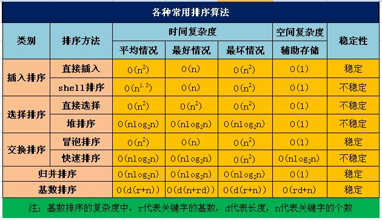
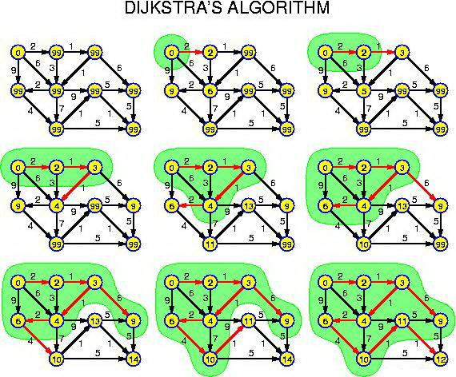
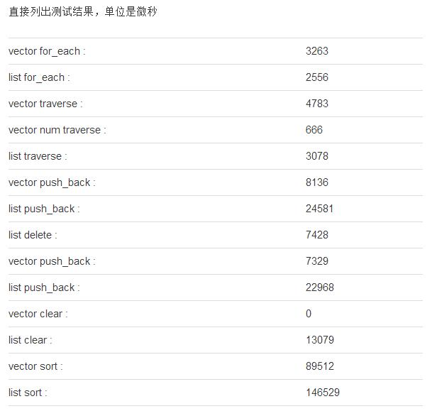

# C++和数据结构识点汇总

### 在类的成员函数中能不能调用delete this？
答案是肯定的，能调用!当调用delete this时，类对象的内存空间被释放。在delete this之后进行的其他任何函数调用，只要不涉及到this指针的内容，都能够正常运行。一旦涉及到this指针，如操作数据成员，调用虚函数等，就会出现不可预期的问题。

如果在类的析构函数中调用delete this，会发生什么？实验告诉我们，会导致堆栈溢出。原因很简单，delete的本质是“为将被释放的内存调用一个或多个析构函数，然后，释放内存”(来自effective c++)。显然，delete this会去调用本对象的析构函数，而析构函数中又调用delete this，形成无限递归，造成堆栈溢出，系统崩溃。

### 构造函数初始化时必须采用初始化列表一共有三种情况？

1. 需要初始化的数据成员是对象(继承时调用基类构造函数)
2. 需要初始化const修饰的类成员
3. 需要初始化引用成员数据

### 当一个类A中没有声命任何成员变量与成员函数这时sizeof(A)的值是多少?

通常是1，用作占位的。为了确保不同对象有不同的地址。

实验：
```
#include <iostream>
#include <stdio.h>

class A
{

};

int main() {
    A a;
    printf("sizeof(A) = %d\n",sizeof(a));  // sizeof(A) = 1
    return 0;
}
```

定义了一个非虚成员函数，sizeof(a)还是1，表明函数指针不存储在对象空间中
```
#include <iostream>
#include <stdio.h>

class A
{
	void foo() {}
};

int main() {
	A a;
	printf("sizeof(A) = %d\n", sizeof(a));  // sizeof(A) = 1
	return 0;
}
```
定义一个虚函数，sizeof(a) = 4，存了个虚函数表指针
```
#include <iostream>
#include <stdio.h>

class A
{
	virtual void foo() {}
};

int main() {
	A a;
	printf("sizeof(A) = %d\n", sizeof(a));  // sizeof(A) = 4
	return 0;
}
```

### 析构函数什么情况下定义为虚函数？
当你用一个基类指针指向一个动态创建的派生类对象的时候，如果你想delete这个派生类对象，就必须把基类的析构函数写成虚函数，这样就可以调用派生类的析构函数delete掉这个对象了。否则会内存泄露。

### C++里是怎么定义常量的？常量存放在内存的哪个位置？

常量在C++里的定义就是一个top-level const加上对象类型，常量定义必须初始化。对于局部对象，常量存放在栈区，对于全局对象，常量存放在全局/静态存储区。对于字面值常量，常量存放在常量存储区。

### 什么是隐式类型转换？怎么避免？
对于内置类型，低精度的变量给高精度变量赋值会发生隐式类型转换，其次，对于只存在单个参数的构造函数的对象构造来说，函数调用可以直接使用该参数传入，编译器会自动调用其构造函数生成临时对象。避免：explict关键字

### 如何定义一个只能在堆上（栈上）生成对象的类?
1.只能在堆上实例化

将构造函数私有化，然后提供一个public的static函数来完成构造，这样不使用new，而是使用一个函数来构造，使用一个函数来析构。代码如下，类似于单例模式：
```
#include <iostream>
#include <stdio.h>


class A
{
private:
    A(){}
    ~A(){}
public:
    static A* create()
    {
        return new A();
    }
    void destory()
    {
        delete this;
    }
};

int main() {
    //A a;  //直接栈上生成对象编译错误
    A* pA = A::create();
    pA->destory();
    return 0;
}
```

2.只能在栈上实例化

只有使用new运算符，对象才会建立在堆上，因此，只要禁用new运算符就可以实现类对象只能建立在栈上。将operator new()设为私有即可。代码如下：
```
#include <iostream>
#include <stdio.h>

class A
{
private:
    void* operator new(size_t t){}
    void operator delete(void *p){}
public:
    A(){}
    ~A(){}
};

int main() {
    A a;
    //A* pA = new A();  //堆上实例化失败
    return 0;
}
```


### 如何设计一个不能被继承的类？
答案跟上面的“如何定义一个只能在堆上生成对象的类?”的处理方法一样，将构造函数和析构函数私有化，当一个类试图从他那继承时必然会调用他的构造函数，进而导致编译失败。

### C++四种类型转换(cast)
1. static_cast
最常用的类型转换符，在正常状况下的类型转换
	
```
char a = 'a';
int b = static_cast<char>(a);//正确，将char型数据转换成int型数据

double *c = new double;
void *d = static_cast<void*>(c);//正确，将double指针转换成void指针

int e = 10;
const int f = static_cast<const int>(e);//正确，将int型数据转换成const int型数据

const int g = 20;
int *h = static_cast<int*>(&g);//编译错误，static_cast不能转换掉g的const属性


if(Derived *dp = static_cast<Derived *>(bp)){//下行转换是不安全的
  //使用dp指向的Derived对象  
}
else{
  //使用bp指向的Base对象  
}

if(Base*bp = static_cast<Derived *>(dp)){//上行转换是安全的
  //使用bp指向的Derived对象  
}
else{
  //使用dp指向的Base对象  
}
```
2. const_cast
用于取出const属性，把const类型的指针变为非const类型的指针，如：const int *fun(int x,int y){}　　int *ptr=const_cast<int *>(fun(2.3))
```
const int g = 20;
int *h = const_cast<int*>(&g);//去掉const常量const属性

const int g = 20;
int &h = const_cast<int &>(g);//去掉const引用const属性

 const char *g = "hello";
char *h = const_cast<char *>(g);//去掉const指针const属性

```
3. dynamic_cast
    
  dynamic_cast <type-id> (expression),运算符把expression转换成type-id类型的对象。Type-id 必须是类的指针、类的引用或者void*；
- 其他三种都是编译时完成的，dynamic_cast是运行时处理的，运行时要进行类型检查
- 不能用于内置的基本数据类型的强制转换
- dynamic_cast转换如果成功的话返回的是指向类的指针或引用，指针转换失败的话则会返回NULL，引用转换失败抛出异常。
- 使用dynamic_cast进行转换的，基类中一定要有虚函数，否则编译不通过
```
if(Derived *dp = dynamic_cast<Derived *>(bp)){
  //使用dp指向的Derived对象  
}
else{
  //使用bp指向的Base对象  
}

//因为不存在所谓空引用，所以引用类型的dynamic_cast转换与指针类型不同，在引用转换失败时，会抛出std::bad_cast异常，该异常定义在头文件typeinfo中。

void f(const Base &b){
 try{
   const Derived &d = dynamic_cast<const Base &>(b);  
   //使用b引用的Derived对象
 }
 catch(std::bad_cast){
   //处理类型转换失败的情况
 }
}

```
从上述定义中可以看到,B1和B2是不相关的类,从L1可以看到,dynamic_cast允许这种转换:只要B1存在多态方法.
L2将编译失败,static_cast并不允许两个完全不相干的类互相转换.

4.reinterpret_cast


interpret是解释的意思，reinterpret即为重新解释，此标识符的意思即为数据的二进制形式重新解释，但是不改变其值。允许将任何指针转换为任何其他指针类型,比如不同类的对象指针可以互相转换。 也允许将任何整数类型转换为任何指针类型以及反向转换。.如：int i; char *ptr="hello freind!"; i=reinterpret_cast<int>(ptr);这个转换方式很少使用。


### static_cast与dynamic_cast用法的异同？
static_cast < type-id > ( exdivssion ) 
该运算符把exdivssion转换为type-id类型，但没有运行时类型检查来保证转换的安全性。它主要有如下几种用法：
1. 用于类层次结构中基类和子类之间指针或引用的转换。
- 进行上行转换（把子类的指针或引用转换成基类表示）是安全的；
- 进行下行转换（把基类指针或引用转换成子类表示）时，由于没有动态类型检查，所以是不安全的。
2. 用于基本数据类型之间的转换，如把int转换成char，把int转换成enum。这种转换的安全性也要开发人员来保证。
3. 把空指针转换成目标类型的空指针。
3. 把任何类型的表达式转换成void类型。

4. 注意：static_cast不能转换掉exdivssion的const、volitale、或者__unaligned属性。

dynamic_cast主要用于类层次间的上行转换和下行转换，还可以用于类之间的交叉转换。
1. 在类层次间进行上行转换时，dynamic_cast和static_cast的效果是一样的；
2. 在进行下行转换时，dynamic_cast具有类型检查的功能，比static_cast更安全。
3. 要注意：B要有虚函数，否则会编译出错；static_cast则没有这个限制。
这是由于运行时类型检查需要运行时类型信息，而这个信息存储在类的虚函数表（
关于虚函数表的概念，详细可见）中，只有定义了虚函数的类才有虚函数表，
没有定义虚函数的类是没有虚函数表的。

dynamic_cast几乎唯一的被用来处理多态。多态分为上行转换和下行转换，上行转换没问题，子类的指针肯定可以转换成父类指针。下行转换就有问题了，如果要把父类的指针A转换成子类的指针B，如果A指向的是子类的对象，这样转没问题。但是，如果A指向的是父类的对象，正确的做法是转换应该为不成功的，因为多态里没有子类的指针指向父类的对象的。所以，在“A指向的是父类的对象，现要把A转成B”这种情况下，如果采用static_cast，不会报错，返回的是转换后的指针，但程序此时是不安全的。如果采用dynamic_cast，它会根据虚函数表找到A指向的是什么对象（这里要求父类必须要有虚函数，否则报错），如果是父类对象，返回NULL，如果是子类对象，返回转换后的指针，程序此时是安全的。所以，这就是dynamic_cast和static_cast最大的区别。


### STL中的容器：增减元素对迭代器的影响？
这个问题主要是针对连续内存容器和非连续内存容器。

对于连续内存容器，如vector、deque等，增减元素均会使得当前之后的所有迭代器失效。因此，以删除元素为例：由于erase()总是指向被删除元素的下一个元素的有效迭代器，因此，可以利用该连续内存容器的成员erase()函数的返回值。常见的编程写法为：
```
for(auto iter = myvec.begin(); iter != myvec.end())
{
    if(delete iter)
        iter = myvec.erase(iter);
    else
        iter++;
}

```
对于非连续内存容器，如set、map等。增减元素只会使得当前迭代器无效。仍以删除元素为例，由于删除元素后，erase()返回的迭代器将是无效的迭代器。因此，需要在调用erase()之前，就使得迭代器指向删除元素的下一个元素。常见的编程写法为：
```
for(autoiter = myset.begin(); iter != myset.end())
{
    if(delete iter)
        myset.erase(iter++);
    else
        iter++;
}

```
### mutable和volatile
1. mutable 

 在C++中，mutable是为了突破const的限制而设置的。被mutable修饰的变量，将永远处于可变的状态，即使在一个const函数中，甚至结构体变量或者类对象为const，其mutable成员也可以被修改。
 ```
#include <iostream>
#include <stdio.h>

struct A
{
    int a;
    mutable int b;
};

int main() {
    const A instance = {1,2};
    instance.a = 11;  //编译错误
    instance.b = 12;

    return 0;
}
 ```
 2. volatile
 
编译器进行优化时，它有时会取一些值的时候，直接从寄存器里进行存取，而不是从内存中获取，这种优化在单线程的程序中没有问题，但到了多线程程序中，由于多个线程是并发运行的，就有可能一个线程把某个公共的变量已经改变了，这时其余线程中寄存器的值已经过时，但这个线程本身还不知道，以为没有改变，仍从寄存器里获取，就导致程序运行会出现未定义的行为。并不是因为用volatile修饰了的变量就是“易变”了，假如没有外因，即使用volatile定义，它也不会变化。而加了volatile修饰的变量，编译器将不对其相关代码执行优化，而是生成对应代码直接存取原始内存地址。

### 智能指针的作用？
智能指针和普通指针的区别在于智能指针实际上是对普通指针加了一层封装机制，这样的一层封装机制的目的是为了使得智能指针可以方便的管理一个对象的生命期。智能指针实质是一个对象，行为表现的却像一个指针。
智能指针共分为4种，即boost库中的auto_ptr、scoped_ptr、shared_ptr、weak_ptr。

- auto_ptr:auto_ptr 基于【排他所有权模式】，这意味着：两个指针（同类型）不能指向同一个资源，复制或赋值都会改变资源的所有权。auto_ptr的析构函数内部释放资源时调用的是delete而不是delete[]，因此不要让auto_ptr托管数组
- scoped_ptr:这是比较简单的一种智能指针，正如其名字所述，scoped_ptr所指向的对象在作用域之外会自动得到析构。但是scoped_ptr的所有权更加严格，不能转让，一旦scoped_pstr获取了对象的管理权，你就无法再从它那里取回来。
- shared_ptr:shared_ptr中所实现的本质是引用计数(reference counting)，也就是说shared_ptr是支持复制的，复制一个shared_ptr的本质是对这个智能指针的引用次数加1，而当这个智能指针的引用次数降低到0的时候，该对象自动被析构。shared_ptr不能对循环引用的对象的内存进行自动管理
- unique_ptr:unique_ptr持有对对象的独有权——两个unique_ptr不能指向一个对象，不能进行复制操作只能进行移动操作。同一时刻只能有一个unique_ptr指向给定对象但可以转移所有权。
- weak_ptr:weak_ptr是为了配合shared_ptr而引入的一种智能指针，因为它不具有普通指针的行为，没有重载operator*和->,它的最大作用在于协助shared_ptr工作，像旁观者那样观测资源的使用情况。weak_ptr可以从一个shared_ptr或者另一个weak_ptr对象构造，获得资源的观测权。但weak_ptr没有共享资源，它的构造不会引起指针引用计数的增加。有点像普通指针。

使用weak_ptr解决循环引用
```
class B;
class A
{
public:
    A()
    {
        cout << "Class A Constructor is called." << endl;
    }

    ~A()
    {
        cout << "Class A Deconstructor is called." << endl;
    }

    // tr1::shared_ptr<B> m_shB;
    tr1::weak_ptr<B> m_shB;
};

class B
{
public:
    B()
    {
        cout << "Class B Constructor is called." << endl;
    }

    ~B()
    {
        cout << "Class B Deconstructor is called." << endl;
    }

    tr1::shared_ptr<A> m_shA;
};

int _tmain(int argc, _TCHAR* argv[])
{
    {
        // 测试重复引用
        tr1::shared_ptr<A> shA(new A());
        tr1::shared_ptr<B> shB(new B());
        
        if (shA && shB)
        {
            shA->m_shB = shB;
            shB->m_shA = shA;
        }

        cout << "A的引用计数：" << shA.use_count() << " B的引用计数：" << shB.use_count() << endl;
      
        cout << "要离开shA和shB的作用域了，正常情况下在这之后会执行shA和shB的析构函数的" << endl;
            
       // 这里是要执行析构函数的
       // 首先，会执行shB这个B对象的析构函数，要析构B的话，得先去判断下托管B的shared_ptr的引用计数，
       //       这里是1，所以去析构B，B析构后紧接着去析构其成员对象A，此时A的引用计数为2，所以会使A的引用计数减为1
       // 然后，会执行shA这个A对象的析构函数，要析构A的话，也得先去判断下托管的A的shared_ptr的引用计数，这里是1，它可以析构
    }

    cout << "已经离开shA和shB的作用域了，请观察shA和shB的析构函数有没有被执行" << endl;
}
```

### 纯虚函数如何定义，为什么对于存在虚函数的类中析构函数要定义成虚函数？
为了实现多态进行动态绑定，将派生类对象指针绑定到基类指针上，对象销毁时，如果析构函数没有定义为析构函数，则会调用基类的析构函数，显然只能销毁部分数据。如果要调用对象的析构函数，就需要将该对象的析构函数定义为虚函数，销毁时通过虚函数表找到对应的析构函数。
```
virtual ~myClass()=0;
```

### 什么是虚函数？
首先的话虚函数的写法是在成员函数上加关键字virtual，虚函数主要的作用是实现多态，执行动态绑定，在运行的时候确定。它虚就虚在所谓“推迟联编”或者“动态联编”上，一个类函数的调用并不是在编译时刻被确定的，而是在运行时刻被确定的。由于编写代码的时候并不能确定被调用的是基类的函数还是哪个派生类的函数，所以被成为“虚”函数。虚函数只能借助于指针或者引用来达到多态的效果。

一个vfptr被加入到类中（如果类中没有的话），该vfptr指向类的虚函数表（vftable）。类中每个虚函数在该类的虚函数表中都占据一项。每项保存一个对于该类适用的虚函数的地址。因此，调用虚函数的过程如下：取得实例的vfptr；通过vfptr得到虚函数表的一项；通过虚函数表该项的函数地址间接调用虚函数。也就是说，在普通函数调用的参数传递、调用、返回指令开销外，虚函数调用还需要额外的开销。

### 虚函数原理，虚函数表存放位置？
一个类存在虚函数，那么编译器就会为这个类生成一个虚表，在虚表里存放的是这个类所有虚函数的地址。当生成类对象的时候，编译器会自动的将类对象的前四个字节设置为虚表的地址，而这四个字节就可以看作是一个指向虚表的指针。虚表里依次存放的是虚函数的地址，每个虚函数的地址占4个字节。

主流 C++ 实现（gcc/clang/VC++）对于最简单的单继承且基类有虚函数的情况（非虚拟继承）的做法都差不多：
- vtable 是每个 class 类型一个，不是每个对象一个。
- vtable 的大小（长度）跟这个 class 的虚函数总数（继承和自己新增）正相关。
- vptr 是每个对象一个，vptr 大小是固定的，跟虚函数多少无关。
- 对象的 vptr 在构造和析构的时候可能会变，指向不同的 vtable。对象构造完就不会变了。
- “只使用前一段”有可能发生，如果派生类添加了新的虚函数的话（比如 virtual void B::print()）。


### 为什么用成员初始化列表会快一些（性能优势）？
优势：省去了临时对象的存在

方法一是在构造函数当中做赋值的操作，而方法二是做纯粹的初始化操作。我们都知道，C++的赋值操作是会产生临时对象的。临时对象的出现会降低程序的效率。

### 析构函数能抛出异常吗?
不能。

如果析构函数抛出异常，则异常点之后的程序不会执行，如果析构函数在异常点之后执行了某些必要的动作比如释放某些资源，则这些动作不会执行，会造成诸如资源泄漏的问题。
通常异常发生时，c++的机制会调用已经构造对象的析构函数来释放资源，此时若析构函数本身也抛出异常，则前一个异常尚未处理，又有新的异常，会造成程序崩溃的问题。


### STL的数据结构的内部实现?
- vector          底层数据结构为数组 ，支持快速随机访问
- list            底层数据结构为双向链表，支持快速增删
- deque           底层数据结构为一个中央控制器和多个缓冲区
- stack           底层一般用list或deque实现，封闭头部即可
- queue           底层一般用list或deque实现，封闭头部即可

（stack和queue其实是适配器,而不叫容器，因为是对容器的再封装）

- priority_queue  底层数据结构一般为vector为底层容器，堆heap为处理规则来管理底层容器实现
- set             底层数据结构为红黑树，有序，不重复
- multiset        底层数据结构为红黑树，有序，可重复 
- map             底层数据结构为红黑树，有序，不重复
- hash_set        底层数据结构为hash表，无序，不重复

### map的实现原理和红黑树的特点?
- set和map都是基于红黑树实现的。
- 红黑树是一种平衡二叉查找树，与AVL树的区别是什么？AVL树是完全平衡的，红黑树基本上是平衡的。
- 为什么选用红黑数呢？因为红黑数是平衡二叉树，其插入和删除的效率都是N(logN)，与AVL相比红黑数插入和删除最多只需要3次旋转，而AVL树为了维持其完全平衡性，在坏的情况下要旋转的次数太多。


红黑树的定义：
1. 节点是红色或者黑色；
2. 父节点是红色的话，子节点就不能为红色；
3. 从根节点到每个页子节点路径上黑色节点的数量相同；
4. 根是黑色的，NULL节点被认为是黑色的。

### vector的扩容机制
vector有两个函数一个是capacity()返回内存空间即缓冲区的大小，另一个是size()返回当前数组中数的数量。vector增加元素来说，当容量已经不能放进数据了，那么他会重新申请一块内存，把之前的内存利用复制构造函数复制到新的内存当中，然后把新添加的内容放入后面，另外此时的他申请的内存空间是原来空间的2倍，vecotor占用的内存只增不减，erase只是将一段区间（ earse(arr.begin(), arr.end() ）的值清除掉或者将某个值( erase(x) )清除掉，但是对于内存空间来说是没变化的。

所有内存空间是在vector析构时候才能被系统回收。empty()用来检测容器是否为空的，clear()可以清空所有元素。但是即使clear()，vector所占用的内存空间依然如故，无法保证内存的回收。

### 为何map和set的插入删除效率比用其他序列容器高？
因为对于关联容器来说，不需要做内存拷贝和内存移动。说对了，确实如此。map和set容器内所有元素都是以节点的方式来存储，其节点结构和链表差不多，指向父节点和子节点。插入和删除就是指针换来换去，和内存移动没有关系。

###  为何每次map和set insert之后，以前保存的iterator不会失效？
iterator这里就相当于指向节点的指针，内存没有变，指向内存的指针怎么会失效呢(当然被删除的那个元素本身已经失效了)。相对与vector来说，vector每次插入和删除，指针都有可能会失效，比如：当该内存块不够它扩容时，它会申请其它内存块，此时指针会失效！

### extern"C"的作用
extern "C"的主要作用就是为了能够正确实现C++代码调用其他C语言代码。加上extern "C"后，会指示编译器这部分代码按C语言的进行编译，而不是C++的。由于C++支持函数重载，因此编译器编译函数的过程中会将函数的参数类型也加到编译后的代码中，而不仅仅是函数名;而C语言并不支持函数重载，因此编译C语言代码的函数时不会带上函数的参数类型，一般只包括函数名。

### C++多态实现机制?
多态分为静态多态和动态多态。静态多态是通过重载和模板技术实现，在编译的时候确定。动态多态通过虚函数和继承关系来实现，执行动态绑定，在运行的时候确定。

动态多态实现有几个条件：
(1) 虚函数；
(2) 一个基类的指针或引用指向派生类的对象；

基类指针在调用成员函数(虚函数)时，就会去查找该对象的虚函数表。虚函数表的地址在每个对象的首地址。查找该虚函数表中该函数的指针进行调用。
每个对象中保存的只是一个虚函数表的指针，C++内部为每一个类维持一个虚函数表，该类的对象的都指向这同一个虚函数表。
虚函数表中为什么就能准确查找相应的函数指针呢？因为在类设计的时候，虚函数表直接从基类也继承过来，如果覆盖了其中的某个虚函数，那么虚函数表的指针就会被替换，因此可以根据指针准确找到该调用哪个函数。

### 虚函数表是针对类的还是针对对象的？同一个类的两个对象的虚函数表是怎么维护的？
编译器为每一个类维护一个虚函数表，每个对象的首地址保存着该虚函数表的指针，同一个类的不同对象实际上指向同一张虚函数表。

### 如何回避虚函数机制？
在某些情况下我们希望对虚函数的调用不要进行动态绑定，而是强迫其执行虚函数的某个特定版本。比如一个派生类虚函数需要调用它的基类版本。使用作用域运算符可以实现这一目的。
```
#include <stdio.h>

class A
{
public:
	virtual void foo() 
	{
		printf("base foo!\n");
	}
};

class B : public A
{
public:
	virtual void foo()
	{
		printf("derived foo!\n");
	}
};

int main()
{

	A* pA = new B();
	pA->A::foo();

	return 0;
}
```

### 工厂模式的实现？
简单工厂模式：
```

enum CTYPE {COREA, COREB};     
class SingleCore    
{    
public:    
    virtual void Show() = 0;  
};    
//单核A    
class SingleCoreA: public SingleCore    
{    
public:    
    void Show() { cout<<"SingleCore A"<<endl; }    
};    
//单核B    
class SingleCoreB: public SingleCore    
{    
public:    
    void Show() { cout<<"SingleCore B"<<endl; }    
};    
//唯一的工厂，可以生产两种型号的处理器核，在内部判断    
class Factory    
{    
public:     
    SingleCore* CreateSingleCore(enum CTYPE ctype)    
    {    
        if(ctype == COREA) //工厂内部判断    
            return new SingleCoreA(); //生产核A    
        else if(ctype == COREB)    
            return new SingleCoreB(); //生产核B    
        else    
            return NULL;    
    }    
};    
```

工厂方法模式:
```

class SingleCore    
{    
public:    
    virtual void Show() = 0;  
};    
//单核A    
class SingleCoreA: public SingleCore    
{    
public:    
    void Show() { cout<<"SingleCore A"<<endl; }    
};    
//单核B    
class SingleCoreB: public SingleCore    
{    
public:    
    void Show() { cout<<"SingleCore B"<<endl; }    
};    
class Factory    
{    
public:    
    virtual SingleCore* CreateSingleCore() = 0;  
};    
//生产A核的工厂    
class FactoryA: public Factory    
{    
public:    
    SingleCoreA* CreateSingleCore() { return new SingleCoreA; }    
};    
//生产B核的工厂    
class FactoryB: public Factory    
{    
public:    
    SingleCoreB* CreateSingleCore() { return new SingleCoreB; }    
}; 
```


抽象工厂模式：
```
//单核    
class SingleCore     
{    
public:    
    virtual void Show() = 0;  
};    
class SingleCoreA: public SingleCore      
{    
public:    
    void Show() { cout<<"Single Core A"<<endl; }    
};    
class SingleCoreB :public SingleCore    
{    
public:    
    void Show() { cout<<"Single Core B"<<endl; }    
};    
//多核    
class MultiCore      
{    
public:    
    virtual void Show() = 0;  
};    
class MultiCoreA : public MultiCore      
{    
public:    
    void Show() { cout<<"Multi Core A"<<endl; }    
    
};    
class MultiCoreB : public MultiCore      
{    
public:    
    void Show() { cout<<"Multi Core B"<<endl; }    
};    
//工厂    
class CoreFactory      
{    
public:    
    virtual SingleCore* CreateSingleCore() = 0;  
    virtual MultiCore* CreateMultiCore() = 0;  
};    
//工厂A，专门用来生产A型号的处理器    
class FactoryA :public CoreFactory    
{    
public:    
    SingleCore* CreateSingleCore() { return new SingleCoreA(); }    
    MultiCore* CreateMultiCore() { return new MultiCoreA(); }    
};    
//工厂B，专门用来生产B型号的处理器    
class FactoryB : public CoreFactory    
{    
public:    
    SingleCore* CreateSingleCore() { return new SingleCoreB(); }    
    MultiCore* CreateMultiCore() { return new MultiCoreB(); }    
};   

```

### 单例中懒汉和饿汉的区别有哪些？
单例中懒汉和饿汉的本质区别在于以下几点：
1. 饿汉式是线程安全的,在类创建的同时就已经创建好一个静态的对象供系统使用,以后不在改变。懒汉式如果在创建实例对象时不加上synchronized则会导致对对象的访问不是线程安全的。
2. 从实现方式来讲他们最大的区别就是懒汉式是延时加载,他是在需要的时候才创建对象,而饿汉式在虚拟机启动的时候就会创建，饿汉式无需关注多线程问题、写法简单明了、能用则用。但是它是加载类时创建实例,所以如果是一个工厂模式、缓存了很多实例、那么就得考虑效率问题，因为这个类一加载则把所有实例不管用不用一块创建。

### 单例模式的实现（懒汉、饿汉）？
为什么我们需要单例模式，绝对不是因为方便调用，因为静态方法更方便。那到底为什么使用单例模式呢？其实经过我们的讨论，单例模式的使用场景是一些全局不可变参数，可以放到单例中，比如从配置获取值，然后缓存到单例中

懒汉式：一种实现方法是定义一个单例类，使用类的私有静态指针变量指向类的唯一实例，并用一个公有的静态方法获取该实例。单例模式通过类本身来管理其唯一实例，这种特性提供了解决问题的方法。唯一的实例是类的一个普通对象，但设计这个类时，让它只能创建一个实例并提供对此实例的全局访问。唯一实例类Singleton在静态成员函数中隐藏创建实例的操作。
```
class CSingleton  
{  
private:  
    CSingleton()   //构造函数是私有的  
    {  
    }  
    static CSingleton *m_pInstance;  
public:  
    static CSingleton * GetInstance()  
    {  
        if(m_pInstance == NULL)  //判断是否第一次调用  
            m_pInstance = new CSingleton();  
        return m_pInstance;  
    }  
};  
```
这种实现方式存在的一个问题是m_pInstance变量的释放问题，即实例的析构问题，虽然我们可以在程序结束时主动调用GetInstance（）方法并对其返回的指针智行delete操作，但是这种方式不仅繁琐，而且调用者忘记的话，会引起很多的问题。

对于上面这种问题的一种解决方法是在该类中定义一个静态全局变量，我们知道，程序在结束的时候，系统会自动析构所有的全局变量。系统也会析构所有的类的静态成员变量，就像这些静态成员也是全局变量一样。我们可以在CSingleton单例类中定义一个这样的静态成员变量，在它的析构函数中删除单例类的实例。
```
class CSingleton  
{  
private:  
    CSingleton()  
    {  
    }  
    static CSingleton *m_pInstance;  
    class CGarbo   //它的唯一工作就是在析构函数中删除CSingleton的实例  
    {  
    public:  
        ~CGarbo()  
        {  
            if(CSingleton::m_pInstance)  
                delete CSingleton::m_pInstance;  
        }  
    };  
    static CGarbo Garbo;  //定义一个静态成员变量，程序结束时，系统会自动调用它的析构函数  
public:  
    static CSingleton * GetInstance()  
    {  
        if(m_pInstance == NULL)  //判断是否第一次调用  
            m_pInstance = new CSingleton();  
        return m_pInstance;  
    }  
}; 
```


饿汉式:如果你对上面添加在单例类内部添加一个类静态对象的方法不是很满意，还可以使用局部静态变量方法构造：
```

class CSingleton  
{  
private:  
    CSingleton()   //构造函数是私有的  
    {  
    }  
public:  
    static CSingleton & GetInstance()  
    {  
        static CSingleton instance;   //局部静态变量  
        return instance;  
    }  
}; 
```
用此种方法会出现类拷贝的问题，例如 Singleton singleton = Singleton :: GetInstance();这种调用方式编译器会为类生成一个默认的构造函数，来支持类的拷贝。这样的话就违背了单例的特性，所以我们可以稍微改一下，返回的是指针：
```
class CSingleton  
{  
private:  
    CSingleton()   //构造函数是私有的  
    {  
    }  
public:  
    static CSingleton * GetInstance()  
    {  
        static CSingleton instance;   //局部静态变量  
        return &instance;  
    }  
}; 
```

### 怎么写出单例模式的线程安全版本？

此处进行了两次m_Instance == NULL的判断，是借鉴了Java的单例模式实现时，使用的所谓的“双检锁”机制。因为进行一次加锁和解锁是需要付出对应的代价的，而进行两次判断，就可以避免多次加锁与解锁操作，同时也保证了线程安全。(懒汉线程安全版)
```
#include <iostream>
using namespace std;
 
class Singleton
{
public:
	static Singleton *GetInstance()
	{
		if (m_Instance == NULL )
		{
			Lock(); // C++没有直接的Lock操作，请使用其它库的Lock，比如Boost，此处仅为了说明
			if (m_Instance == NULL )
			{
				m_Instance = new Singleton ();
			}
			UnLock(); // C++没有直接的Lock操作，请使用其它库的Lock，比如Boost，此处仅为了说明
		}
		return m_Instance;
	}
 
	static void DestoryInstance()
	{
		if (m_Instance != NULL )
		{
			delete m_Instance;
			m_Instance = NULL ;
		}
	}
 
	int GetTest()
	{
		return m_Test;
	}
 
private:
	Singleton(){ m_Test = 0; }
	static Singleton *m_Instance;
	int m_Test;
};
 
Singleton *Singleton ::m_Instance = NULL;
 
int main(int argc , char *argv [])
{
	Singleton *singletonObj = Singleton ::GetInstance();
	cout<<singletonObj->GetTest()<<endl;
	Singleton ::DestoryInstance();
 
	return 0;
}

```

或者这种：（饿汉模式）
```
#include <iostream>
using namespace std;
 
class Singleton
{
public:
	static Singleton *GetInstance()
	{
		static Singleton m_Instance;
		return &m_Instance;
	}
 
	int GetTest()
	{
		return m_Test++;
	}
 
private:
	Singleton(){ m_Test = 10; };
	int m_Test;
};
 
int main(int argc , char *argv [])
{
	Singleton *singletonObj = Singleton ::GetInstance();
	cout<<singletonObj->GetTest()<<endl;
 
	singletonObj = Singleton ::GetInstance();
	cout<<singletonObj->GetTest()<<endl;
}

```

### 策略模式的实现？
当用户需要选择不同的算法或行为时，如果把这些算法或行为写在一个类里，通过判断来选择的话，这个类将变得非常复杂并且难以维护。策略模式就是构造一个抽象类，具体的算法或者行为继承这个类，让用户来选择。这样做的好处是，可以随时增加或者修改行为，即增加、修改算法或行为的类就可以了。

策略模式和简单工厂模式的差别：

简单工厂模式是通过一个抽象类来构造新对象，用户接触不到具体对象。

策略模式是通过抽象类来选择行为或算法。

```
//抽象接口  
class ReplaceAlgorithm  
{  
public:  
    virtual void Replace() = 0;  
};  
//三种具体的替换算法  
class LRU_ReplaceAlgorithm : public ReplaceAlgorithm  
{  
public:  
    void Replace() { cout<<"Least Recently Used replace algorithm"<<endl; }  
};  
  
class FIFO_ReplaceAlgorithm : public ReplaceAlgorithm  
{  
public:  
    void Replace() { cout<<"First in First out replace algorithm"<<endl; }  
};  
class Random_ReplaceAlgorithm: public ReplaceAlgorithm  
{  
public:  
    void Replace() { cout<<"Random replace algorithm"<<endl; }  
};  

//Cache需要用到替换算法  
class Cache  
{  
private:  
    ReplaceAlgorithm *m_ra;  
public:  
    Cache(ReplaceAlgorithm *ra) { m_ra = ra; }  
    ~Cache() { delete m_ra; }  
    void Replace() { m_ra->Replace(); }  
};  


int main()  
{  
    Cache cache(new LRU_ReplaceAlgorithm()); //暴露了算法的定义  
    cache.Replace();  
    return 0;  
}  

```

### 什么是适配器模式？
适配器模式将一个类的接口转换成客户希望的另外一个接口，使得原本由于接口不兼容而不能一起工作的那些类可以一起工作。举个例子，在STL中就用到了适配器模式。STL实现了一种数据结构，称为双端队列（deque），支持前后两段的插入与删除。STL实现栈和队列时，没有从头开始定义它们，而是直接使用双端队列实现的。这里双端队列就扮演了被适配类的角色。队列用到了它的后端插入，前端删除。而栈用到了它的后端插入，后端删除。假设栈和队列都是一种顺序容器，有两种操作：压入和弹出。

```
//使用复合，对象模式
class Deque  //双端队列，被适配类
{
public:
    void push_back(int x)
    {
        cout << "Deque push_back:" << x << endl;
    }
    void push_front(int x)
    {
        cout << "Deque push_front:" << x << endl;
    }
    void pop_back()
    {
        cout << "Deque pop_back" << endl;
    }
    void pop_front()
    {
        cout << "Deque pop_front" << endl;
    }
};

class Sequence  //顺序类，目标类
{
public:
    virtual void push(int x) = 0;
    virtual void pop() = 0;
};

class Stack:public Sequence   //栈, 适配类
{
public:
    void push(int x)
    {
        m_deque.push_back(x);
    }
    void pop()
    {
        m_deque.pop_back();
    }
private:
    Deque m_deque;
};

class Queue:public Sequence  //队列，适配类
{
public:
    void push(int x)
    {
        m_deque.push_back(x);
    }
    void pop()
    {
        m_deque.pop_front();
    }
private:
    Deque m_deque;
};
//END
```

### 什么是代理模式？
- 代理模式：为其它对象提供一种代理以控制对这个对象的访问。
- 主要解决：在直接访问对象时带来的问题，比如：要访问的对象在远程服务器上。在面向对象系统中，有些对象由于某些原因，直接访问会给使用者或系统带来很多麻烦，可以在访问此对象时加上一个对此对象的访问层。

```
//统一的抽象接口 IFactory
class IFactory  
{  
public:  
    IFactory(){}  
    virtual void makeProduct() = 0;  
};  

//你的手机工厂
class PhoneFactory : IFactory  
{  
public:  
    PhoneFactory(){}  
    void makeProduct()  
    {  
        cout<<"生产手机"<<endl;  
    }  
};  

//专门做代工的代理工厂富士康
class FoxconnProxy : IFactory  
{  
public:  
    FoxconnProxy(IFactory* factory)  
    {  
        m_real = factory;  
    }  
    void makeProduct()  
    {  
        m_real->makeProduct();  
    }  
private:  
    IFactory* m_real;  
};  

//客户端：
IFactory* factory = new PhoneFactory();  
FoxconnProxy* proxy =  new FoxconnProxy(factory);  
proxy->makeProduct();  

```

### 类中哪些函数不能为虚函数？ 
- 构造函数:因为构造函数本来就是为了明确初始化对象成员才产生的,现在对象还没有产生，如何使用virtual函数来完成你想完成的动作（编译器报错）
- 内联成员函数:内联函数就是为了在代码中直接展开，减少函数调用花费的代价，内联函数是个静态行为，而虚函数是个动态行为，他们之间是有矛盾的（多态调用，不能内联，非多态调用可以内联,如b->Base::Foo(); // 非多态调用，可以内联（但具体是否内联由编译器决定））
- 静态成员函数:静态成员函数对于每个类来说只有一份代码，所有的对象都共享这一份代码，他也没有要动态邦定的必要性（编译器报错）
- 友元函数:因为C++不支持友元函数的继承，对于没有继承特性的函数没有虚函数的说法

### 为什么采用内存对齐，理由？
一方面是因为我们的计算机硬件就是这么设计的，也就是说CPU在访问存储器的时候只能在某些地址处获取某些特定类型的数据。另一方面，因为CPU读取数据的时候不是一个一个读的，几个几个读的。如果数据不按照一定的规则存储的话，会降低读取速度，从而影响计算效率。如果加入pragma pack(n) ，取n和变量自身大小较小的一个。

### 函数的调用怎么实现的，传参呢？

### 如何检测内存泄漏
自己重载new操作符，用list或者map对分配的内存进行收集，如果释放了，就删除节点，最后检测容器里面还有没有节点，有就是泄露了，也可以记录是哪一行的代码分配的内存被泄露了，这都看你想要记录什么。最终可以生成报告给自己去分析。

存泄漏通常是指堆内存的泄漏，也就是通过malloc、calloc函数申请的内存，因此内存泄漏的检测方法核心思想就是通过宏定义自定义内存分配及释放函数来替换用户的malloc、calloc、free等函数。申请信息，申请内存时，记录并插入到全局的链表中；释放内存时从全局链表中查找对应的记录，并删除。程序结束时，将链表中信息写入文件，并清除链表。
```
#define malloc(size) malloc_detector(size,__FILE__,__LINE__)
#define calloc(element_num,element_size) calloc_detector (element_num,element_size,__FILE__,__LINE__)
#define free(addr) free_detector(addr)
```

```
//---------------------------------------------------------------
// 重载new,new[],delete,delete[] 
//---------------------------------------------------------------
void* operator new(size_t size, const char* file, unsigned int line) {
  void* ptr = malloc(size);
  mem_stack.Insert(ptr, file, line);
  return ptr;
}
void* operator new[](size_t size, const char* file, unsigned int line) {
  return operator new(size, file, line); // 不能用new 
}
void operator delete(void* ptr) {
  free(ptr);
  mem_stack.Delete(ptr);
}
void operator delete[](void* ptr) {
  operator delete(ptr);
}

//---------------------------------------------------------------
// 使用宏将带测试代码中的new和delte替换为重载的new和delete 
//---------------------------------------------------------------
#define new new(__FILE__,__LINE__)
```

使用工具：Linux下通过工具valgrind检测

```
g++ mem.cpp -o mem -g

Valgrind --tool=memcheck --leak-check=full ./mem
```

该工具可以检测下列与内存相关的问题 :

- 未释放内存的使用
- 对释放后内存的读/写
- 对已分配内存块尾部的读/写
- 内存泄露
- 不匹配的使用malloc/new/new[] 和 free/delete/delete[]
- 重复释放内存

### 讲讲大端小端，如何检测？
- 变量的高字节放到内存的低地址中（变量的低字节放到内存的高地址中）==>大端
- 变量的高字节放到内存的高地址中（变量的低字节放到内存的低地址中）==>小端 

```
#include <stdio.h>
int main() {
    int i = 0x11223344;
    char *p;

    p = (char *) &i;
    if (*p == 0x44) {
        printf("Little endian\n");
    }
    else {
        printf("Big endian\n");
    }
    return 0;
}
```


### 静态链接、动态链接的区别？
静态链接是指在编译阶段直接把静态库加入到可执行文件中去，这样可执行文件会比较大。而动态链接则是指链接阶段仅仅只加入一些描述信息，而程序执行时再从系统中把相应动态库加载到内存中去。

### STL中unordered_map和map

### hash冲突如何解决？
- 开放定址法：线性，平方
- 链地址法

### 堆和栈的区别 堆的栈哪个大？ 堆一般多大？
Linux:栈1M，堆理论上无上限，取决于机器位数（32位，4G）

### B+树为何适合数据库索引？
- 不同于B树只适合随机检索，B+树同时支持随机检索和顺序检索；
- B+树的磁盘读写代价更低。B+树的内部结点并没有指向关键字具体信息的指针，其内部结点比B树小，盘块能容纳的结点中关键字数量更多，一次性读入内存中可以查找的关键字也就越多，相对的，IO读写次数也就降低了。而IO读写次数是影响索引检索效率的最大因素。
- B树在提高了磁盘IO性能的同时并没有解决元素遍历的效率低下的问题。B+树的叶子节点使用指针顺序连接在一起，只要遍历叶子节点就可以实现整棵树的遍历。而且在数据库中基于范围的查询是非常频繁的，而B树不支持这样的操作（或者说效率太低）。

### reverse/capacity函数和 resize/size函数的区别？
size()告诉你容器中实际有多少个元素，resize()则会在容器末尾添加或者删除元素，使得容器达到指定大小；capacity()告诉你最少添加多少个元素才会导致容器的重新分配内存，而reserve()在必要时候总是容器内部缓冲区扩至一个更大的内容，reserve()并不改变容器中元素的数量，它仅影响vector预先分配多大的内存空间。

### 迭代器类型有哪些？ map的迭代器属于哪一种类型?

### C++内存分为那几块？
（堆区，栈区，常量区，静态和全局区）
上面是高地址，堆区向上生长（地址越分越大），栈区向下生长（地址越分越小）,栈的生长方向是从高地址向低地址（X86）

### STL里的内存池实现？

STL内存分配分为一级分配器和二级分配器，一级分配器就是采用malloc分配内存，二级分配器采用内存池。
二级分配器设计的非常巧妙，分别给8k，16k,..., 128k等比较小的内存片都维持一个空闲链表，每个链表的头节点由一个数组来维护。需要分配内存时从合适大小的链表中取一块下来。假设需要分配一块10K的内存，那么就找到最小的大于等于10k的块，也就是16K，从16K的空闲链表里取出一个用于分配。释放该块内存时，将内存节点归还给链表。
如果要分配的内存大于128K则直接调用一级分配器。
为了节省维持链表的开销，采用了一个union结构体，分配器使用union里的next指针来指向下一个节点，而用户则使用union的空指针来表示该节点的地址。


### 十亿整数（随机生成，可重复）中前K最大的数？
- 快排的思想 近似O(n):调用降序快排的partition函数，设区间为[low,high]，返回index，则index左边都是大于data[index]的。 
1. 若index及index左边数字有k个则data[index]就是第k大，index及其左边元素为Top K元素 
2. 左边数字大于k个则继续在[low,index]里找 
3. 左边数字小于k个则去右边[index+1,high]找 k - 左边数字个数
- 小根堆 O(nlogk):维护一个k个元素的小根堆，保持堆里元素为最大的K个且堆顶为第k大(堆里最小的)，扫一遍数据，若堆里个数小于k则插入，否则看新的数和堆顶数大小关系： 
1. 若新来的数小于等于堆顶，即新元素比Top K里最小的还小，则新来的数显然不可能是前k大 
2. 若新来的数大于堆顶，则删掉堆顶，将新数字放到堆里且调整堆来保持堆的属性
- 部分排序:题目要求是求出Top 10，因此我们没有必要对所有的Query都进行排序，我们只需要维护一个10个大小的数组，初始化放入10个Query，按照每个Query的统计次数由大到小排序，然后遍历这300万条记录，每读一条记录就和数组最后一个Query对比，如果小于这个Query，那么继续遍历，否则，将数组中最后一条数据淘汰(还是要放在合适的位置，保持有序)，加入当前的Query。最后当所有的数据都遍历完毕之后，那么这个数组中的10个Query便是我们要找的Top10了。不难分析出，这样，算法的最坏时间复杂度是N*K， 其中K是指top多少。

### 什么是布隆过滤器？
布隆过滤器（Bloom Filter）是1970年由布隆提出的。它实际上是一个很长的二进制向量和一系列随机映射函数。布隆过滤器可以用于检索一个元素是否在一个集合中。它的优点是空间效率和查询时间都远远超过一般的算法，缺点是有一定的误识别率和删除困难。

布隆过滤器算法：
1. 首先需要k个hash函数，每个函数可以把key散列成为1个整数
2. 初始化时，需要一个长度为n比特的数组，每个比特位初始化为0
3. 某个key加入集合时，用k个hash函数计算出k个散列值，并把数组中对应的比特位置为1
4. 判断某个key是否在集合时，用k个hash函数计算出k个散列值，并查询数组中对应的比特位，如果所有的比特位都是1，认为在集合中。

优点：不需要存储key，节省空间

缺点：
1. 算法判断key在集合中时，有一定的概率key其实不在集合中
2. 无法删除

### 几十亿个数经常要查找某一个数在不在里面，使用布隆过滤器，布隆过滤器的原理。布隆过滤器可能出现误判，怎么保证无误差？


### 全局变量和static变量的区别？
 1) 全局变量(外部变量)的说明之前再冠以static 就构成了静态的全局变量。全局变量本身就是静态存储方式， 静态全局变量当然也是静态存储方式。 这两者在存储方式上并无不同。这两者的区别在于非静态全局变量的作用域是整个源程序， 当一个源程序由多个源文件组成时，非静态的全局变量在各个源文件中都是有效的。 而静态全局变量则限制了其作用域， 即只在定义该变量的源文件内有效， 在同一源程序的其它源文件中不能使用它。由于静态全局变量的作用域局限于一个源文件内，只能为该源文件内的函数公用， 因此可以避免在其它源文件中引起错误。 
		
 2) 从以上分析可以看出，把局部变量改变为静态变量后是改变了它的存储方式即改变了它的生存期。把全局变量改变为静态变量后是改变了它的作用域，限制了它的使用范围。　　   		
 		
 3) static函数与普通函数作用域不同,仅在本文件。只在当前源文件中使用的函数应该说明为内部函数(static)，内部函数应该在当前源文件中说明和定义。对于可在当前源文件以外使用的函数，应该在一个头文件中说明，要使用这些函数的源文件要包含这个头文件 　　		
	
### 什么是柔性数组？		
```		
 typedef struct test  		
 {  		
     int a;  		
     double b;  		
     char c[0];  		
 };  		
 		
 //有些编译器会报错无法编译可以改成：		
 typedef struct test  		
 {  		
     int a;  		
     double b;  		
     char c[];  		
 };  		
 		
 //通过如下表达式给结构体分配内存：		
 test *stpTest = (test *)malloc(sizeof(test)+100*sizeof(char));  		
```		
c就是一个柔性数组成员，如果把stpTest指向的动态分配内存看作一个整体，c就是一个长度可以动态变化的结构体成员，柔性一词来源于此。c的长度为0，因此它不占用test的空间，同时stpTest->c就是“hello world”的首地址，不需要再使用( char * )( stpTest + 1 )这么丑陋的代码了。那个0个元素的数组没有占用空间，而后我们可以进行变长操作了。这样我们为结构体指针c分配了一块内存。用stpTest->c[n]就能简单地访问可变长元素。		
 		
### 存有100万个有序数的数组里，查找一个数，最快的方法是什么？				
### 存有100万个无序数的数组里，要求数组前一半的数都小于后一半的数，怎么做最快？			
### 输出二叉树每一层最大的数		
 		
### 输出带权重的树中权重最大的一条路径以及该树的所有路径权重之和		
		
### 如何避免编译器进行的隐式类型转换		
explict关键字		
		
### C++函数栈空间的最大值 ？		
默认是1M，不过可以调整。ulimit -s		

### 怎么重载前置++，后置++，+，new？		
```		
 #include <iostream>		
 #include <stdlib.h>		
 #include <stdio.h>		
 		
 using namespace std;		
 		
 class A		
 {		
 private:		
     int a;		
     int b;		
     int c[3];		
 public:		
     A(int a,int b)		
     {		
         this->a = a;		
         this->b = b;		
         c[0] = 1;		
         c[1] = 2;		
         c[2] = 3;		
     }		
 		
     inline bool operator ==(const A& as) const		
     {		
         if(this->a == as.a && this->b == as.b)		
             return true;		
         else		
             return false;		
     }		
 		
 		
     inline int operator +(const A& as)const		
     {		
         return this->a + as.a;		
     }		
 		
     A operator ++() //前增量,++i 		
     {		
         this->a++;		
         this->b++;		
         return *this;		
     }		
 		
     A operator ++(int)  //后增量,i++		
     {		
         A tmp(*this);		
         this->a++;		
         this->b+1;		
         return tmp;		
     }		
 		
     int& operator [](int i)		
     {		
         return this->c[i];		
     }		
 		
     friend ostream& operator <<(ostream& out, const A& as)		
     {		
         out<<"("<<as.a<<","<<as.b<<")";		
         return out;		
     }		
 		
     friend istream& operator >>(istream& in, A& as)		
     {		
         in >> as.a >> as.b;		
         return in;		
     }		
 };		
 		
 		
 //对于全局重载操作符，代表左操作数的参数必须被显式指定		
 		
 void* operator new(size_t size, const char* file, unsigned int line) 		
 {		
     void* ptr = malloc(size);		
     printf("%s,line:%d",file,line);		
     return ptr;		
 }		
 		
 		
int main()		
{		
    A test_a(2,3);		
    A test_b(2,3);		
    if(test_a == test_b)		
        cout<<"euqal!"<<endl;		
    else		
        cout<<"not equal!"<<endl;		
		
    //cout<<"add:"<<test_a + test_b<<endl;		
    cout<<test_b<<endl;		
		
    return 0;		
}		
```		
		
### 哪些排序是稳定排序？		
下面表格归并排序的空间复杂度有误，应为O(n)，因为需要开辟n大小的数组辅助排序		
		
 		
		
### 快排的优化思路有哪些？		
快排的运行时间与划分是否对称有关，而后者又与具体使用的划分算法有关。当初始排序表基本有序或逆序时就得到最坏情况下的时间复杂度O(n^2)。		
		
优化方法：		
1. 当递归过程中划分得到的子序列规模较小时不要再继续递归调用快排，而是采用直接插入排序。		
2. 尽量选取一个数据可以将数据中分的枢轴元素，比如从序列的头尾以及中间选取三个元素，再取这三个元素的中间值作为枢轴元素。		
		
### C++11有哪些特性？		
		
### hash_Map和map区别,实现原理		
		
### 什么是B树？什么是B+树？他们的区别是什么？		
B树，也就是英文中的B-Tree，一个 m 阶的B树满足以下条件：		
- 每个结点至多拥有m棵子树；		
- 根结点至少拥有两颗子树（存在子树的情况下）；		
- 除了根结点以外，其余每个分支结点至少拥有 m/2 棵子树；		
- 所有的叶结点都在同一层上；		
- 有 k 棵子树的分支结点则存在 k-1 个关键码，关键码按照递增次序进行排列；		
- 关键字数量需要满足ceil(m/2)-1 <= n <= m-1；		
		
		
		
B+树,同样的，以一个m阶树为例：		
- 根结点只有一个，分支数量范围为[2，m]；		
- 分支结点，每个结点包含分支数范围为[ceil(m/2), m]；		
- 分支结点的关键字数量等于其子分支的数量减一，关键字的数量范围为[ceil(m/2)-1, m-1]，关键字顺序递增；		
- 所有叶子结点都在同一层；		
		
		
		
两者区别：由于B+树的数据都存储在叶子结点中，分支结点均为索引，方便扫库，只需要扫一遍叶子结点即可，但是B树因为其分支结点同样存储着数据，我们要找到具体的数据，需要进行一次中序遍历按序来扫，所以B+树更加适合在区间查询的情况，所以通常B+树用于数据库索引，而B树则常用于文件索引。		
		
这都是由于B+树和B具有这不同的存储结构所造成的区别，以一个m阶树为例。		
- 关键字的数量不同；B+树中分支结点有m个关键字，其叶子结点也有m个，其关键字只是起到了一个索引的作用，但是B树虽然也有m个子结点，但是其只拥有m-1个关键字。		
- 存储的位置不同；B+树中的数据都存储在叶子结点上，也就是其所有叶子结点的数据组合起来就是完整的数据，但是B树的数据存储在每一个结点中，并不仅仅存储在叶子结点上。		
- 分支结点的构造不同；B+树的分支结点仅仅存储着关键字信息和儿子的指针（这里的指针指的是磁盘块的偏移量），也就是说内部结点仅仅包含着索引信息。		
- 查询不同；B树在找到具体的数值以后，则结束，而B+树则需要通过索引找到叶子结点中的数据才结束，也就是说B+树的搜索过程中走了一条从根结点到叶子结点的路径。		
		
### char* s = "hello";那sizeof(s)等于多少？		
```		
int main()		
{		
    char* s = "hello!";		
    printf("sizeof(s):%d\n",sizeof(s));  // 8  指针大小		
    printf("sizeof(*s):%d\n",sizeof(*s)); // 1　　单个字符大小		
		
    return 0;		
}		
```		
		
### 外部排序的思想是什么？		
现在我要进行排序，不过需要排序的数据很大，有1000G那么大，但是我的机器内存只有2G大小，所以每次只能把2G的数据从文件中传入内存，然后用一个“内部排序“算法在内存排好序后，再将这有序数据，载入一个2G大小的文件。然后再载入第二个2G数据。循环500遍之后，我现在得到500个文件，每个文件2G，文件内部是有序的，然后我再比较这500个文件的第一个数，最小的肯定就是这1000G数据的最小的（维护一个最小堆辅助排序）。那么之后的过程你肯能想到了，就是不断将这500个2G数据进行一个归并，内存每当排满数据后就将该内存的数据存回磁盘，然后内存清空，以此方式迭代，最终就能得到这1000G的有序数据文件了。		
		
		
 		
 		
### 有序的大数据全局打乱的思路是？		
假设内存1G，有100G有序的数组文件。先将1G数据读入，i1 = rand(),i2 = rand(),将i1和i2坐标的数交换，一共执行n此交换，对这个随机化后的数组写回外存。重复以上操作，得到100个随机化后的分段，再分别随机取每一段的一个数送入内存，再做随机化，再送回内存，重复操作，完成大数组的随机化。		
 	
### new得到的指针能否用free来释放？		
这是未定义行为。这是未定义行为。另外，考虑p = new Foo[n]对应delete [] p，后者不用提供n，说明在实现上需要分配额外空间记录数组大小，以供析构。		
		
### 什么是Trie树？它有什么用途		
又称单词查找树，Trie树，是一种树形结构，是一种哈希树的变种。典型应用是用于统计，排序和保存大量的字符串（但不仅限于字符串），所以经常被搜索引擎系统用于文本词频统计、过滤禁词、字符串检索、字符串排序。它的优点是：利用字符串的公共前缀来减少查询时间，最大限度地减少无谓的字符串比较，查询效率比哈希树高。		
		
		
		
它有3个基本性质：		
- 根节点不包含字符，除根节点外每一个节点都只包含一个字符； 		
- 从根节点到某一节点，路径上经过的字符连接起来，为该节点对应的字符串； 		
- 每个节点的所有子节点包含的字符都不相同。		
		
插入和查询的效率很高，均是O（m），其中 m 是待插入/查询的 字符串长度 。Trie树中不同的关键字不会产生冲突。关于查询，有人会说hash表时间复杂度是O（1）不是更快？但是哈希搜索的效率取决于哈希函数的好坏，若一个坏的hash函数导致了很多冲突，效率不一定比Trie树高。		
		
### 什么是哈夫曼树？他有什么应用？		
给定n个权值作为n个叶子结点，构造一棵二叉树，若带权路径长度达到最小，称这样的二叉树为最优二叉树，也称为哈夫曼树(Huffman Tree)。哈夫曼树是带权路径长度最短的树，权值较大的结点离根较近。用途：在数据通信中的数据压缩传输，即哈夫曼编码。		
		
### 解最小生成树的方法有哪些？		
Kruskal算法和Prim算法。		
		
Kruskal算法：此算法可以称为“加边法”，初始最小生成树边数为0，每迭代一次就选择一条满足条件的最小代价边，加入到最小生成树的边集合里。		
		
		
Prim算法:此算法可以称为“加点法”，每次迭代选择代价最小的边对应的点，加入到最小生成树中。算法从某一个顶点s开始，逐渐长大覆盖整个连通网的所有顶点。时间复杂度O(V^2)，v是节点数。		
		
		
### 怎么解单源最短路径问题？		
迪杰斯特拉算法（Dijkstra和洛伊德算法（Floyd）。		
		
Dijkstra提出按各顶点与源点v间的路径长度的递增次序，生成到各顶点的最短路径的算法。既先求出长度最短的一条最短路径，再参照它求出长度次短的一条最短路径，依次类推，直到从源点v 到其它各顶点的最短路径全部求出为止。		
		
		
### 堆排序的优化思路？		
堆中从根节点到叶节点的一条路径是有序的，最大堆是降序，我们在shiftDown操作时，实际上是在找根节点在某条路径上的一个插入位置，可以借鉴二分的思想，我们可以一次下降到当前高度h的一半的位置（在下降的过程中要将沿途的较大的子节点上移，这样在h/2高度形成空位），即h/2，再比较在一半高度h/2的节点与根节点的大小，如果比根节点大则继续寻找当前一半高度位置的元素即h/4，依次类推，如果当前高度的元素比根节点小，我们就引入shiftUp操作，即将根节点再上移，但由前面的分析可知，上移的次数是有限的，这样就将shiftDown的复杂度变为O(lglgn)，堆排序的总体复杂度变为O(n*lglgn)。		
		
### 堆排序和快排序的应用场景？		
应用场景：		
		
- 若n较小（数据规模较小），插入排序或选择排序较好		
- 若数据初始状态基本有序（正序），插入、冒泡或快速排序为宜		
- 若n较大，则采用时间复杂度为O(nlogn)的排序方法：快速排序或堆排序		
- 快速排序是目前基于比较的排序中被认为是最好的方法，当待排序的关键字是随机分布时，快速排序的平均时间最短；		
- 堆排序所需的辅助空间少于快速排序，并且不会出现快速排序可能出现的最坏情况。这两种排序都是不稳定的。		
		
		
### 微信随机红包的实现？		
```		
#include <stdio.h>		
#include <vector>		
#include <math.h>		
#include<stdlib.h>		
		
		
using namespace std;		
		
float GetRandomMoney(float total_money, int package_num);		
vector<float> AllocateRedPackage(float total_money, int package_num);		
		
int main()		
{		
    vector<float> random_packages;		
    random_packages = AllocateRedPackage(100.0, 10);		
		
    for(int i=0;i<random_packages.size();i++)		
    {		
        printf("%.1f ", random_packages[i]);		
    }		
    printf("\n");				
    return  0;		
}		
		
vector<float> AllocateRedPackage(float total_money, int package_num)		
{		
    vector<float> ret;		
    while(total_money && package_num)		
    {		
        float random_money = GetRandomMoney(total_money, package_num);		
        ret.push_back(random_money);		
        total_money -= random_money;		
        package_num--;		
    }		
    return ret;		
}		
 		
 		
float GetRandomMoney(const float total_money, const int package_num)		
{		
    if(package_num == 1)		
    {		
        return (float)round(total_money*10)/10;		
    }		
	
     float r = (float)(rand() % 10) / 10;		
     float min = 0.1;		
     float max = total_money / package_num * 2;		
     float money = r * max;		
     money = money<=min?min:money;		
     money = money * 10 / 10;		
     return money;		
 }		
```		
 		
### 为什么在平均情况下快速排序比堆排序要优秀？		
 简单来说，就是局部性原理。在堆排中，每一个操作都是不利于程序的局部性原理的，每次元素间的比较、数的调整等，都不是相邻或者尽可能附近的元素间的比较(堆调整每次都从堆底拿元素到堆顶然后向下进行调整），那么这就需要不断地在磁盘和内存间换入换出数据。反观快排，利用分而治之的方法，元素间的比较都在某个段内，局部性相当好哇。		
		
### C++如何彻底禁止掉对象的复制操作?		
普通的C++菜鸟会说，那我在类的设计里，不去实现拷贝构造和赋值操作不就完了吗？其实不行！C++会在背后偷偷的帮你现实一个默认的拷贝构造的版本，我们必须将这个后门给堵死。禁止掉这些复制的操作，可以将复制相关的操作设置为私有的，这样外界就无法对其复制了。将拷贝构造函数与赋值函数，声明为private，并且不给出实现。这样就实现了类复制的完全禁止。		
```		
class CPeople  		
{  		
    // ...  		
private:  		
    // 将复制相关的操作定义为私有  		
     CPeople(); // 只声明不实现  		
    const CPeople& operator=(const CPeople& rhis); // 只声明不实现  		
};  		
		
```		
 
### 最小堆的底层结构是什么？		
最小堆，是一种经过排序的完全二叉树，其中任一非终端节点的数据值均不大于其左子节点和右子节点的值。		


### 常见的内存问题有哪些？		
 常见的内存问题一共七种：		
 1. 动态内存泄露；		
 2. 资源泄露，比如文件指针不关闭；		
 3. 动态内存越界；		
 4. 数组内存越界；		
 5. 动态内存double free；		
 6. 使用野指针，即未初始化的指针；		
 7. 释放野指针，即未初始化的指针。		
 		
### 怎么使用gdb调试程序？		
```		
 g++ mem.cpp -o mem -g		
 gdb ./mem		
```		 		
运行		
- run：简记为 r ，其作用是运行程序，当遇到断点后，程序会在断点处停止运行，等待用户输入下一步的命令。		
- continue （简写c ）：继续执行，到下一个断点处（或运行结束）		
- next：（简写 n），单步跟踪程序，当遇到函数调用时，也不进入此函数体；此命令同 step 的主要区别是，step 遇到用户自定义的函数，将步进到函数中去运行，而 next 则直接调用函数，不会进入到函数体内。		
- step （简写s）：单步调试如果有函数调用，则进入函数；与命令n不同，n是不进入调用的函数的		
- until：当你厌倦了在一个循环体内单步跟踪时，这个命令可以运行程序直到退出循环体。		
- until+行号： 运行至某行，不仅仅用来跳出循环		
- finish： 运行程序，直到当前函数完成返回，并打印函数返回时的堆栈地址和返回值及参数值等信息。		
- call 函数(参数)：调用程序中可见的函数，并传递“参数”，如：call gdb_test(55)		
- quit：简记为 q ，退出gdb		
		
		
设置断点		
- break n （简写b n）:在第n行处设置断点		
（可以带上代码路径和代码名称： b OAGUPDATE.cpp:578）		
- b fn1 if a＞b：条件断点设置		
- break func（break缩写为b）：在函数func()的入口处设置断点，如：break cb_button		
- delete 断点号n：删除第n个断点		
- disable 断点号n：暂停第n个断点		
- enable 断点号n：开启第n个断点		
- clear 行号n：清除第n行的断点		
- info b （info breakpoints） ：显示当前程序的断点设置情况		
- delete breakpoints：清除所有断点：		
		
 查看源代码		
- list ：简记为 l ，其作用就是列出程序的源代码，默认每次显示10行。		
- list 行号：将显示当前文件以“行号”为中心的前后10行代码，如：list 12		
- list 函数名：将显示“函数名”所在函数的源代码，如：list main		
- list ：不带参数，将接着上一次 list 命令的，输出下边的内容。		
		
 打印表达式		
- print 表达式：简记为 p ，其中“表达式”可以是任何当前正在被测试程序的有效表达式，比如当前正在调试C语言的程序，那么“表达式”可以是任何C语言的有效表达式，包括数字，变量甚至是函数调用。		
- print a：将显示整数 a 的值		
- print ++a：将把 a 中的值加1,并显示出来		
- print name：将显示字符串 name 的值		
- print gdb_test(22)：将以整数22作为参数调用 gdb_test() 函数		
- print gdb_test(a)：将以变量 a 作为参数调用 gdb_test() 函数		
- display 表达式：在单步运行时将非常有用，使用display命令设置一个表达式后，它将在每次单步进行指令后，紧接着输出被设置的表达式及值。如：
 display a		
- watch 表达式：设置一个监视点，一旦被监视的“表达式”的值改变，gdb将强行终止正在被调试的程序。如： watch a		
- whatis ：查询变量或函数		
- info function： 查询函数		
- 扩展info locals： 显示当前堆栈页的所有变量		
		
		
查询运行信息		
- where/bt ：当前运行的堆栈列表；		
- bt backtrace 显示当前调用堆栈		
- up/down 改变堆栈显示的深度		
- set args 参数:指定运行时的参数		
- show args：查看设置好的参数		
-info program： 来查看程序的是否在运行，进程号，被暂停的原因。		
		
### 怎么调试coredump？		
gdb调试coredump文件		
```		
ulimit -c unlimited  		
ulimit –c		
		
		
gdb mem core		
		
backtrace/bt		
		
```		
### BST相关的复杂度？		
BST的：		
- 插入：O(logn)		
- 建树：O(nlogn)		
- 查找：O(logn) / O(n)		
- 删除：O(logn)		
		
AVL:		
- 旋转：O(1)		
- 高度更新:O(1)		
		
### STL map遍历时的顺序是什么？怎么改变该顺序？		
 排序问题，STL中默认是采用小于号来排序的，因为设置int等类型做key，它本身支持小于号运算（底层红黑树，从BST理解）。用string类型作为key，我们的存储就是按学生姓名的字典排序储存的。		
 		
 map这里指定less作为其默认比较函数(对象)，所以我们通常如果不自己指定Compare，map中键值对就会按照Key的less顺序进行组织存储，因此我们就看到了上面代码输出结果是按照学生姓名的字典顺序输出的，即string的less序列。		
 		
 我们可以在定义map的时候，指定它的第三个参数Compare，比如我们把默认的less指定为greater。或者自己重写compare函数		
```		
 struct CmpByKeyLength {  		
   bool operator()(const string& k1, const string& k2) {  		
     return k1.length() < k2.length();  		
   }  		
 };  		
 		
 		
 		
 int main() {  		
   map<string, int, CmpByKeyLength> name_score_map;  		
   name_score_map["LiMin"] = 90;   		
   name_score_map["ZiLinMi"] = 79;   		
   name_score_map["BoB"] = 92;   		
   name_score_map.insert(make_pair("Bing",99));  		
   name_score_map.insert(make_pair("Albert",86));  		
   for (map<string, int>::iterator iter = name_score_map.begin();  		
        iter != name_score_map.end();  		
        ++iter) {  		
     cout << *iter << endl;  		
   }  		
   return 0;  		
 }		
 		
```		
### STL的组成部分有哪些？		
STL可分为容器(containers)、迭代器(iterators)、空间配置器(allocator)、配接器(adapters)、算法(algorithms)、仿函数(functors)六个部分。		
### 循环队列中怎么判断队列满？		
一般而言，front指向当前元素，rear指向当前元素的后一个元素。循环队列会空一个单位。		
- 求队列长度 （r-f+maxsize）%maxsize.		
- 队列空 r == f		
- 队列满 (r+1)%maxsize == f		
- 入队 (r+1)%maxsize		
- 出队(f+1)%maxsize		
		
### 成员函数指针存放在哪里？		
在大部分情况下函数是一段机器码，函数指针的实现就是保存那段机器码的地址。		
		
在C++中，如果你的函数不是虚函数（ fooFunc 、barFunc），那么你调用函数的时候就是静态调用，编译器会插入跳转到内存中代码段里对应的函数的地址，每个类的实例不会占用多余的存储空间。如果你的函数是虚函数（ vFunc ），那么每一个对象实例就会携带一个虚指针，通常这个指针在对象实例的首部，这是为了保证访问虚函数表拥有高性能（尤其是当多重继承的时候）。虚指针指向类的虚函数表，然后找到需要调用的函数的指针，然后再跳转到那儿。		
		
### vector和list中插入操作谁效率更高？		
-看你怎么插往前后插，那用deque;往后插，用vector;往中间插或者插了要频繁的删除，用list;还有数据如果是需要按照值查找，那建议用map或者set;这又分为两种，一种是用红黑树实现(nlgn时间复杂度），一种用哈希表实现（理论上是常量时间复杂度，但是空间复杂度高）。如果数据的key可重复，建议用multimap。或者muliset				
-迭代器遍历，list 比vector 稍块，使用for_each 比使用for更快。		
- 顺序插入(push_back)， vector比list 约快3倍 （理论上vector存在扩容情况需要耗费一点时间，但是从从总体考虑，vector发生扩容的次数和时间还是比较少的，反观list，每次插入都需要指针变换操作，需要的时间反而更多）		
- clear操作，vector 几乎不耗时，list 要耗费好多时间，vector比list至少快1千倍以上（vector是连续的内存，清空速度快，直接memset就行。list需要遍历每个节点，一个个去delete，速度肯定慢）		
- 排序， vector 大约比list 快2倍。	



### 怎么对基类的成员变量做初始化？
```
#include <stdio.h>

class A
{
public:
	virtual void foo() 
	{
		printf("base foo!\n");
	}
	A(int x, int y) :a(x), b(y)
	{

	}
private:
	int a;
	int b;
};

class B : public A
{
public:
	virtual void foo()
	{
		printf("derived foo!\n");
	}
	B(int x, int y, int z) :A(x, y), c(z)
	{

	}
private:
	int c;
};

int main()
{

	A* pA = new B(1,2,3);
	pA->A::foo();

	return 0;
}
```

### 引用和指针的区别？
总结一下指针和引用的相同点和不同点：
相同点：
- 都是地址的概念；
- 指针指向一块内存，它的内容是所指内存的地址；而引用则是某块内存的别名。

不同点：
- 指针是一个实体，而引用仅是个别名；
- 引用只能在定义时被初始化一次，之后不可变；指针可变；引用“从一而终”，指针可以“见异思迁”；
-引用没有const，指针有const，const的指针不可变；（具体指没有int& const a这种形式，而const int& a是有      的，  前者指引用本身即别名不可以改变，这是当然的，所以不需要这种形式，后者指引用所指的值不可以改变）
- 引用不能为空，指针可以为空；
- “sizeof 引用”得到的是所指向的变量(对象)的大小，而“sizeof 指针”得到的是指针本身的大小；
 指针和引用的自增(++)运算意义不一样；
- 引用是类型安全的，而指针不是 (引用比指针多了类型检查

### 如何不引入辅助变量来交换两变量的值？
有两种方式可以不使用中间变量，交换同类型的变量a,b的值：
1. 使用加法操作a+=b; b=a-b;a -= b;
2. 使用异或操作：a^=b;b^=a;a^=b;

### C++类的默认函数有几个？分别是什么？
```
//定义一个空的C++类，例如
class Empty
{
}
//一个空的class在C++编译器处理过后就不再为空，编译器会自动地为我们声明一些member function，一般编译过去就相当于
class Empty
{
public:
    Empty(); // 缺省构造函数
    Empty( const Empty& ); // 拷贝构造函数
    ~Empty(); // 析构函数
    Empty& operator=( const Empty& ); // 赋值运算符
    Empty* operator&(); // 取址运算符
    const Empty* operator&() const; // 取址运算符 const
};
```
如果你只是声明一个空类，不做任何事情的话，编译器会自动为你生成一个默认构造函数、一个拷贝默认构造函数、一个默认拷贝赋值操作符和一个默认析构函数。这些函数只有在第一次被调用时，才会别编译器创建。所有这些函数都是inline和public的。

### 友元关系能继承吗？
不能被继承。

友元能够是个函数，该函数被称为友元函数；友元也能够是个类，该类被称为友元类。
在C++中，自定义函数可以充当友元，友元只是能访问指定类的私有和保护成员的自定义函数，不是被指定类的成员，自然不能继承。
使用友元类时注意：
- 友元关系不能被继承。 
- 友元关系是单向的，不具有交换性。若类B是类A的友元，类A不一定是类B的友元，要看在类中是否有相应的声明。
- 友元关系不具有传递性。若类B是类A的友元，类C是B的友元，类C不一定是类A的友元，同样要看类中是否有相应的申明
```
class Base
{
    friend class frnd;
protected:
    int i;
}

// Frnd has no access to members in D1
class D1 : public Base
{
protected:
    int j;
};

class Frnd
{
public:
    int mem(Base b) { return b.i; } // ok: Frnd is friend to Base
    int mem(D1 d) { return d.i; } // error: friendship doesn’t inherit
};

// D2 has no access to members in Base
class D2 : public Frnd
{
public:
    int mem(Base b) { return b.i; } // error: friendship doesn’t inherit
};
```

注意事项：
1. 友元可以访问类的私有成员。
2. 只能出现在类定义内部，友元声明可以在类中的任何地方，一般放在类定义的开始或结尾。
3. 友元可以是普通的非成员函数，或前面定义的其他类的成员函数，或整个类。
4. 类必须将重载函数集中每一个希望设为友元的函数都声明为友元。
5. 友元关系不能继承，基类的友元对派生类的成员没有特殊的访问权限。如果基类被授予友元关系，则只有基类具有特殊的访问权限。该基类的派生类不能访问授予友元关系的类。

### 在构造函数中能调用虚函数吗？
```
#include <stdio.h>

class base
{
public:
	base()
	{
		foo();
	}

	virtual void foo()
	{
		printf("base\n");
	}
};


class derive :public base
{
public:
	derive()
	{
		foo();
	}

	virtual void foo()
	{
		printf("derive\n");
	}
};

int main()
{
	derive d;

	return 0;
}

//output:
//base
//derive
```
注意，虚函数表是构造函数启动时首先构造的，构造完采取执行构造函数里的其他操作。

1. 先构造基类部分，调用基类Base的构造函数，这个时候，派生类部分还没有产生，这时候虚表应该是绑定基类的，自然调用的是Base::Func()

2. 再构造派生类部分，这个时候，虚表发生变化，绑定在派生类上，调用Deri::Func()

虽然，在派生类中有重载Func这个函数，但是，在构造基类部分的时候，派生类的成员数据还没有初始化，如果是调用派生类中的Func，会造成错误，内存越界甚至崩溃。发现在调用base的构造函数时对象对应的虚表和构造后对象对应的虚表不是同一个。其实这正是奥秘的所在。

### 类静态函数能调用非静态成员变量吗？
不可以。

类的静态成员变量和成员函数作个总结：

1. 静态成员函数中不能调用非静态成员，但可以调用静态成员。

2. 非静态成员函数中可以调用静态成员。因为静态成员属于类本身，在类的对象产生之前就已经存在了，所以在非静态成员函数中是可以调用静态成员的。

3. 静态成员变量使用前必须先初始化(如int MyClass::m_nNumber = 0;)，否则会在linker时出错。

４. 静态类成员函数可以直接在类内声明＋定义(static void foo() {})，也可以在类内声明(static void foo();)，然后在类外实现void A::foo() {}　（注意不加static）

针对1，其实我们可以通过一些手段来实现静态函数访问非静态成员。有一个很取巧的办法，就是在静态函数的形参表里加上实例的地址,我们调用　静态函数时传入对象的指针即可。
```
class A
{
public:
    static void test(A *a)
    {
        a->m_a += 1;
    }
    void hello()
    {
    }
private:
    static int m_staticA;
    int m_a
};
```

### 深拷贝和浅拷贝的区别？
所谓浅拷贝，指的是在对象复制时，只对对象中的数据成员进行简单的赋值，默认拷贝构造函数执行的也是浅拷贝。在“深拷贝”的情况下，对于对象中动态成员，就不能仅仅简单地赋值了，而应该重新动态分配空间

如果一个类拥有资源，当这个类的对象发生复制过程的时候，资源重新分配，这个过程就是深拷贝

### 什么时候发生拷贝构造，什么时候发生赋值？
```
#include <iostream>

using namespace std;

class Person
{
public:
     Person(){}
     Person(const Person& p)
     {
        cout << "Copy Constructor" << endl;
     }
     Person& operator=(const Person& p)
     {
         cout << "Assign" << endl;
         return *this;
     }
private:
    int age;
    string name;
};
void f(Person p)
{
    return;
}
Person f1()
{
    Person p;
    return p;
}
Person f2()
{
    static Person p;
    return p;
}


int main()
{
    Person p;
    //Person p1 = p; // 拷贝构造
    Person p2;
    //p2 = p; // 赋值
    //f(p2); // 拷贝构造
    //p2 = f1(); // 赋值
    //Person p3 = f1(); //啥都没有，RVO是返回值优化，基本是个牛逼点儿的编译器都支持，作用是消除函数返回时产生的一次临时对象
    //Person p4 = f2();  //拷贝构造
    //p2 = f2(); //拷贝构造＋赋值:拷贝构造发生在return时会构造一个暂时的副本用于返回
    return 0;
}
```

### 一个对象作为函数返回值，以值传递的方式从函数返回时的拷贝构造是怎么样的？
```
//g函数返回的是一个元素（复杂类型的），返回的是一个新的匿名对象（所以会调用匿名对象类的copy构造函数）
//
A g()
{
    A a;
    return a;.//先调用copy构造函数，用a对象创建了一个匿名对象；再执行a的析构函数（因为a为局部对象）
}

void main()
{
    A a0;
    a0 = g();//匿名对象浅copy给a0，匿名对象被析构。调用的是赋值操作。
    A a1 = g();//匿名对象直接去初始化a1，不会调用copy构造函数（此时c++编译器直接把匿名对象转成a1）。不是赋值也不是拷贝构造。
}
```
### 什么叫NRV优化?
```
class TextFile {
public:
	TextFile() {};
	TextFile(const TextFile& tf) {
		cout << "copy" << endl;
	};
	TextFile& operator=(TextFile& tf) {
		cout << "operator=" << endl;
		return *this;
	};
};

TextFile get_tmp_text_file() {
	TextFile tf;
	return tf;
}

int main() {

	TextFile tf = get_tmp_text_file();
}

```
这是很经典的例子，很多文章都会讲 TextFile tf = get_tmp_text_file(); 会调用两次拷贝构造函数，一次是 get_tmp_text_file 函数返回时，将函数返回拷贝到临时变量里，第二次是在 main 函数内构造 TextFile 对象时，将临时变量拷贝到 tf 对象上。所以，程序会输出两遍 copy。

然而，如果你现在写了这么一个程序，真的跑一遍，它什么都不会输出。

不要怀疑自己，代码没错，教程也没错，这是因为GCC的 返回值优化 。

当一个函数返回一个对象实例，一个临时对象将被创建并通过复制构造函数把目标对象复制给这个临时对象。C++标准允许省略这些复制构造函数，即使这导致程序的不同行为，即使编译器把两个对象视作同一个具有副作用。

这是C++标准允许编译器独立实现的优化。被称为返回值优化（RVO/NRVO）。

G++编译时，会默认对代码进行返回值优化，优化后的等价代码如下：

```
TextFile get_tmp_text_file(TextFile * tf) {
	// 直接在tf上构造
}

int main() {
    TextFile tf;
	get_tmp_text_file(&tf);
}

```
因此就不需要再调用 TextFile 对象的拷贝构造函数。

要关闭这种优化，只要在编译时加上 -fno-elide-constructors 强制G++总是使用拷贝构造函数。
```
g++ 2DimensionArray.cpp -o run -fno-elide-constructors && ./run

输出：
copy
copy
```

### C++继承中重载、重写的区别？
重载overload：是函数名相同，参数列表不同 重载只是在类的内部存在。但是不能靠返回类型来判断。

重写override：也叫做覆盖。子类重新定义父类中有相同名称和参数的虚函数。函数特征相同。但是具体实现不同，主要是在继承关系中出现的 。

重定义 (redefining)也叫做隐藏:子类重新定义父类中有相同名称的非虚函数 ( 参数列表可以不同 ) 。


1. 成员函数重载特征：
- 相同的范围（在同一个类中）
- 函数名字相同
- 参数不同
- virtual关键字可有可无

2. 重写（覆盖)是指派生类函数覆盖基类函数，特征是：
- 不同的范围，分别位于基类和派生类中
- 函数的名字相同
- 参数相同
- 基类函数必须有virtual关键字

3. 重定义(隐藏)是指派生类的函数屏蔽了与其同名的基类函数，规则如下：
- 如果派生类的函数和基类的函数同名，但是参数不同，此时，不管有无virtual，基类的函数被隐藏。
- 如果派生类的函数与基类的函数同名，并且参数也相同，但是基类函数没有vitual关键字，此时，基类的函数被隐藏。

```
#include <iostream>
#include <vector>

using namespace std;

class Base {
private:
    virtual void display() { cout << "Base display()" << endl; }
    void say(){ cout << "Base say()" << endl; }
public:
    void exec(){ display(); say(); }
    void f1(string a) { cout << "Base f1(string)" << endl; }
    void f1(int a) { cout << "Base f1(int)" << endl; } //overload，两个f1函数在Base类的内部被重载
};

class DeriveA :public Base{
public:
    void display() { cout << "DeriveA display()" << endl; } //override，基类中display为虚函数，故此处为重写
    void f1(int a, int b) { cout << "DeriveA f1(int,int)" << endl; } //redefining，f1函数在Base类中不为虚函数，故此处为重定义
    void say() { cout << "DeriveA say()" << endl; } //redefining，同上
};


class DeriveB :public Base
{
public:
    void f1(int a) { cout << "DeriveB f1(int)" << endl; } //redefining，重定义
};


int main(){
    DeriveA a;
    Base *b = &a;
    b->exec(); //display():version of DeriveA call(polymorphism) //say():version of Base called(allways )

    //b里边的函数display被A类覆盖，但是say还是自己的。

    a.exec(); //same result as last statement   
    a.say();
    DeriveB c;
    c.f1(1); //version of DeriveB called
}

```
### 为什么进程切换的开销比线程切换大呢？
进程切换分两步
1. 切换页目录以使用新的地址空间
2. 切换内核栈和硬件上下文。

对于linux来说，线程和进程的最大区别就在于地址空间。
对于线程切换，第1步是不需要做的，第2是进程和线程切换都要做的。

进行进程切换就是从正在运行的进程中收回处理器，然后再使待运行进程来占用处理器。　这里所说的从某个进程收回处理器，实质上就是把进程存放在处理器 的寄存器中的中间数据找个地方存起来，从而把处理器的寄存器腾出来让其他进程使用。那么被中止运行进程的中间数据存在何处好呢？当然这个地方应该是进程的 私有堆栈。 　　

让进程来占用处理器，实质上是把某个进程存放在私有堆栈中寄存器的数据（前一次本进程被中止时的中间数据）再恢复到处理器的寄存器中去，并把待运行进程的断点送入处理器的程序指针PC，于是待运行进程就开始被处理器运行了，也就是这个进程已经占有处理器的使用权了。

进程切换比线程切换开销大是因为进程切换时要切页表，而且往往伴随着页调度，因为进程的数据段代码段要换出去，以便把将要执行的进程的内容换进来。本来进程的内容就是线程的超集。而且线程只需要保存线程的上下文（相关寄存器状态和栈的信息）就好了，动作很小。context switch过高，会导致CPU像个搬运工，频繁在寄存器和运行队列直接奔波  ，更多的时间花在了线程切换，而不是真正工作的线程上。直接的消耗包括CPU寄存器需要保存和加载，系统调度器的代码需要执行。间接消耗在于多核cache之间的共享数据。 

### skip-list的原理是什么？


### 25匹马求最快的5匹马，有5个赛道


### 什么是RTTI？

C++通过以下的两个操作提供RTTI：
1. typeid运算符，该运算符返回其表达式或类型名的实际类型。
2. dynamic_cast运算符，该运算符将基类的指针或引用安全地转换为派生类类型的指针或引用。

dynamic_cast 操作符

如果dynamic_cast转换指针类型失败，则返回0；如果转换引用类型失败，则抛出一个bad_cast类型的异常。
```
if (Derived *derivedPtr = dynamic_cast<Derived *>(basePtr))
{
    // use the Derived object to which derivedPtr points
}
else
{ // basePtr points at a Base object
    // use the Base object to which basePtr points
}
```

typeid操作符

typeid能够获取一个表达式的类型：typeid(e)。

如果操作数不是类类型或者是没有虚函数的类，则获取其静态类型；如果操作数是定义了虚函数的类类型，则计算运行时类型。
```
Base *bp;
Derived *dp;
// compare type at run time of two objects
if (typeid(*bp) == typeid(*dp))
{
    // bp and dp point to objects of the same type
}
// test whether run time type is a specific type
if (typeid(*bp) == typeid(Derived))
{
    // bp actually points a Derived
}

```
### STL中仿函数有什么用，和函数指针有什么不同，哪个效率高？

### 隐式转换和显示转换？
