# Linux系统级编程知识点积累

其中包括以下知识点：
- Linux网络编程
- Linux进程间通信
- 线程安全
- 计算机网络
- 操作系统

### GCC的编译过程分为那几步？
预处理、编译、汇编和链接４个步骤。
- 预处理，生成预编译文件：gcc -E hello.c -o hello.i
- 编译，生成汇编代码：gcc -S hello.i -o hello.s
- 汇编，生成目标文件：gcc -c hello.s -o hello.o
- 链接，生成可执行文件：gcc hello.o -o hello

### 文件权限rwxrwxrwx代表什么意思？
前三位表示文件所有者的权限、中间三位是文件所有者所属组权限、后三位是其他用户的权限。777（111,111,111）表示所有用户可读可写可执行，754(111,101,100)表示文件拥有者具有可读可写可执行的权限，文件拥有者所在组有读、执行权限，而其他用户有读权限。

### umask()函数是干什么的？
umask用于影响新建立文件的默认权限，当新建立一个文件或目录时，系统会根据umask的值来“剥夺”文件或目录的相应权限。例如，如果umask的值是022的话，表示新创建的文件权限是622-022=755。即rwxr--r--。


### init进程的PID是多少？
空闲进程（当没有其他进程在运行时，内核所运行的进程，PID为0），在启动后，内核运行的第一个进程交init进程，PID为1

### 进程最大PID是多少？
32768，因为系统只使用16位来存储PID。

### 什么叫僵死进程？
如果一个子进程在父进程之前结束，内核应该把子进程设置为一个特殊的状态，处于这种状态的进程叫做僵死进程，进程只保留最小的概要信息，即一些保存着有用信息的内核数据结构。僵死的进程等待这父进程来查询自己的信息。只要父进程获取了子进程的信息，子进程就会消失，否则一直处于僵死状态。

### Linux进程状态有哪几种？
R、S、D、T、Z、X

R (TASK_RUNNING)，可执行状态；S (TASK_INTERRUPTIBLE)，可中断的睡眠状态；D (TASK_UNINTERRUPTIBLE)，不可中断的睡眠状态；T (TASK_STOPPED or TASK_TRACED)，暂停状态或跟踪状态；Z (TASK_DEAD - EXIT_ZOMBIE)，退出状态，进程成为僵尸进程；X (TASK_DEAD - EXIT_DEAD)，退出状态，进程即将被销毁。

### 如何建立守护进程
Linux Daemon（守护进程）是运行在后台的一种特殊进程。它独立于控制终端并且周期性地执行某种任务或等待处理某些发生的事件。
编写守护进程的一般步骤步骤：

（1）在父进程中执行fork并exit推出；

（2）在子进程中调用setsid函数创建新的会话；

（3）在子进程中调用chdir函数，让根目录 ”/” 成为子进程的工作目录；

（4）在子进程中调用umask函数，设置进程的umask为0；

（5）在子进程中关闭任何不需要的文件描述符．

```
    #include <unistd.h>   
    #include <signal.h>   
    #include <fcntl.h>  
    #include <sys/syslog.h>  
    #include <sys/param.h>   
    #include <sys/types.h>   
    #include <sys/stat.h>   
    #include <stdio.h>  
    #include <stdlib.h>  
    #include <time.h>  
      
    int init_daemon(void)  
    {   
        int pid;   
        int i;  
          
        // 1）屏蔽一些控制终端操作的信号  
        signal(SIGTTOU,SIG_IGN);   
        signal(SIGTTIN,SIG_IGN);   
        signal(SIGTSTP,SIG_IGN);   
        signal(SIGHUP ,SIG_IGN);  
       
        // 2）在后台运行  
        if( pid=fork() ){ // 父进程  
            exit(0); //结束父进程，子进程继续  
        }else if(pid< 0){ // 出错  
            perror("fork");  
            exit(EXIT_FAILURE);  
        }  
          
        // 3）脱离控制终端、登录会话和进程组  
        setsid();    
          
        // 4）禁止进程重新打开控制终端  
        if( pid=fork() ){ // 父进程  
            exit(0);      // 结束第一子进程，第二子进程继续（第二子进程不再是会话组长）   
        }else if(pid< 0){ // 出错  
            perror("fork");  
            exit(EXIT_FAILURE);  
        }    
          
        // 5）关闭打开的文件描述符  
        // NOFILE 为 <sys/param.h> 的宏定义  
        // NOFILE 为文件描述符最大个数，不同系统有不同限制  
        for(i=0; i< NOFILE; ++i){  
            close(i);  
        }  
          
        // 6）改变当前工作目录  
        chdir("/tmp");   
          
        // 7）重设文件创建掩模  
        umask(0);    
          
        // 8）处理 SIGCHLD 信号  
        signal(SIGCHLD,SIG_IGN);  
          
        return 0;   
    }   
      
    int main(int argc, char *argv[])   
    {  
        init_daemon();  
          
        while(1);  
      
        return 0;  
    }  
```

### TCP自己实现过吗？滑动窗口过程?

### dup/dup2的作用和区别
有时我们希望把标准输入重定向到一个文件，或者把标准输出重定向到一个网络连接。dup()与dup2()能对输入文件描述符进行重定向。dup重定向标准输出时需要先关闭stdout，而使用dup2时不需要。

dup:
```
#include <stdio.h>
#include <unistd.h>
#include <fcntl.h>
#include <string.h>

int main()
{
    int fd = open("./a.log", O_CREAT|O_RDWR,0644);
    close(1);
    
    int new_fd = dup(fd);
    if(new_fd < 0)
    {
        perror("dup");
        return 0;
    }
    close(fd);
    
    char buf[1024];
    
    while(1)
    {
        memset(buf,0,sizeof(buf));
        scanf("%s",buf);
        if(buf[0] == 'q') break;
        printf("%s\n",buf);
        fflush(stdout); //必须做，因为重定向后printf函数将由行缓冲变为全缓冲  
    }
    close(new_fd);
    
    return 0;
}
```

dup2:
```
#include <stdio.h>
#include <unistd.h>
#include <fcntl.h>
#include <string.h>

int main()
{
    int fd = open("./b.log", O_CREAT|O_RDWR,0644);
    close(1);
    
    int new_fd = dup2(fd,1);
    if(new_fd < 0)
    {
        perror("dup");
        return 0;
    }
    //close(fd);  //使用dup2不需要手动关闭原先的fd，系统自动关
    
    char buf[1024];
    
    while(1)
    {
        memset(buf,0,sizeof(buf));
        scanf("%s",buf);
        if(buf[0] == 'q') break;
        printf("%s\n",buf);
        fflush(stdout); //必须做，因为重定向后printf函数将由行缓冲变为全缓冲  
    }
    close(new_fd);
    
    return 0;
}
```

### sed, awk, grep的作用？
三个超强大的命名，分别用与格式化修改，统计，和正则查找

awk、sed、grep更适合的方向：
- grep 更适合单纯的查找或匹配文本
- sed 更适合编辑匹配到的文本
- awk 更适合格式化文本，对文本进行较复杂格式处理

记一下比较经典的操作：
sed:
- sed -e '1d' inputfile (删除第一行)
- sed -e 'x1d' -e 'x2d' -e 'x3d' inputfile  (删除第x1,x2,x3行)
- sed -e '1,3d' file (删除第一到第三行)
- sed -e '1,$d' file  (删除第一行到最后一行)
- sed -e '/#/d' file  (删除含有'#'号的行)
- sed -e '/xx/!d' file (删除除含有字符串xx的所有行)
- sed -e '/t.*t/d' file     (删除含有两个t的行)
- sed -e 'nc/just do it' file  (把第n行替换成just do it)
- sed -e '1,10c/I can do it' file  (把1到10行替换成一行:I can do it)
- sed -e 's/w1/& w2/' file  （w1的地方输出 w1 w2）
- sed 's/book/books/' file (替换文本中book为books)
- sed -i 's/book/books/g' file （全局替换：换文本中book为books）
- sed -i 's/sk/SK/2g' file（从第2个匹配时开始替换）

awk:
- awk '{print $1,$4}' log.txt(每行按空格或TAB分割，输出文本中的1、4项/列)
- awk '{printf "%-8s %-10s\n",$1,$4}' log.txt（格式化输出）
- awk -F ',' '{print $1,$2}'   log.txt（使用","分割）
- awk -F '[ ,]'  '{print $1,$2,$5}'   log.txt（使用多个分隔符.先使用空格分割，然后对分割结果再使用","分割）
- awk -va=1 -vb=s '{print $1,$1+a,$1b}' log.txt（设置变量）
- awk '$1>2' log.txt（过滤第一列大于2的行）
- awk '$1>2 && $2=="Are" {print $1,$2,$3}' log.txt（过滤第一列大于2并且第二列等于'Are'的行）
- awk '{print $0}' (打印所有行)
- awk -F: 'NR%2==1 {print NR,$0}' log.txt(打印奇数行)
- awk -F: 'NR==4 {print $2+$1+$3}' a.txt  > b.txt (将过滤后的文本写入新的文件)
- awk '{print NR,NF,$1,$NF,}' file （ 显示文件file的当前记录号、域数和每一行的第一个和最后一个域）
- awk  -v sum=0 '{if(NR==2){for(i=1;i<=NF;i++) sum+=$i; print sum;}}' a.txt (输出文本第二行所有元素相加的结果)


grep:
- grep linuxtechi /etc/passwd /etc/shadow /etc/gshadow (在多个文件中查找模式)
- grep -l linuxtechi /etc/passwd /etc/shadow /etc/fstab /etc/mtab (使用-L参数列出包含指定模式的文件的文件名)
- grep -n linuxtechi /etc/passwd (使用-N参数，在文件中查找指定模式并显示匹配行的行号)
- grep -v linuxtechi /etc/passwd (使用-V参数输出不包含指定模式的行)
- grep ^root /etc/passwd (使用 ^ 符号输出所有以某指定模式开头的行)
- grep bash$ /etc/passwd (使用 $ 符号输出所有以指定模式结尾的行)
- grep -i LinuxTechi /etc/passwd (-i参数在查找时忽略字符的大小写)
- grep -c  grep_pattern /etc/passwd (使用 -C 参数计算模式匹配到的数量)
- grep -A 4"games" /etc/passwd (输出匹配指定模式行的前或者后面N行:-A 前 -B后 -C 前后)
- echo "redh" |grep "[e]" （匹配指定范围内的任意字符 [e] 匹配任意单个字符）
- echo "redh" |grep "[a-d]" （匹配指定范围内的任意字符 [a-z],[1-3a-b] [1-3a-bX-Z]）
- echo "16" |grep "[1-9a-z]"
- echo "a" |grep "[^1-3a-b]" （匹配非[1-3],非[a-b]的）


```
echo "d"|grep "\(re\)\|\(d\+\)"  （匹配red,redd,reddd,redddd,...）
echo "zredhat"|grep "\(re\)\(d\+\)"  （匹配red,redd,reddd,redddd,...）
```

### http和https的区别？
HTTPS和HTTP的区别主要如下：

1、https协议需要到ca申请证书，一般免费证书较少，因而需要一定费用。

2、http是超文本传输协议，信息是明文传输，https则是具有安全性的ssl加密传输协议。

3、http和https使用的是完全不同的连接方式，用的端口也不一样，前者是80，后者是443。

4、http的连接很简单，是无状态的；HTTPS协议是由SSL+HTTP协议构建的可进行加密传输、身份认证的网络协议，比http协议安全。


### 多线程的生产者消费者模型？

### 出现close_wait状态是怎么回事？怎么解决？
关闭socket分为主动关闭（Active closure）和被动关闭（Passive closure）两种情况。前者是指有本地主机主动发起的关闭；而后者则是指本地主机检测到远程主机发起关闭之后，作出回应，从而关闭整个连接。

在被动关闭连接情况下，在已经接收到FIN，但是还没有发送自己的FIN的时刻，连接处于CLOSE_WAIT状态。
通常来讲，CLOSE_WAIT状态的持续时间应该很短，正如SYN_RCVD状态。但是在一些特殊情况下，就会出现连接长时间处于CLOSE_WAIT状态的情况。

出现大量close_wait的现象，主要原因是某种情况下对方关闭了socket链接，但是我方忙与读或者写，没有关闭连接。代码需要判断socket，一旦读到0，断开连接，read返回负，检查一下errno，如果不是AGAIN，就断开连接。

解决：
1. 只能通过修改一下TCP/IP的参数，来缩短这个时间：修改tcp_keepalive_*系列参数有助于解决这个问题。 

### TCP如何实现可靠交付？
1. 应用数据被分割成TCP认为最适合发送的数据块。 
2. 超时重传：当TCP发出一个段后，它启动一个定时器，等待目的端确认收到这个报文段。如果不能及时收到一个确认，将重发这个报文段。 
3. TCP给发送的每一个包进行编号，接收方对数据包进行排序，把有序数据传送给应用层。 
4. 校验和：TCP将保持它首部和数据的检验和。这是一个端到端的检验和，目的是检测数据在传输过程中的任何变化。如果收到段的检验和有差错，TCP将丢弃这个报文段和不确认收到此报文段。 
5. TCP的接收端会丢弃重复的数据。 
6. 流量控制：TCP连接的每一方都有固定大小的缓冲空间，TCP的接收端只允许发送端发送接收端缓冲区能接纳的我数据。当接收方来不及处理发送方的数据，能提示发送方降低发送的速率，防止包丢失。TCP使用的流量控制协议是可变大小的滑动窗口协议。 
7. 拥塞控制：当网络拥塞时，减少数据的发送。

### 死锁的四个条件?
死锁产生的四个必要条件
- 互斥条件：资源是独占的且排他使用，进程互斥使用资源，即任意时刻一个资源只能给一个进程使用，其他进程若申请一个资源，而该资源被另一进程占有时，则申请者等待直到资源被占有者释放。
- 不可剥夺条件：进程所获得的资源在未使用完毕之前，不被其他进程强行剥夺，而只能由获得该资源的进程资源释放。
- 请求和保持条件：进程每次申请它所需要的一部分资源，在申请新的资源的同时，继续占用已分配到的资源。
- 循环等待条件：在发生死锁时必然存在一个进程等待队列{P1,P2,…,Pn},其中P1等待P2占有的资源，P2等待P3占有的资源，…，Pn等待P1占有的资源，形成一个进程等待环路，环路中每一个进程所占有的资源同时被另一个申请，也就是前一个进程占有后一个进程所申请地资源。 


### 死锁怎么预防？
我们可以通过破坏死锁产生的4个必要条件来 预防死锁，由于资源互斥是资源使用的固有特性是无法改变的。

- 资源一次性分配：（破坏请求和保持条件）
- 可剥夺资源：即当某进程新的资源未满足时，释放已占有的资源（破坏不可剥夺条件）
- 资源有序分配法：系统给每类资源赋予一个编号，每一个进程按编号递增的顺序请求资源，释放则相反（破坏环路等待条件）


### 死锁的避免？
银行家算法：他的思想是：把操作系统看成银行家，操作系统管理的资源看作是银行家管理的资金，进程向操作系统请求分配资源相当于用户向银行家贷款。当进程首次申请资源时，要测试改进程对资源的最大量，如果系统现存的资源可以满足它的最大需求量则按当前的申请量分配资源，否则推迟分配。当进程在执行中继续申请资源时，先测试该进程已占用的资源数与本次申请的资源数之和是否超过了该进程对资源的最大资源量。若超过则拒绝分配资源，若没有超过则再测试系统现存的资源能否满足该进程尚需的最大资源量，若能满足则按当前的申请量分配资源，否则也要推迟分配。

### 死锁怎么解除？
1. 资源剥夺法：挂起某些死锁进程，抢占他们的资源，将这些资源分配给其他死锁进程。
2. 撤销进程法：强制撤销部分、甚至全部死锁进程并剥夺这些进程的资源。
3. 进程回退法：让一个或多个进程回退到足以回避死锁的地步。

### 线程池的原理和实现？

### 内存池的原理和实现？

### IO复用的原理？
I/O多路复用实际上就是用select, poll, epoll监听多个io对象，当io对象有变化（有数据）的时候就通知用户进程。好处就是单个进程可以处理多个socket。
1. 当用户进程调用了select，那么整个进程会被block；
2. 而同时，kernel会“监视”所有select负责的socket；
3. 当任何一个socket中的数据准备好了，select就会返回；
4. 这个时候用户进程再调用read操作，将数据从kernel拷贝到用户进程。

　　所以，I/O 多路复用的特点是通过一种机制一个进程能同时等待多个文件描述符，而这些文件描述符（套接字描述符）其中的任意一个进入读就绪状态，select()函数就可以返回。如果处理的连接数不是很高的话，使用select/epoll的web server不一定比使用多线程 + 阻塞 IO的web server性能更好，可能延迟还更大。
select/epoll的优势并不是对于单个连接能处理得更快，而是在于能处理更多的连接。

### select，epoll内部原理？？从select由来一直到epoll的优势，一一说明
select缺点：
- 每次调用select，都需要把fd集合从用户态拷贝到内核态，这个开销在fd很多时会很大
- 每次调用select都需要在内核遍历传递进来的所有fd，这个开销在fd很多时也很大
- select支持的文件描述符数量太小了，默认是1024
- select的触发方式是水平触发，应用程序如果没有完成对一个已经就绪的文件描述符进行IO操作，那么之后每次select调用还是会将这些文件描述符通知进程。

poll缺点：
- poll修正了select的第三个缺点，即fd最大数量不受限制了，但其他缺点依旧存在

epoll的优点:
- 支持一个进程打开大数目的socket描述符
- IO效率不随FD数目增加而线性下降
- 使用mmap加速内核与用户空间的消息传递
- 支持边缘触发(ET)


在连接数很大，且活跃连接不多的情况下，使用epoll有明显的优势；而如果连接数较少，且连接基本都是活跃的，其实select的效果反而会更好。

内部原理：


poll和select的实现基本上是一致的，只是传递参数有所不同，他们的基本流程如下：

1. 复制用户数据到内核空间

2. 估计超时时间

3. 遍历每个文件并调用f_op->poll 取得文件当前就绪状态， 如果前面遍历的文件都没有就绪，向文件插入wait_queue节点

4. 遍历完成后检查状态：

- 如果已经有就绪的文件转到5；

- 如果有信号产生，重启poll或select（转到 1或3）；

- 否则挂起进程等待超时或唤醒，超时或被唤醒后再次遍历所有文件取得每个文件的就绪状态

5. 将所有文件的就绪状态复制到用户空间

6. 清理申请的资源

epoll的高效就在于，当我们调用epoll_ctl往里塞入百万个句柄时，epoll_wait仍然可以飞快的返回，并有效的将发生事件的句柄给我们用户。这是由于我们在调用epoll_create时，内核除了帮我们在epoll文件系统里建了个file结点，在内核cache里建了个红黑树用于存储以后epoll_ctl传来的socket外，还会再建立一个list链表，用于存储准备就绪的事件，当epoll_wait调用时，仅仅观察这个list链表里有没有数据即可。有数据就返回，没有数据就sleep，等到timeout时间到后即使链表没数据也返回。所以，epoll_wait非常高效。

而且，通常情况下即使我们要监控百万计的句柄，大多一次也只返回很少量的准备就绪句柄而已，所以，epoll_wait仅需要从内核态copy少量的句柄到用户态而已，如何能不高效？！

那么，这个准备就绪list链表是怎么维护的呢？当我们执行epoll_ctl时，除了把socket放到epoll文件系统里file对象对应的红黑树上之外，还会给内核中断处理程序注册一个回调函数，告诉内核，如果这个句柄的中断到了，就把它放到准备就绪list链表里。所以，当一个socket上有数据到了，内核在把网卡上的数据copy到内核中后就来把socket插入到准备就绪链表里了。

如此，一颗红黑树，一张准备就绪句柄链表，少量的内核cache，就帮我们解决了大并发下的socket处理问题。执行epoll_create时，创建了红黑树和就绪链表，执行epoll_ctl时，如果增加socket句柄，则检查在红黑树中是否存在，存在立即返回，不存在则添加到树干上，然后向内核注册回调函数，用于当中断事件来临时向准备就绪链表中插入数据。执行epoll_wait时立刻返回准备就绪链表里的数据即可。


###  IP首部，TCP首部，UDP首部？

### TCP和UDP应用场景

### TCP重发机制，Nagle算法
Nagle的文档里定义了处理他所谓的小包问题的方法，这种问题指的是应用程序一次产生一字节数据，这样会导致网络由于太多的包而过载（一个常见的情况是发送端的"糊涂窗口综合症(Silly Window Syndrome)"）。从键盘输入的一个字符，占用一个字节，可能在传输上造成41字节的包，其中包括1字节的有用信息和40字节的首部数据。这种情况转变成了4000%的消耗!

Nagle算法主要是避免发送小的数据包，要求TCP连接上最多只能有一个未被确认的小分组，在该分组的确认到达之前不能发送其他的小分组。

针对上面提到的这个状况，Nagle算法的改进在于：如果发送端欲多次发送包含少量字符的数据包（一般情况下，后面统一称长度小于MSS的数据包为小包，与此相对，称长度等于MSS的数据包为大包，为了某些对比说明，还有中包，即长度比小包长，但又不足一个MSS的包），则发送端会先将第一个小包发送出去，而将后面到达的少量字符数据都缓存起来而不立即发送，直到收到接收端对前一个数据包报文段的ACK确认、或当前字符属于紧急数据，或者积攒到了一定数量的数据（比如缓存的字符数据已经达到数据包报文段的最大长度）等多种情况才将其组成一个较大的数据包发送出去。

- nagle 算法是:   发送端 收到前一个报文的确认然后再发送下一个tcp数据。这样可以避免大量的小数据。 TCP_NODELAY选项控制。
- Delay ACK是:   接收端 在等待超时（还有其他发送ack确认的时机） 然后才发送ACK给客户端。
- CORK算法 是:  发送端 尽可能的进行数据的组包，以最大mtu传输，如果发送的数据包大小过小则如果在0.6~0.8S范围内都没能组装成一个MTU时，直接发送。

### 什么时候用多进程？什么时候用多线程？
进程与线程的选择取决以下几点：
1. 需要频繁创建销毁的优先使用线程；因为对进程来说创建和销毁一个进程代价是很大的。
2. 线程的切换速度快，所以在需要大量计算，切换频繁时用线程，还有耗时的操作使用线程可提高应用程序的响应
3. 因为对CPU系统的效率使用上线程更占优，所以可能要发展到多机分布的用进程，多核分布用线程；
4. 并行操作时使用线程，如C/S架构的服务器端并发线程响应用户的请求；
5. 需要更稳定安全时，适合选择进程；需要速度时，选择线程更好。

### 进程间通讯方式?

管道( pipe )：管道是一种半双工的通信方式，数据只能单向流动，而且只能在具有亲缘关系的进程间使用。进程的亲缘关系通常是指父子进程关系。

命名管道 (FIFO) ： 有名管道也是半双工的通信方式，但是它允许无亲缘关系进程间的通信。
```
#include <stdio.h>
#include <stdlib.h>
#include <sys/types.h>
#include <unistd.h>
#include <sys/stat.h>
#include <fcntl.h>
#include <stdlib.h>
#include <string.h>

#define FIFO_CHANNEL "./fifo.channel"
#define BUF_SIZE 256

int main(int argc, char *argv[])
{
    int fd;
    int pid;
    char recv_buf[BUF_SIZE] = {0};
    
    if(argc != 2)
    {
    	printf("Invalid input! Corrected usage: %s (1|2) \n",argv[0]);
    	return -1;
    }

    //write msg to fifo
    if(atoi(argv[1]) == 1)
    {
    	int count = 1;
    	if(mkfifo(FIFO_CHANNEL,0777) == -1)
    	{
    		perror("cannot create fifo channel!\n");
    		return -1;
    	}

    	fd = open(FIFO_CHANNEL,O_WRONLY);
    	if(fd == -1)
    	{
    		perror("cannot open FIFO\n");
    		return -1;
    	}
    	while(1)
    	{
	    	char s_msg[128] = {0};
	    	sprintf(s_msg,"%d msg to other process.\n",count++);
	    	//注意，如果没有fifo，另一端没有进程读取数fifo数据，write将一直拥塞
	    	if(write(fd,s_msg,strlen(s_msg)) == -1)
	    	{
	    		perror("process cannot write data to  fifo!\n");
	    		return -1;
	    	}
	    	else
	    	{
	    		printf("send msg: %s\n",s_msg);
	    	}
	    	sleep(1);
    	}
    }
    else if (atoi(argv[1]) == 2)  //receive msg from fifo
    {
    	fd = open(FIFO_CHANNEL,O_RDONLY);
    	if(fd == -1)
    	{
    		perror("cannot open the FIFO\n");
    		return -1;
    	}
    	while(1)
    	{
            //注意，如果没有fifo，另一端没有进程向fifo写数据，read将一直拥塞
	    	if(read(fd,recv_buf,BUF_SIZE) == -1)
	    	{
	    		perror("process cannot read data from fifo!\n");
	    		memset(recv_buf,0,BUF_SIZE);
	    	}
	    	else
	    	{
	    		printf("receive msg from fifo : %s\n",recv_buf);
	    	}
    	}
    }
    else
    {
    	printf("Invalid input! Corrected usage: %s (1|2) \n",argv[0]);
    	return -1;
    }

    return 0;
}

```

信号量：信号量用于实现进程间的互斥与同步，而不是用于存储进程间通信数据，有XSI信号量和POSIX信号量，POSIX信号量更加完善。

消息队列( message queue ) ： 消息队列是由消息的链表，存放在内核中并由消息队列标识符标识。消息队列克服了信号传递信息少、管道只能承载无格式字节流以及缓冲区大小受限等缺点。

查看msgqid的方法：ipcs -q

msg_recv:
```
#include <stdio.h>
#include <sys/types.h>
#include <sys/ipc.h>
#include <sys/msg.h>
#include <unistd.h>
#include <string.h>
#include <stdlib.h>

#define BUF_SIZE 256
#define MSG_TYPE 100

typedef struct 
{
    long mtype;
    char mtext[BUF_SIZE];
}msg_info_t;

int recv_msg(int msqid, int msg_type, char msg[])
{
    int result;
    msg_info_t buffer;
    buffer.mtype = msg_type;

    result = msgrcv(msqid, &buffer, BUF_SIZE, msg_type, 0);
    if(result == -1)
    {
        perror("cannot receive msg from msg queue!\n");
    }

    strcpy(msg, buffer.mtext);

    return result;
}

int main(int argc, char *argv[])
{
    int msqid = atoi(argv[1]);

    char buf[BUF_SIZE] = {0};
    while(1)
    {
        if(recv_msg(msqid, MSG_TYPE, buf) == -1)
        {
            perror("cannot get msg!\n");
            return -1;
        }
        else
        {
            printf("recv msg: %s\n",buf);
        }
    }

    return 0;
}
```
msg_send:
```
#include <stdio.h>
#include <sys/types.h>
#include <sys/ipc.h>
#include <sys/msg.h>
#include <unistd.h>
#include <string.h>

#define BUF_SIZE 256
#define MYKEY 168
#define MSG_TYPE 100

typedef struct 
{
    long mtype;
    char mtext[BUF_SIZE];
}msg_info_t;

int create_msg_queue()
{
    key_t key;
    int msqid;
    key = MYKEY;

    msqid = msgget(key, IPC_CREAT|0660);
    if(msqid == -1)
    {
        perror("cannot create msg queue!\n");
        return -1;
    }

    return msqid;
}

int send_msg(int msqid, char msg[])
{
    int result;
    msg_info_t buf;

    buf.mtype = MSG_TYPE;
    strcpy(buf.mtext, msg);

    result = msgsnd(msqid, &buf, strlen(msg), 0);
    if(result == -1)
    {
        perror("cannot send msg to msg queue!\n");
        return -1;
    }

    return result;
}

int main()
{
    int msqid;
    if(msqid=create_msg_queue() < 0)
    {
        perror("fail to create msg queue!\n");
        return -1;
    }

    char str[] = "hello friend!\n";
    
    while(1)
    {
        if(send_msg(msqid, str) < 0)
        {
            perror("fail to send msg to msg queue!\n");
            return -1;
        }

        sleep(1);
    }

    return 0;
}
```

共享内存( shared memory ) ：共享内存就是映射一段能被其他进程所访问的内存，这段共享内存由一个进程创建，但多个进程都可以访问。共享内存是最快的 IPC 方式，它是针对其他进程间通信方式运行效率低而专门设计的。通常是由一个进程开辟一块共享内存区域，然后允许多个进程对此区域进行访问。由于不需要使用中间介质，而是数据由内存直接映射到进程空间，因此共享内存是最快速的进程间通信机制。它往往与其他通信机制，如信号量，配合使用，来实现进程间的同步和通信。(原理一定要清楚，常考)
```
#include <sys/types.h>
#include <sys/ipc.h>
#include <sys/shm.h>
#include <string.h>
#include <unistd.h>
#include <stdio.h>
#include <stdlib.h>

#define SHM_SIZE 1024
#define MYKEY 24

int main(int argc, char const *argv[])
{
	if(argc != 2)
	{
		perror("Invalid input!Usage: %s (1|2)\n");
		return -1;
	}
	if(atoi(argv[1]) == 1)  //write msg to shared memory
	{
		key_t key;
		int shmid;
		char* shm_addr;

		key = ftok("./", MYKEY);
		if(key == -1)
		{
			perror("cannot generate the IPC key!\n");
			return -1;
		}

		shmid = shmget(key, SHM_SIZE, IPC_CREAT|0660);
		if(shmid == -1)
		{
			perror("cannot create a shared memory segment!\n");
			return -1;
		}

		shm_addr = (char*)shmat(shmid,NULL,0);
		if(shm_addr == (char*)-1)
		{
			perror("cannot attach the shared memory to process!\n");
			return -1;
		}

		while(1)
		{
			printf("input:");
			scanf("%s",shm_addr);			
		}

	}
	else if(atoi(argv[1]) == 2)  // read msg from shared memory
	{
		key_t key;
		int shmid;
		char* shm_addr;

		key = ftok("./", MYKEY);
		if(key == -1)
		{
			perror("cannot generate the IPC key!\n");
			return -1;
		}

		shmid = shmget(key, SHM_SIZE, IPC_CREAT|0660);
		if(shmid == -1)
		{
			perror("cannot create a shared memory segment!\n");
			return -1;
		}

		shm_addr = (char*)shmat(shmid,NULL,0);
		if(shm_addr == (char*)-1)
		{
			perror("cannot attach the shared memory to process!\n");
			return -1;
		}
		int read_conut = 0;
		while(1)
		{
			if(read_conut > 20)
				break;
			printf("out:%s\n",shm_addr);
			sleep(3);
			read_conut++;
		}

		
		if(shmdt(shm_addr) == -1)
	    {
	        perror("shmdt department error!\n");
	        return -1;
	    }

	    // 删除共享内存
	    if(shmctl(shmid, IPC_RMID, 0) == -1)
	    {
	        perror("shmctl delete error!\n");
	        return -1;
	    }
	}
	else
	{
		perror("Invalid input!Usage: %s (1|2)\n");
		return -1;		
	}

	return 0;
}
```

信号 ( sinal ) ： 信号是一种比较复杂的通信方式，用于通知接收进程某个事件已经发生，常见的信号。

套接字( socket ) ： 套解口也是一种进程间通信机制，与其他通信机制不同的是，它可用于不同及其间的进程通信。

### 共享内存被删除后其他进程还能用这段内存吗？
当进程删除共享内存区时，要通过函数 shmdctl + IPC_RMID来删除已存在的共享内存。
如果共享内存已经与所有访问它的进程断开了连接，则调用IPC_RMID子命令后，系统将立即删除共享内存的标识符，并删除该共享内存区，以及所有相关的数据结构；

如果仍有别的进程与该共享内存保持连接，则调用IPC_RMID子命令后，该共享内存并不会被立即从系统中删除，而是被设置为IPC_PRIVATE状态，并被标记为"已被删除"（使用ipcs命令可以看到dest字段）；直到已有连接全部断开，该共享内存才会最终从系统中消失。

### 如何用指令来删除共享内存？
ipcs -m ：查看共享内存标号 shmid

ipcrm -m shmid：删除标号为shmid的共享内存。（shmid）为要删除的共享内存编号。


### 匿名管道与命名管道的区别?
匿名管道只能在具有公共祖先的两个进程间使用。

### 怎么实现管道的双向通信？
在Linux系统中，管道只能实现单向通信，因此要实现双向通信，必须创建两个管道：一个作为读取数据的管道，一个作为写入数据的管道。

### 常见的信号有哪些？
SIGINT，SIGKILL(不能被捕获)，SIGTERM(可以被捕获)，SIGSEGV，SIGCHLD，SIGALRM

### 什么是线程同步？
同步就是协同步调，按预定的先后次序进行运行。如：你说完，我再说。如进程、线程同步，可理解为进程或线程A和B一块配合，A执行到一定程度时要依靠B的某个结果，于是停下来，示意B运行；B依言执行，再将结果给A；A再继续操作。线程同步：即当有一个线程在对内存进行操作时，其他线程都不可以对这个内存地址进行操作，直到该线程完成操作， 其他线程才能对该内存地址进行操作，而其他线程又处于等待状态，目前实现线程同步的方法有很多，临界区对象就是其中一种。 

### 线程同步的方式有哪几种？
互斥锁、信号量、条件变量
- 互斥锁
```
pthread_mutex_t mutex = PTHREAD_MUTEX_INITIALIZER;
int pthread_mutex_lock(pthread_mutex *mutex);
int pthread_mutex_unlock(pthread_mutex_t *mutex);
int pthread_mutex_destroy(pthread_mutex *mutex);
```
- 信号量
```
int sem_init (sem_t *sem , int pshared, unsigned int value);
int sem_wait(sem_t *sem);
int sem_post(sem_t *sem);
int sem_destroy(sem_t *sem);
```

- 条件变量:条件变量用来自动阻塞一个线程，直到某特殊情况发生为止。通常条件变量和互斥锁同时使用。条件变量分为两部分: 条件和变量。条件本身是由互斥量保护的。线程在改变条件状态前先要锁住互斥量。条件变量使我们可以睡眠等待某种条件出现。条件变量是利用线程间共享的全局变量进行同步的一种机制，主要包括两个动作：一个线程等待"条件变量的条件成立"而挂起；另一个线程使"条件成立"（给出条件成立信号）。条件的检测是在互斥锁的保护下进行的。如果一个条件为假，一个线程自动阻塞，并释放等待状态改变的互斥锁。如果另一个线程改变了条件，它发信号给关联的条件变量，唤醒一个或多个等待它的线程，重新获得互斥锁，重新评价条件。
```
pthread_cond_t cond = PTHREAD_COND_INITIALIER;
int pthread_cond_wait(pthread_cond_t *cond, pthread_mutex_t *mutex);
int pthread_cond_signal(pthread_cond_t *cond);
int pthread_cond_broadcast(pthread_cond_t *cond); //解除所有线程的阻塞
int pthread_cond_destroy(pthread_cond_t *cond);
```


### 孤儿进程与僵死进程
孤儿进程：一个父进程退出，而它的一个或多个子进程还在运行，那么那些子进程将成为孤儿进程。孤儿进程将被init进程(进程号为1)所收养，并由init进程对它们完成状态收集工作。

僵尸进程：一个进程使用fork创建子进程，如果子进程退出，而父进程并没有调用wait或waitpid获取子进程的状态信息，那么子进程的进程描述符仍然保存在系统中。这种进程称之为僵死进程。如果进程不调用wait / waitpid的话， 那么保留的那段信息就不会释放，其进程号就会一直被占用，但是系统所能使用的进程号是有限的，如果大量的产生僵死进程，将因为没有可用的进程号而导致系统不能产生新的进程. 此即为僵尸进程的危害，应当避免。

### 僵尸进程解决办法？
1.通过信号机制

子进程退出时向父进程发送SIGCHILD信号，父进程处理SIGCHILD信号。在信号处理函数中调用wait进行处理僵尸进程。测试程序如下所示：
```
#include <stdio.h>
#include <unistd.h>
#include <errno.h>
#include <stdlib.h>
#include <signal.h>

static void sig_child(int signo);

int main()
{
    pid_t pid;
    //创建捕捉子进程退出信号
    signal(SIGCHLD,sig_child);
    pid = fork();
    if (pid < 0)
    {
        perror("fork error:");
        exit(1);
    }
    else if (pid == 0)
    {
        printf("I am child process,pid id %d.I am exiting.\n",getpid());
        exit(0);
    }
    printf("I am father process.I will sleep two seconds\n");
    //等待子进程先退出
    sleep(2);
    //输出进程信息
    system("ps -o pid,ppid,state,tty,command");
    printf("father process is exiting.\n");
    return 0;
}

static void sig_child(int signo)
{
     pid_t        pid;
     int        stat;
     //处理僵尸进程
     while ((pid = waitpid(-1, &stat, WNOHANG)) >0)
            printf("child %d terminated.\n", pid);
}
```

2.fork两次

《Unix 环境高级编程》8.6节说的非常详细。原理是将子进程成为孤儿进程，从而其的父进程变为init进程，通过init进程可以处理僵尸进程。测试程序如下所示：
```
#include <stdio.h>
#include <stdlib.h>
#include <unistd.h>
#include <errno.h>

int main()
{
    pid_t  pid;
    //创建第一个子进程
    pid = fork();
    if (pid < 0)
    {
        perror("fork error:");
        exit(1);
    }
    //第一个子进程
    else if (pid == 0)
    {
        //子进程再创建子进程
        printf("I am the first child process.pid:%d\tppid:%d\n",getpid(),getppid());
        pid = fork();
        if (pid < 0)
        {
            perror("fork error:");
            exit(1);
        }
        //第一个子进程退出
        else if (pid >0)
        {
            printf("first procee is exited.\n");
            exit(0);
        }
        //第二个子进程
        //睡眠3s保证第一个子进程退出，这样第二个子进程的父亲就是init进程里
        sleep(3);
        printf("I am the second child process.pid: %d\tppid:%d\n",getpid(),getppid());
        exit(0);
    }
    //父进程处理第一个子进程退出
    if (waitpid(pid, NULL, 0) != pid)
    {
        perror("waitepid error:");
        exit(1);
    }
    exit(0);
    return 0;
}
```

### du和df的区别和联系？
du，disk usage,是通过搜索文件来计算每个文件的大小然后累加，du能看到的文件只是一些当前存在 
的，没有被删除的。他计算的大小就是当前他认为存在的所有文件大小的累加和。

df，disk free，通过文件系统来快速获取空间大小的信息，当我们删除一个文件的时候，这个文件不 
是马上就在文件系统当中消失了，而是暂时消失了，当所有程序都不用时，才会根据OS的规则释放掉已 
经删除的文件， df记录的是通过文件系统获取到的文件的大小，他比du强的地方就是能够看到已经删除 
的文件，而且计算大小的时候，把这一部分的空间也加上了，更精确了。
当文件系统也确定删除了该文件后，这时候du与df就一致了。

常见的df和du不一致情况就是文件删除的问题。当一个文件被删除后，在文件系统 目录中已经不可见了，所以du就不会再统计它了。然而如果此时还有运行的进程持有这个已经被删除了的文件的句柄，那么这个文件就不会真正在磁盘中被删除， 分区超级块中的信息也就不会更改。这样df仍旧会统计这个被删除了的文件。

当出现du和df差距很大的情况时，考虑是否是有删除文件未完成造成的，方法是lsof命令，然后停止相关进程即可。

### 一个文件被删除了，没有被释放是什么原因呢?
当文件进程锁定，或者有进程一直在向这个文件写数据，就会出现这种删除文件后空间不释放的情况。

### df和du底层/原理是什么，是干什么的，百分比计算是怎么算的?
du命令会对待统计文件逐个调用fstat这个系统调用，获取文件大小。它的数据是基于文件获取的，所以有很大的灵活性，不一定非要针对一个分区，可以跨越多个分区操作。如果针对的目录中文件很多，du速度就会很慢了。

df命令使用的事statfs这个系统调用，直接读取分区的超级块信息获取分区使用情况。它的数据是基于分区元数据的，所以只能针对整个分区。由于df直接读取超级块，所以运行速度不受文件多少影响。

### 内存映射是什么?
mmap是一种内存映射文件的方法，即将一个文件或者其它对象映射到进程的地址空间，实现文件磁盘地址和进程虚拟地址空间中一段虚拟地址的一一对映关系。

1. 通过以上的分析，发现应用程序通过read,write,ioctl来访问硬件设备，它们都要经过两次的数据拷贝，一次是用户空间和内核空间的数据拷贝，另外一次是内核空间和硬件之间的数据拷贝
2. 用户访问设备，最终其实涉及的用户和硬件，而read,write,ioctl本身会牵扯到内核，所以这些函数涉及2次的数据拷贝，用户要直接去访问硬件设备，只需要将硬件设备的物理地址信息映射到用户的虚拟地址空间即可，一旦完毕，不会在牵扯到内核空间，以后用户直接访问用户的虚拟地址就是在访问设备硬件，由2次的数据拷贝的
转换为一次的数据拷贝。(mmap)

MMAP内存映射区作用：目的：将硬件物理地址映射到用户虚拟地址空间，由2次数据拷贝变成1次数据拷贝！

让用户程序直接访问设备内存，在要求高性能的应用当中比较常用。应用程序使用的动态库映射到这个区域；
应用程序调用mmap，将设备物理地址和这个区域的虚拟内存进行映射；
mmap映射内存必须是页面大小的整数倍（也就是字节/4K）.当访问的文件比较小时，可以用read、write，文件比较大时，用mmap

```
/*
 * mmap file to memory
 * ./mmap1 data.txt
 */
#include <stdio.h>
#include <unistd.h>
#include <sys/stat.h>
#include <sys/mman.h>
#include <fcntl.h>
#include <stdlib.h>

int main(int argc, char *argv[])
{
        int fd = -1;
        struct stat sb;
        char *mmaped = NULL;

        fd = open(argv[1], O_RDWR);
        if (fd < 0) {
                fprintf(stderr, "open %s fail\n", argv[1]);
                exit(-1);
        }

        if (stat(argv[1], &sb) < 0) {
                fprintf(stderr, "stat %s fail\n", argv[1]);
                goto err;
        }

        /* 将文件映射至进程的地址空间 */
        mmaped = (char *)mmap(NULL, sb.st_size, PROT_READ | PROT_WRITE, MAP_SHARED, fd, 0);
        if (mmaped == (char *)-1) {
                fprintf(stderr, "mmap fail\n");
                goto err;
        }

        /* 映射完后, 关闭文件也可以操纵内存 */
        close(fd);
        printf("%s", mmaped);

        mmaped[5] = '$';
        if (msync(mmaped, sb.st_size, MS_SYNC) < 0) {
                fprintf(stderr, "msync fail\n");
                goto err;
        }
        
        printf("%s",mmaped);

        return 0;

err:
        if (fd > 0)
                close(fd);

        if (mmaped != (char *)-1)
                munmap(mmaped, sb.st_size);

        return -1;
}

```

### timewait状态的时候，可以接受到新的请求吗？
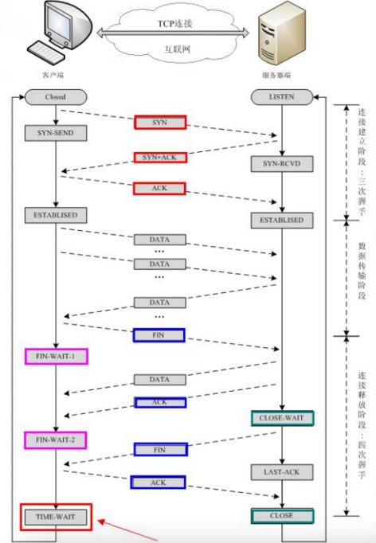 

如果只看连接释放阶段，四次握手

- 客户端先发送FIN，进入FIN_WAIT1状态
- 服务端收到FIN，发送ACK，进入CLOSE_WAIT状态，客户端收到这个ACK，进入FIN_WAIT2状态
- 服务端发送FIN，进入LAST_ACK状态
- 客户端收到FIN，发送ACK，进入TIME_WAIT状态，服务端收到ACK，进入CLOSE状态
- 客户端TIME_WAIT持续2倍MSL时长，在linux体系中大概是60s，转换成CLOSE状态

TCP主动断开连接的一方可能是客户端，也可能是服务端。能不能发送完ACK之后不进入TIME_WAIT就直接进入CLOSE状态呢？不行的，这个是为了TCP协议的可靠性，由于网络原因，ACK可能会发送失败，那么这个时候，被动一方会主动重新发送一次FIN，这个时候如果主动方在TIME_WAIT状态，则还会再发送一次ACK，从而保证可靠性。那么从这个解释来说，2MSL的时长设定是可以理解的，MSL是报文最大生存时间，如果重新发送，一个FIN＋一个ACK，再加上不定期的延迟时间，大致是在2MSL的范围。

### 怎么保证一个CPU只有一个线程运行?

### 协程了解过没有？

### 线程共享进程的什么，不共享什么，CPU共享吗？
线程共享的环境包括：进程代码段、进程的公有数据(利用这些共享的数据，线程很容易的实现相互之间的通讯)、进程打开的文件描述符、信号的处理器、进程的当前目录和进程用户ID与进程组ID。

进程拥有这许多共性的同时，还拥有自己的个性。有了这些个性，线程才能实现并发性。这些个性包括：
1. 线程ID
2. 寄存器组的值
3. 线程的栈
4. 错误返回码
5. 线程的信号屏蔽码
6. 线程的优先级

### 多线程同步和互斥方法，内核态下有什么方法?
回答三个：信号、互斥量、条件变量

### 缓冲区溢出是什么？会造成什么危害呢？出现原因是什么？
溢出，在计算机程序中，就是数据使用到了被分配内存空间之外的内存空间。而缓冲区溢出，简单的说就是计算机对接收的输入数据没有进行有效的检测（理想的情况是程序检查数据长度并不允许输入超过缓冲区长度的字符），向缓冲区内填充数据时超过了缓冲区本身的容量，而导致数据溢出到被分配空间之外的内存空间，使得溢出的数据覆盖了其他内存空间的数据。

### 如何查看端口使用情况？
- lsof -i  
- lsof -i：端口号
- netstat -tunlp
- netstat -tunlp|grep 端口号

### 0.0.0.0与127.0.0.1的区别？
严格说来，0.0.0.0已经不是一个真正意义上的IP地址了。它表示的是这样一个集合：所有不清楚的主机和目的网络。这里的“不清楚”是指在本机的路由表里没有特定条目指明如何到达。对本机来说，它就是一个“收容所”，所有不认识的“三无”人员，一律送进去。如果你在网络设置中设置了缺省网关，那么Windows系统会自动产生一个目的地址为0.0.0.0的缺省路由。

127.0.0.1,本机地址，主要用于测试。用汉语表示，就是“我自己”。在Windows系统中，这个地址有一个别名“Localhost”。寻址这样一个地址，是不能把它发到网络接口的。除非出错，否则在传输介质上永远不应该出现目的地址为“127.0.0.1”的数据包。


### Linux的I/O模型介绍以及同步异步阻塞非阻塞的区别?
- 阻塞 I/O（blocking IO）:说明：任何一个系统调用都会产生一个由用户态到内核态切换，再从内核态到用户态切换的过程，而进程上下文切换是通过系统中断程序来实现的，需要保存当前进程的上下文状态，这是一个极其费力的过程。


- 非阻塞 I/O（nonblocking IO）:当我们把套接口设置成非阻塞时，就是由用户进程不停地询问内核某种操作是否准备就绪，这就是我们常说的“轮询”。这同样是一件比较浪费CPU的方式。
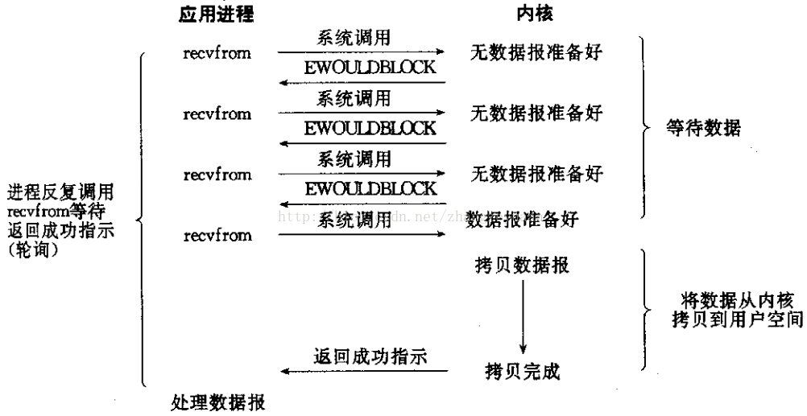

- I/O 多路复用（ IO multiplexing）:有一点不同于阻塞IO的就是，尽管看起来与阻塞IO相比，这里阻塞了两次，但是第一次阻塞在select上时，select可以监控多个套接口上是否已有IO操作准备就绪的，而不是像阻塞IO那种，一次性只能监控一个套接口。


- 信号驱动 I/O（ signal driven IO）:信号驱动IO就是说我们可以通过sigaction系统调用注册一个信号处理程序，然后主程序可以继续向下执行，当我们所监控的套接口有IO操作准备就绪时，由内核通知触发前面注册的信号处理程序执行，然后将我们所需要的数据从内核空间拷贝到用户空间。

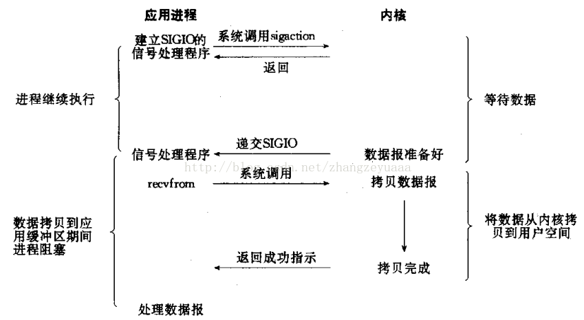

- 异步 I/O（asynchronous IO）:异步IO与信号驱动IO最主要的区别就是信号驱动IO是由内核通知我们何时可以进行IO操作了，而异步IO则是由内核告诉我们IO操作何时完成了。具体来说就是，信号驱动IO当内核通知触发信号处理程序时，信号处理程序还需要阻塞在从内核空间缓冲区拷贝数据到用户空间缓冲区这个阶段，而异步IO直接是在第二个阶段完成后内核直接通知可以进程后续操作了。


总结：


###  Epoll的ET模式和LT模式（ET的非阻塞）?
- LT(level triggered，水平触发模式)是缺省的工作方式，并且同时支持 block 和 non-block socket。在这种做法中，内核告诉你一个文件描述符是否就绪了，然后你可以对这个就绪的fd进行IO操作。如果你不作任何操作，内核还是会继续通知你的，所以，这种模式编程出错误可能性要小一点。比如内核通知你其中一个fd可以读数据了，你赶紧去读。你还是懒懒散散，不去读这个数据，下一次循环的时候内核发现你还没读刚才的数据，就又通知你赶紧把刚才的数据读了。这种机制可以比较好的保证每个数据用户都处理掉了。

- ET(edge-triggered，边缘触发模式)是高速工作方式，只支持no-block socket。在这种模式下，当描述符从未就绪变为就绪时，内核通过epoll告诉你。然后它会假设你知道文件描述符已经就绪，并且不会再为那个文件描述符发送更多的就绪通知，等到下次有新的数据进来的时候才会再次出发就绪事件。简而言之，就是内核通知过的事情不会再说第二遍，数据错过没读，你自己负责。这种机制确实速度提高了，但是风险相伴而行。

### 硬链接和软链接（符号链接）的区别？
- 硬链接指向了物理硬盘的一个区块，事实上文件系统会维护一个引用计数，只要有文件指向这个区块，它就不会从硬盘上消失。
- 软链接： 保存了其代表的文件的绝对路径，是另外一种文件，在硬盘上有独立的区块，访问时替换自身路径。

ln we.txt hard

ln we.txt -s soft

删除源文件后，之前的硬链接没有丝毫地影响，因为它 inode 所指向的区块由于有一个硬链接在指向它，所以这个区块仍然有效，并且可以访问到。
然而软链接的 inode 所指向的内容实际上是保存了一个绝对路径，当用户访问这个文件时，系统会自动将其替换成其所指的文件路径，然而这个文件已经被删除了，所以自然就会显示无法找到该文件了。


### 海量数据的bitmap使用原理

###  怎么回收线程?
默认的条件下，一个线程结束后，其对应的资源不会被释放，于是，如果在一个程序中，反复建立线程，而线程又默认的退出，则最终线程资源耗尽，进程将不再能建立新的线程。线程是可结合的（joinable），或者是分离的（detached）。一个可结合的线程能够被其他线程收回其资源和杀死；在被其他线程回收之前，它的存储器资源（如栈）是不释放的。相反，一个分离的线程是不能被其他线程回收或杀死的，它的存储器资源在它终止时由系统自动释放。线程回收问题，有2种方式，系统自动释放线程资源，或者由另一个线程释放该线程资源。
- 系统自动释放：如果想在线程结束时，由系统释放线程资源，则需要设置线程属性为detach，是线程分离主线程。pthread_attr_setdetachstate(&a, PTHREAD_CREATE_DETACHED);      //设置线程属性
- 由另一个线程将该资源释放:pthread_join(t)//等待线程t退出，并释放t线程所占用的资源。注意：在默认情况下线程可结合状态的
- 设置线程分离状态的函数为pthread_attr_setdetachstate（pthread_attr_t *attr, int detachstate）。第二个参数可选为PTHREAD_CREATE_DETACHED（分离线程）和 PTHREAD _CREATE_JOINABLE（非分离线程）。
- 这里要注意的一点是，如果设置一个线程为分离线程，而这个线程运行又非常快，它很可能在pthread_create函数返回之前就终止了，它终止以后就可能将线程号和系统资源移交给其他的线程使用，这样调用pthread_create的线程就得到了错误的线程号。要避免这种情况可以采取一定的同步措施，最简单的方法之一是可以在被创建的线程里调用pthread_cond_timewait函数，让这个线程等待一会儿，留出足够的时间让函数pthread_create返回。


### 异常和中断的区别
中断和异常的作用是指示系统中的某个地方发生一些事件, 需要引起处理器(包括正在执行中的程序和任务)的注意. 当中断和异常发生时, 典型的结果是迫使处理器将控制从当前正在执行的程序或任务转移到另一个历程或任务中去. 该例程叫做中断处理程序, 或者异常处理程序. 如果是一个任务, 则发生任务切换.
- 异常是80386在执行指令期间检测到不正常的或非法的条件所引起的。异常与正执行的指令有直接的联系。例如，执行除法指令时，除数等于0、地址越界、虚拟内存缺页。再如，执行指令时发现特权级不正确。当发生这些情况时，指令就不能成功完成。
- 中断是由异步的外部事件引起的，比如设备发出的IO结束中断。包括硬中断和软中断。

### 那在linux中，对于一个已经动态编译后的文件，怎么查找出它用了哪些动态库？ 


### 怎么查询一个文件的最后10行
tail指令

最后 10行 

tail -n 10 a.log

最后 5行

tail -n 5 a.log

最后10行的前5行

tail -n 10 a.log | head -n 5

### 什么是惊群效应？
使用线程池会发生惊群效应。惊群现象就是多进程（多线程）在同时阻塞等待同一个事件的时候（休眠状态），如果等待的这个事件发生，那么他就会唤醒等待的所有进程（或者线程），但是最终却只可能有一个进程（线程）获得这个时间的“控制权”，对该事件进行处理，而其他进程（线程）获取“控制权”失败，只能重新进入休眠状态，这种现象和性能浪费就叫做惊群。

解决惊群问题:Nginx中使用mutex互斥锁解决这个问题，具体措施有使用全局互斥锁，每个子进程在epoll_wait()之前先去申请锁，申请到则继续处理，获取不到则等待，并设置了一个负载均衡的算法（当某一个子进程的任务量达到总设置量的7/8时，则不会再尝试去申请锁）来均衡各个进程的任务量。

惊群效应到底消耗了什么：
1. 系统对用户进程/线程频繁的做无效的调度、上下文切换，系统系能大打折扣。
2. 为了确保只有一个线程得到资源，用户必须对资源操作进行加锁保护，进一步加大了系统开销。


### 计算机网络怎么划分层次的？
OSI七层模型：
- 应用层
- 表示层
- 会话层
- 传输层
- 网络层
- 数据链路层
- 物理层

TCP/IP四层模型：
- 应用层
- 传输层
- 网际层
- 网络接口层

五层模型：
- 应用层
- 传输层(TCP UDP ARQ)
- 网络层(IP ICMP ARP IGMP NAT)
- 数据链路层(PPP）
- 物理层

### 数据链路层的三个基本问题是什么？
封装成帧（帧首部和尾部）、透明传输（字节填充）、差错检测（CRC，不是可靠传输）。

### TCP和UDP在应用层都有哪些应用呢？
- UDP:DNS(53),TFTP(69),RIP,DHCP,SNMP(161)
- TCP:SMTP,TELNET(23),HTTP(80),FTP(21)

### TCP如何实现可靠通信？
停止等待协议和自动重传请求ARQ。即每次发送信息都需要对方确认，如果在指定时间内没收到对方确认，那就重传刚才的数据包。

### TCP如何实现拥塞控制？
慢开始、拥塞避免、快重传、快恢复

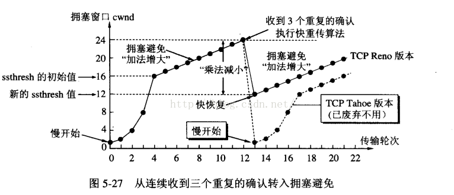 

### 什么是CSMA/CD协议?
这是一个数据链路层上的协议，中文全称为：载波监听多点接入/碰撞检测。它的核心思想是：
1. 发送前先检测信道，信道忙则等待；
2. 边发送边检测信道，争用期内未检测到碰撞，则该帧发送成功，若检测碰撞，则停止发送数据，执行截断二进制指数避让算法等待重传，若重传１６次仍不成功则停止重传向上报错。

### A,B,C,D类地址是怎么划分的？
- 1.0.0.0到126.255.255.255为A类 主要分配给具有大量主机而局域网络数量较少的大型网络
- 128.0.0.0到191.255.255.255为B类 一般用于国际性大公司和政府机构
- 192.0.0.0到223.255.255.255为C类 用于一般小公司 校园网 研究机构等
- 224.0.0.0到239.255.255.255为D类 用于特殊用途. 又称做广播地址
- 240.0.0.0到247.255.255.255为E类. 暂时保留

### 快重传机制是怎么样的？
这是数据丢包的情况下给出的一种修补机制。一般来说，重传发生在超时之后，但是如果发送端接受到3个以上的重复ACK的情况下（上面的图中第二个包丢失了，就收到了两个相同的ack=11），就应该意识到，数据丢了，需要重新传递。这个机制是不需要等到重传定时器溢出的，所以叫做快速重传，它可以避免发送端因等待重传计时器的超时而空闲较长时间，以此增加网络吞吐量。

### 两个进程访问临界区资源，会不会出现都获得自旋锁的情况？

### 怎么唤醒被阻塞的socket线程？

### 怎样确定当前线程是繁忙还是阻塞？

### 就绪状态的进程在等待什么？
等待CPU调度。

### 死循环+来连接时新建线程的方法效率有点低，怎么改进？

### 键盘敲一个A，发生了什么?

### 怎么理解拥塞send和非拥塞send?
写的本质也不是进行发送操作,而是把用户态的数据copy 到系统底层去,然后再由系统进行发送操作,send，write返回成功，只表示数据已经copy 到底层缓冲,而不表示数据已经发出,更不能表示对方端口已经接收到数据.

在阻塞模式下, send函数的过程是将应用程序请求发送的数据拷贝到发送缓存中发送就返回.但由于发送缓存的存在,表现为:如果发送缓存大小比请求发送的大小要大,那么send函数立即返回,同时向网络中发送数据;否则,send会等待接收端对之前发送数据的确认,以便腾出缓存空间容纳新的待发送数据,再返回(接收端协议栈只要将数据收到接收缓存中,就会确认,并不一定要等待应用程序调用recv),如果一直没有空间能容纳待发送的数据,则一直阻塞;

在非阻塞模式下,send函数的过程仅仅是将数据拷贝到协议栈的缓存区而已,如果缓存区可用空间不够,则尽能力的拷贝,立即返回成功拷贝的大小;如缓存区可用空间为0,则返回-1,同时设置errno为EAGAIN.

对于阻塞模式的socket send函数将不返回直到系统缓冲区有足够的空间把你要发送的数据Copy过去以后才返回,而对于非阻塞的socket来说send会立即返回WSAEWOULDDBLOCK告诉调用者说:"发送操作被阻塞了!!!你想办法处理吧..."

1. send/sendto操作

- 在阻塞模式下send操作将会等待所有数据均被拷贝到发送缓冲区后才会返回：如果发送缓冲区可用大小为0或比要发送的数据长度要小，则会阻塞，直到发送缓冲区里的数据被系统发送后，可用缓冲区大小比要发送的数据长度大时，send返回成功，否则一直阻塞等待。由此可知，send返回的发送大小，必然是你参数中的发送长度的大小。

- 在阻塞模式下sendto操作不会被阻塞：UDP没有真正意义上的发送缓冲区，它所做的只是把应用层的缓冲区数据拷贝到下层的协议栈，在此过程中加UDP头，IP头，所以不存在阻塞

- 在非阻塞模式下send操作会立即返回：如果发送缓冲区可用大小为0，则会立即返回EWOULDBLOCK错误，表示无法拷贝任何数据到发送缓冲区；如果发送缓冲区可用大小不为0，但小于发送数据的长度，则拷贝可用大小的数据到缓冲区；由此可知，非阻塞send总是尽自己最大能力往发送缓冲区拷贝尽可能多的数据，所以存在非阻塞send返回的大小比发送数据的长度要小的情况。

- 在非阻塞模式下sendto操作也不会阻塞：大致与阻塞模式下情况一致，不会被阻塞

2. recv/recvfrom操作

- 在阻塞模式下，recv/recvfrom会一直阻塞到接收缓冲区里有一个字节或一个完整的UDP数据报为止，然后再返回:

recv的原型：int recv(SOCKET sd, char *buffer, int len, int flag)，注意到系统并不会等待buffer被填满了再返回，而是一旦有数据被接收到，就立刻返回，因此不要期望实际收到的数据长度就等于len。

- 在非阻塞模式下，recv/recvfrom会立即返回:

如果接收缓冲区，有至少一个字节或UDP数据报，则会返回接收到的数据大小，如果没有，则返回错误EWOULDBLOCK


### 阻塞send怎么写？
```
//拥塞send写法
ssize_t socket_send(int sockfd, const char* buffer, size_t buflen)
{
ssize_t tmp;
size_t total = buflen;
const char *p = buffer;
while(1)
{
    tmp = send(sockfd, p, total, 0);
    if(tmp < 0)
    {
      // 当send收到信号时,可以继续写,但这里返回-1.
      if(errno == EINTR)
        return -1;
      // 当socket是非阻塞时,如返回此错误,表示写缓冲队列已满,
      // 在这里做延时后再重试.
      if(errno == EAGAIN)
      {
        usleep(1000);
        continue;
      }
      return -1;
    }
    if((size_t)tmp == total)
      return buflen;
    total -= tmp;
    p += tmp;
}
```
### 若调用recv时发现用户缓冲区没读完，怎么办？
```
while(rs)
{
buflen = recv(activeevents[i].data.fd, buf, sizeof(buf), 0);
if(buflen < 0)
{
    // 由于是非阻塞的模式,所以当errno为EAGAIN时,表示当前缓冲区已无数据可读
    // 在这里就当作是该次事件已处理处.
    if(errno == EAGAIN)
     break;
    else
     return;
   }
   else if(buflen == 0)
   {
     // 这里表示对端的socket已正常关闭.
   }
   if(buflen == sizeof(buf)
     rs = 1;   // 需要再次读取
   else
     rs = 0;
}

```


### 网络编程中，怎么建立UDP/TCP服务器和客户端？
TCP:

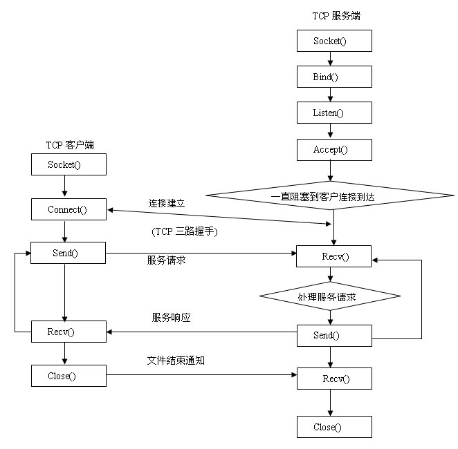

UDP:


### 怎么根据场景选择服务器类型？

### 什么是Linux系统调用？
系统调用就是用户进入内核态然后执行特权指令然后再回到用户态。用户程序只在用户态下运行，有时需要访问系统核心功能，这时通过系统调用接口使用系统调用。常用系统调用有fork、exit、getpid、wait、open、read、write

### 系统调用和普通调用的区别？
系统调用本质上是一种过程调用，但它是一种特殊的过程调用，与一般用户程序中的过程调用有明显的区别 。 
- 运行状态不同。
系统调用的调用过程和被调用过程运行在不同的状态，而普通的过程调用一般运行在相同的状态。 
- 调用方法不同。
系统调用必须通过软中断机制首先进入系统核心，然后才能转向相应的命令处理程序。普通过程调用可以直接由调用过程转向被调用过程。 
- 返回问题。
在采用抢先式调度的系统中，当系统调用返回时，要重新进行调度分析――是否有更高优先级的任务就绪。普通的过程调用直接返回调用过程继续执行。 

### Linux查看一个100G的文件该用什么命令?

### Linux用户态占用过高怎么排查?
top 命令，回车，按下shift+p，按照cpu利用率排序，找到对应的进程，第一列是pid，拿到pid后，执行 ps -ef|grep pid 可以看到是哪个程序在跑。找到有关联的文件，kill -9 pid，rm 删除关联文件，查看crontab是否有被改动。

###  cat的原理?

### DNS解析过程?

### 进程有哪些状态？
- 运行状态
- 就绪状态
- 等待状态
- 创建状态
- 结束状态

前三个是三种最基本的状态。

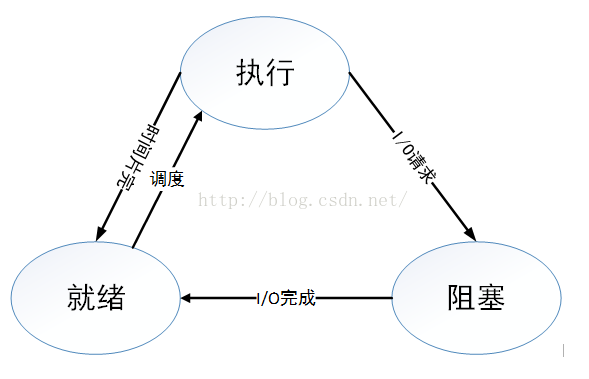

就绪状态和等待状态的区别在于：就绪状态是缺少cpu而不能执行，而等待状态又叫拥塞状态，该状态表明进程缺少的是除cpu外的其他资源（事件或资源）。

### 为什么要引入线程？
为了减小程序在并发执行时所付出的时空开销，提高操作系统的并发性能。线程，是被系统调度和分配的基本单位。

### 线程与进程的区别？
- 调度。
- 拥有资源。
- 并发性。
- 系统开销。
- 地址空间和其他资源。
- 通信方式。

### 调度算法有哪些？
- 先来先服务（FCFS）调度算法：对长作业有利，对短作业不利，有利于CPU繁忙型作业，不利于IO繁忙型作业。
- 短作业优先（SJF）：平均等待时间、平均周转时间最小，对长作业不利（饥饿），没考虑作业的紧迫程度，不合理。
- 优先级调度算法。
- 高响应比优先调度算法：响应比=（等待时间+要求服务时间）/要求服务时间
- 时间片轮转调度算法(Round Robin)

### 怎么理解局部性原理？
- 时间局部性（Temporal Locality）：如果一个信息项正在被访问，那么在近期它很可能还会被再次访问。
程序循环、堆栈等是产生时间局部性的原因。
- 空间局部性（Spatial Locality）：在最近的将来将用到的信息很可能与现在正在使用的信息在空间地址上是临近的。这是因为数据一般以向量、数组等形式簇聚存储。


### 怎么理解虚拟内存？
虚拟内存使用了外存的空间来扩充内存空间，通过一定的换入换出，使得整个系统在逻辑上能够使用一个远远超出其物理内存的大小的内存容量。虚拟内存的大小<=16G(64位计算机)

### 虚拟地址，逻辑地址，物理地址有什么区别？
- 虚拟地址是由程序产生的由段选择符和段内偏移地址组成的地址。这两部分组成的地址并没有直接访问物理内存，而是要通过分段地址的变换处理后才会对应到相应的物理内存地址。
- 逻辑地址指由程序产生的段内偏移地址。有时把逻辑地址当成虚拟地址，两者并没有明确的界限。
- 物理地址是指现在 CPU 外部地址总线上的寻址物理内存的地址信号，是地址变换的最终结果。

物理内存和虚拟内存关系：物理内存和虚拟内存对应。除OS外任何程序都不会直接访问物理内存而是访问虚拟内存。可把虚拟内存等同于物理内存。以后就只说内存，不再区分物理内存和虚拟内存。

虚拟地址空间和物理地址空间对应：虚拟地址空间指的是进程的可用地址空间范围。而物理地址空间指的是实际可用的内存空间范围。

### 虚拟内存中页面置换算法有哪些？
- OPT:选择以后不用的页面
- FIFO：选择最先装入的页面，会发生Belady异常，即分配的物理块数增大而页故障数不减反增。
- LRU：选择最近最久未用的页面
- CLOCK/NRU：选择最近未用的页面，循环缓冲区，指针循环访问页，访问就设该页的标记位为0，若缺页需要替换时，就对指针遇到的第一个0的页替换。如果页被使用，页的标记位自动设为1.
- 改进型CLOCK：考虑页面修改问题
- LFU（Least Frequently Used）最近最少使用算法。RU的淘汰规则是基于访问时间，而LFU是基于访问次数的。
- 随机替换

地址翻译：TLB->页表（TLB未命中）->Cache->主存(cache未命中)->外存(缺页)

### 怎么理解页面置换过程中的抖动现象？
抖动现象就是刚刚换出的页面又要换入内存，刚刚换入内存的页面又要换出内存。发生抖动现象的原因是：某个进程频繁访问的页面数目高于可用的物理页帧数目。


### Unix Domain Socket是干什么用的？

socket API原本是为网络通讯设计的，但后来在socket的框架上发展出一种IPC机制，就是UNIX Domain Socket。虽然网络socket也可用于同一台主机的进程间通讯（通过loopback地址127.0.0.1），但是UNIX Domain Socket用于IPC更有效率：不需要经过网络协议栈，不需要打包拆包、计算校验和、维护序号和应答等，只是将应用层数据从一个进程拷贝到另一个进程。这是因为，IPC机制本质上是可靠的通讯，而网络协议是为不可靠的通讯设计的。UNIX Domain Socket也提供面向流和面向数据包两种API接口，类似于TCP和UDP，但是面向消息的UNIX Domain Socket也是可靠的，消息既不会丢失也不会顺序错乱。

Unix domain socket 使用系统文件的地址来作为自己的身份。它可以被系统进程引用。所以两个进程可以同时打开一个Unix domain sockets来进行通信。不过这种通信方式是发生在系统内核里而不会在网络里传播。

UNIX Domain Socket是全双工的，API接口语义丰富，相比其它IPC机制有明显的优越性，目前已成为使用最广泛的IPC机制，比如X Window服务器和GUI程序之间就是通过UNIXDomain Socket通讯的

如果熟悉Socket的话,UDS也是同样的方式, 区别如下:

1. UDS不需要IP和Port, 而是通过一个文件名来表示
2. domain 为 AF_UNIX
3. UDS中使用sockaddr_un表示

```
//API定义是一样的，不过这里的第一个参数，也就是域一定要设置成AF_UNIX或AF_LOCAL，而不是普通TCP/IP套接字的AF_INET。
Socket(AF_UNIX, SOCK_STREAM, 0);

//结构体中的第一个字段必须要设置成“AF_UNIX”。而第二个字段，表示的是一个路径名。因此，要将一个Unix域套接字绑定到一个本地地址上(一个文件路径)，需要创建并初始化一//个sockaddr_un结构体，并将指向这个结构体的指针作为addr参数（需要类型转换）传入bind()函数，并将addrlen参数设置成这个结构体的实际大小。
struct sockaddr_un {  
sa_family_t sun_family;  
char sun_path[108];  
}  
```
### raw socket有什么用？
raw socket的用途：主要有三个方面

1. 通过raw socket来接收发向本机的ICMP,IGMP协议包,或者用来发送这些协议包.
2. 接收发向本机但TCP/IP栈不能够处理的IP包：现在许多操作系统在实现网络部分的时候,通常只实现了常用的几种协议,如tcp,udp,icmp等,但象其它的如ospf,ggp等协议,操作系统往往没有实现,如果自己有必要编写位于其上的应用,就必须借助raw socket来实现,这是因为操作系统遇到自己不能够处理的数据包(ip头中的protocol所指定的上层协议不能处理)就将这个包交给协议对应的raw socket.
3. 用来发送一些自己制定源地址等特殊作用的IP包(自己写IP头,TCP头等等)，因为内核不能识别的协议、格式等将传给原始套接字，因此，可以使用原始套接字定义用户自己的协议格式

```
//网络层socket - 网络层 raw socket
//建立方式如下:

socket(AF_INET, SOCK_RAW, IPPROTO_UDP );//三层socket,第三个参数可以是UDP,TCP或者ICMP 
sock = socket(PF_PACKET, SOCK_RAW, htons(ETH_P_IP));//二层socket,第三个参数可以为ETH_P_ALL ETH_P_IP ETH_P_ARP等
```
### git的常用指令有哪些？
```
git init //建立一个仓库
git init newrepo  //使用我们指定目录作为Git仓库
git add filename //使用add命令添加文件
git commit -m "Adding files"  //提交版本
git clone ssh://example.com/~/www/project.git  //从服务器克隆一个库并上传
git push ssh://example.com/~/www/project.git //修改之后可以进行推送到服务器
git pull //当前分支自动与唯一一个追踪分支进行合并
git rm file //从资源库中删除文件
git branch test //要创建一个新的分支
git checkout test  //branch命令不会将我们带入分支，只是创建一个新分支。所以我们使用checkout命令来更改分支。
git checkout master //对其他分支的更改不会反映在主分支上。如果想将更改提交到主分支，则需切换回master分支，然后使用合并。
git merge test
git branch -d test  //删除分支，我们使用-d标识

//本地分支版本回退的方法
git reflog  //先用下面命令找到要回退的版本的commit id
git reset --hard Obfafd  //接着回退版本
//自己的远程分支版本回退的方法
首先要回退本地分支,紧接着强制推送到远程分支：
git reflog
git reset --hard Obfafd
git push -f
```
### 在编程角度解释死锁的出现和解决？
死锁场景：假如线程 “A”获得了刀，而线程“B”获得了叉。线程“A”就会进入阻塞状态来等待获得叉，而线程“B”则阻塞来等待“A”所拥有的刀。

两大解决办法打破上述3种情况同时出现的：
1. 加锁顺序。避免同一时刻持有两把锁，在可能的情况下改为先持有A，释放后再申请B。如果上述情况无法避免，确保会被同时持有的锁的申请顺序和释放顺序在任何地方都一致。因此避免死锁的一个通用的经验法则是:当几个线程都要访问共享资源A、B、C时，保证使每个线程都按照同样的顺序去访问它们，比如都先访问A，在访问B和C。 
2. 加锁时限。允许出现死锁，当检测到死锁后触发解锁机制：例如申请到A后，再申请B，500ms后发现申请失败，回头去释放A，解除死锁。
3. 避免使用锁，有多种手段可以使用：Lock-free无锁数据结构，消息队列，管道等等。

### 为什么要使用线程池呢？
简单来说就是线程本身存在开销，我们利用多线程来进行任务处理，单线程也不能滥用，无止禁的开新线程会给系统产生大量消耗，而线程本来就是可重用的资源，不需要每次使用时都进行初始化，因此可以采用有限的线程个数处理无限的任务。

### 线程的joinable和detached有什么区别呢？
在任何一个时间点上，线程是可结合的（joinable），或者是分离的（detached）。一个可结合的线程能够被其他线程收回其资源和杀死；在被其他线程回收之前，它的存储器资源（如栈）是不释放的。相反，一个分离的线程是不能被其他线程回收或杀死的，它的存储器资源在它终止时由系统自动释放。

### NAT工作原理?
借助于NAT，私有（保留）地址的"内部"网络通过路由器发送数据包时，私有地址被转换成合法的IP地址，一个局域网只需使用少量IP地址（甚至是1个）即可实现私有地址网络内所有计算机与Internet的通信需求。


### 什么是操作系统的“原子操作”?
原子操作是不可分割的，在执行完毕不会被任何其它任务或事件中断，分为两种情况（两种都应该满足）

1. 在单线程中， 能够在单条指令中完成的操作都可以认为是" 原子操作"，因为中断只能发生于指令之间。
2. 在多线程中，不能被其它进程（线程）打断的操作就叫原子操作。

 为什么关注原子操作?如果确定某个操作是原子的, 就不用为了去保护这个操作而加上会耗费昂贵性能开销的锁.巧妙的利用原子操作和实现无锁编程)

### i++是否原子操作？并解释为什么？
原子操作可以是一个步骤，也可以是多个操作步骤，但是其顺序不可以被打乱，也不可以被切割而只执行其中的一部分。
将整个操作视作一个整体是原子性的核心特征。

i++分为三个阶段：
1. 内存到寄存器
2. 寄存器自增
3. 写回内存
这三个阶段中间都可以被中断分离开.

### 如何避免内存碎片？
- 少用动态内存分配的函数(尽量使用栈空间)
- 分配内存和释放的内存尽量在同一个函数中
- 尽量一次性申请较大的内存，而不要反复申请小内存
- 尽可能申请大块的 2 的指数幂大小的内存空间
- 外部碎片避免——伙伴系统算法
- 内部碎片避免——slab 算法
- 自己进行内存管理工作，设计内存池

### Linux的分页机制是怎么样的？
内存地址——分页机制（32 位）
- 分页机制是在分段机制之后进行的，它进一步将线性地址转换为物理地址
- 10 位页目录，10 位页表项， 12 位页偏移地址
- 单页的大小为 4KB


### 怎么理解Linux内存管理的伙伴算法？
Linux内核通过伙伴算法来管理物理内存。伙伴系统（Buddy System）在理论上是非常简单的内存分配算法。它的用途主要是尽可能减少外部碎片，同时允许快速分配与回收物理页面。为了减少外部碎片，连续的空闲页面，根据空闲块（由连续的空闲页面组成）大小，组织成不同的链表（或者orders）。这样所有的2个页面大小的空闲块在一个链表中，4个页面大小的空闲块在另外一个链表中，以此类推。

1. 申请算法
- 申请 2^i 个页块存储空间，如果 2^i 对应的块链表有空闲页块，则分配给应用
- 如果没有空闲页块，则查找 2^(i+1) 对应的块链表是否有空闲页块，如果有，则分配 2^i 块链表节点给应用，另外 2^i 块链表节点插入到 2^i 对应的块链表中
- 如果 2^(i+1) 块链表中没有空闲页块，则重复步骤 2，直到找到有空闲页块的块链表
- 如果仍然没有，则返回内存分配失败

2. 回收算法
- 释放 2^i 个页块存储空间，查找 2^i 个页块对应的块链表，是否有与其物理地址是连续的页块，如果没有，则无需合并


### 怎么理解多级分页？虚拟地址怎么映射到物理地址的？
为避免始终在内存中保存庞大的页表，许多计算机采取了多级页表，比如一个32位计算机，32位的虚拟地址被划分为10位的PT1、10位PT2和12位的offset域。因为偏移量是12位，所以页面大小为4KB，共2的20次方个页面。避免把全部页表一直保存在内存中是多级页表的关键所在。比如一个需要12MB的进程，底端是4MB的程序正文，后面是4MB数据，顶端是4MB的堆栈。

左边是顶级页表，具有1024个表项，对应于10位的PT1域。当一个虚拟地址被送进MMU时，MMU首先提取PT1域并把该值作为访问顶级页表的索引。因为整个4GB的虚拟空间地址已经被分为1024字节的块，所以这1024个表项中的每一个都表示4MB的虚拟地址空间。PT2域作为访问选定的二级页表的索引（10位，同样表示1024个页面），以便找到该虚拟页面的页帧号。最后页帧号+偏移量量=物理地址。

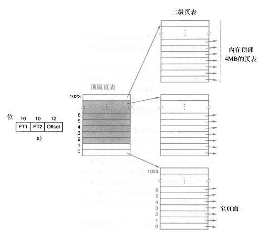


每个页表都有其页表项，里面记录了一些跟页表相关的信息，比如：页框号，访问位，修改位等。

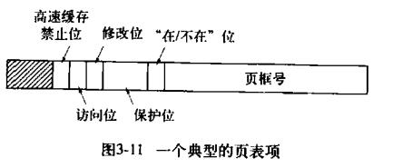

### 怎么理解TLB？

### Linux的.a、.so和.o文件分别代表什么？
- .o,是目标文件,相当于windows中的.obj文件 
- .so 为共享库,是shared object,用于动态连接的,相当于windows下的dll 
- .a为静态库,是好多个.o合在一起,用于静态连接 

### Linux下的打包压缩怎么做？
打包是指将一大堆文件或目录变成一个总的文件；压缩则是将一个大的文件通过一些压缩算法变成一个小文件。

- 解包：tar xvf FileName.tar
- 打包：tar cvf FileName.tar DirName
- 解压1：gunzip FileName.gz
- 解压2：gzip -d FileName.gz
- 解压：tar zxvf FileName.tar.gz
- 压缩：tar zcvf FileName.tar.gz DirName
- 解压：unzip FileName.zip
- 压缩：zip FileName.zip DirName
- 解压：rar x FileName.rar
- 压缩：rar a FileName.rar DirName 


### 缓存穿透、缓存击穿、缓存雪崩的区别？
- 缓存穿透:指的是请求不存在的数据，从而使得缓存形同虚设，缓存层被穿透了。例如我们请求一个 UserID 为 -1 的用户数据，因为该用户不存在，所以该请求每次都会去读取数据库。在这种情况下，如果某些心怀不轨的人利用这个存在的漏洞去伪造大量的请求，那么很可能导致DB承受不了那么大的流量就挂掉了。

解决：
     1. 采用布隆过滤器，使用一个足够大的bitmap，用于存储可能访问的key，不存在的key直接被过滤；
     2. 访问key未在DB查询到值，也将空值写进缓存，但可以设置较短过期时间。

- 缓存击穿:指的是并发量很高的 KEY，在该 KEY 失效的瞬间有很多请求同同时去请求数据库，更新缓存。例如我们有一个业务 KEY，该 KEY 的并发请求量为 10000。当该 KEY 失效的时候，就会有 1 万个线程会去请求数据库更新缓存。这个时候如果没有采取适当的措施，那么数据库很可能崩溃。

解决：
  1. 采用 L1 (一级缓存)和 L2(二级缓存) 缓存方式，L1 缓存失效时间短，L2 缓存失效时间长。 请求优先从 L1 缓存获取数据，如果 L1缓存未命中则加锁，只有 1 个线程获取到锁,这个线程再从数据库中读取数据并将数据再更新到到 L1 缓存和 L2 缓存中，而其他线程依旧从 L2 缓存获取数据并返回。
  2. 加锁控制读写，双重判断
  ```
  
        // 从缓存读取数据
        result = getDataFromCache();
        if (result.isEmpty()) {
            synchronized (lock) {
            //双重判断,第二个以及之后的请求不必去找数据库,直接命中缓存
                // 查询缓存
                result = getDataFromCache();
                if (result.isEmpty()) {
                    // 从数据库查询数据
                    result = getDataFromDB();
                    // 将查询到的数据写入缓存
                    setDataToCache(result);
                }
            }

  ```

- 缓存雪崩:则是指缓存在同一时间同时过期，就像所有雪块同一时刻掉下来，像雪崩一样。例如我们有 1000 个KEY，而每个 KEY 的并发请求不大，只有 10 次。而缓存雪崩指的就是这 1000 个 KEY 在同一时间，同时失效，这个时候就突然有 1000 ** 10 = 一万次查询。

解决：
    1. 可以给缓存设置过期时间时加上一个随机值时间，使得每个key的过期时间分布开来，不会集中在同一时刻失效。

「缓存穿透」是业务层面的漏洞导致非法请求，与请求量、缓存失效没关系。「缓存击穿」则只会出现在热点数据上，发生在缓存失效的瞬间，与业务没多大关系。「缓存雪崩」则是因为多个 KEY 同时失效，导致数据库请求太多。非热点数据也会导致缓存雪崩，只要同时失效的 KEY 足够多。

### TCP为什么要三次握手而结束要四次？
举个打电话的例子：

　　A : 你好我是A，你听得到我在说话吗

　　B : 听到了，我是B，你听到我在说话吗

　　A : 嗯，听到了

　　建立连接，开始聊天！

以上的例子中如果B得不到A的回应，B又怎么知道A能听到B说话呢？

先看2次握手的情况：客户端给服务器发送建立连接的请求，服务器同意连接请求发回应给客户端，连接就此建立。

有问题的就是网络中经常会出现的包的延迟，如果客户端的某个包在路由器上延迟了，过了很久才发给服务器，服务器收到这个包后回应给客户端，服务器以为连接就此建立成功，分配资源，这样就会出现问题。那万一服务器回客户端的信息在传输过程丢失了呢？如果没有客户端的回应，服务器没法确认服务器到客户端这个方向的通信是可用的。

什么不是四次握手？其实3次握手已经是能够使双方知道对方设备都是好用的最少次数。四次握手会浪费资源。

为什么TCP协议终止链接要四次？

1、当主机A确认发送完数据且知道B已经接受完了，想要关闭发送数据口（当然确认信号还是可以发），就会发FIN给主机B。

2、主机B收到A发送的FIN，表示收到了，就会发送ACK回复。

3、但这是B可能还在发送数据，没有想要关闭数据口的意思，所以FIN与ACK不是同时发送的，而是等到B数据发送完了，才会发送FIN给主机A。

4、A收到B发来的FIN，知道B的数据也发送完了，回复ACK， A等待2MSL以后，没有收到B传来的任何消息，知道B已经收到自己的ACK了，A就关闭链接，B也关闭链接了

### TCP长连接和短连接的区别？
所谓长连接指建立SOCKET连接后不管是否使用都保持连接，但安全性较差；节省了TCP建立连接释放连接的时间耗费

所谓短连接指建立SOCKET连接后发送后接收完数据后马上断开连接，不用维护众多不用的连接

### redis有哪些持久化策略，他们之间的区别是什么？
Redis 提供了多种不同级别的持久化方式：
1. RDB 持久化可以在指定的时间间隔内生成数据集的时间点快照（point-in-time snapshot）。
2. AOF 持久化记录服务器执行的所有写操作命令，并在服务器启动时，通过重新执行这些命令来还原数据集。 AOF 文件中的命令全部以 Redis 协议的格式来保存，新命令会被追加到文件的末尾。 Redis 还可以在后台对 AOF 文件进行重写（rewrite），使得 AOF 文件的体积不会超出保存数据集状态所需的实际大小。
3. Redis 还可以同时使用 AOF 持久化和 RDB 持久化。 在这种情况下， 当 Redis 重启时， 它会优先使用 AOF 文件来还原数据集， 因为 AOF 文件保存的数据集通常比 RDB 文件所保存的数据集更完整。

RDB优点：
- RDB 是一个非常紧凑（compact）的文件，它保存了 Redis 在某个时间点上的数据集。 这种文件非常适合用于进行备份： 比如说，你可以在最近的 24 小时内，每小时备份一次 RDB 文件，并且在每个月的每一天，也备份一个 RDB 文件。 这样的话，即使遇上问题，也可以随时将数据集还原到不同的版本。
- RDB 非常适用于灾难恢复（disaster recovery）：它只有一个文件，并且内容都非常紧凑，可以（在加密后）将它传送到别的数据中心，或者亚马逊 S3 中。
- RDB 可以最大化 Redis 的性能：父进程在保存 RDB 文件时唯一要做的就是 fork 出一个子进程，然后这个子进程就会处理接下来的所有保存工作，父进程无须执行任何磁盘 I/O 操作。
- RDB 在恢复大数据集时的速度比 AOF 的恢复速度要快。

RDB缺点；
- 如果你需要尽量避免在服务器故障时丢失数据，那么 RDB 不适合你。 虽然 Redis 允许你设置不同的保存点（save point）来控制保存 RDB 文件的频率， 但是， 因为RDB 文件需要保存整个数据集的状态， 所以它并不是一个轻松的操作。 因此你可能会至少 5 分钟才保存一次 RDB 文件。 在这种情况下， 一旦发生故障停机， 你就可能会丢失好几分钟的数据。
- 每次保存 RDB 的时候，Redis 都要 fork() 出一个子进程，并由子进程来进行实际的持久化工作。 在数据集比较庞大时， fork() 可能会非常耗时，造成服务器在某某毫秒内停止处理客户端； 如果数据集非常巨大，并且 CPU 时间非常紧张的话，那么这种停止时间甚至可能会长达整整一秒。 虽然 AOF 重写也需要进行 fork() ，但无论 AOF 重写的执行间隔有多长，数据的耐久性都不会有任何损失。


AOF优点
- 使用 AOF 持久化会让 Redis 变得非常耐久（much more durable）：你可以设置不同的 fsync 策略，比如无 fsync ，每秒钟一次 fsync ，或者每次执行写入命令时 fsync 。 AOF 的默认策略为每秒钟 fsync 一次，在这种配置下，Redis 仍然可以保持良好的性能，并且就算发生故障停机，也最多只会丢失一秒钟的数据（ fsync 会在后台线程执行，所以主线程可以继续努力地处理命令请求）。
- AOF 文件是一个只进行追加操作的日志文件（append only log）， 因此对 AOF 文件的写入不需要进行 seek ， 即使日志因为某些原因而包含了未写入完整的命令（比如写入时磁盘已满，写入中途停机，等等）， redis-check-aof 工具也可以轻易地修复这种问题。- 
- Redis 可以在 AOF 文件体积变得过大时，自动地在后台对 AOF 进行重写： 重写后的新 AOF 文件包含了恢复当前数据集所需的最小命令集合。 整个重写操作是绝对安全的，因为 Redis 在创建新 AOF 文件的过程中，会继续将命令追加到现有的 AOF 文件里面，即使重写过程中发生停机，现有的 AOF 文件也不会丢失。 而一旦新 AOF 文件创建完毕，Redis 就会从旧 AOF 文件切换到新 AOF 文件，并开始对新 AOF 文件进行追加操作。

AOF缺点：
- 对于相同的数据集来说，AOF 文件的体积通常要大于 RDB 文件的体积。
- 根据所使用的 fsync 策略，AOF 的速度可能会慢于 RDB 。 在一般情况下， 每秒 fsync 的性能依然非常高， 而关闭 fsync 可以让 AOF 的速度和 RDB 一样快， 即使在高负荷之下也是如此。 不过在处理巨大的写入载入时，RDB 可以提供更有保证的最大延迟时间（latency）。


### TCP为什么会粘包?
TCP为了提高网络的利用率，会使用一个叫做Nagle的算法。该算法是指，发送端即使有要发送的数据，如果很少的话，会延迟发送。如果应用层给TCP传送数据很快的话，就会把两个应用层数据包“粘”在一起，TCP最后只发一个TCP数据包给接收端。

### Redis支持哪些数据结构？
Redis最为常用的数据类型主要有以下：

- String（一般做一些复杂的计数功能的缓存）,底层数据结构是sds，里面包含len-数组所保存的字符串的长度，free-数组未使用的字节。里面还有个柔型数组。
- Hash（这里value存放的是结构化的对象，比如存用户信息），底层实现是ziplist-键短和hashtable-键长
- List（做简单的消息队列的功能）,底层实现是ziplist-键短和linkedlist-键长
- Set（全局去重的功能），底层实现是intset-元素是整数而且元素个数较少和hashtable-元素多
- Sorted set（排行榜应用，取TOP N操作），底层实现是skiplist(为了维持有序)和hashtable(为了O(1)查找)
- pub/sub
- Transactions

### 单线程的redis为什么这么快?
- 纯内存操作
- 单线程操作，避免了频繁的上下文切换
- 采用了非阻塞I/O多路复用机制


### redis的过期策略以及内存淘汰机制？
redis采用的是定期删除+惰性删除策略。

定期删除，redis默认每个100ms检查，是否有过期的key,有过期key则删除。需要说明的是，redis不是每个100ms将所有的key检查一次，而是随机抽取进行检查(如果每隔100ms,全部key进行检查，redis岂不是卡死)。因此，如果只采用定期删除策略，会导致很多key到时间没有删除。
于是，惰性删除派上用场。也就是说在你获取某个key的时候，redis会检查一下，这个key如果设置了过期时间那么是否过期了？如果过期了此时就会删除。

如果定期删除没删除key。然后你也没即时去请求key，也就是说惰性删除也没生效。这样，redis的内存会越来越高。那么就应该采用内存淘汰机制。在redis.conf中有一行配置：
```
# maxmemory-policy volatile-lru
```
该配置就是配内存淘汰策略的

allkeys-lru：当内存不足以容纳新写入数据时，在键空间中，移除最近最少使用的key。推荐使用，目前项目在用这种。

### redis 和 memcahe的区别是哪些？
1. Redis不仅仅支持简单的k/v类型的数据，同时还提供list，set，zset，hash等数据结构的存储。
2. Redis支持master-slave(主-从)模式应用，高可用的cache系统，支持集群服务器之间数据同步。
3. Redis支持数据持久化，可以将内存中的数据保持在磁盘中，重启的时候可以再次加载进行使用。
4. Redis单个value的最大限制是1GB，（k－v），memcached只能保存1MB的数据。（k：250kb v：1mb）


### fork的流程是怎么样的？
fork之后，操作系统会拷贝出一个与父进程完全相同的子进程，这两个进程共享代码段空间，但是数据段是互相独立的，子进程数据空间中的内容是父进程的完整拷贝，指令指针也完全相同，子进程拥有父进程当前运行到的位置（两进程的程序计数器pc值相同，也就是说，子进程是从fork返回处开始执行的）。子进程复制了父进程的task_struct，系统堆栈空间和页面表.调用fork之后，数据、堆、栈有两份，代码仍然为一份但是这个代码段成为两个进程的共享代码段都从fork函数中返回，箭头表示各自的执行处。当父子进程有一个想要修改数据或者堆栈时，两个进程真正分裂。

### fork的写时拷贝是什么原理？
fork函数用于创建子进程，典型的调用一次，返回两次的函数，其中返回子进程的PID和0，其中调用进程返回了子进程的PID，而子进程则返回了0，这是一个比较有意思的函数，但是两个进程的执行顺序是不定的。fork()函数调用完成以后父进程的虚拟存储空间被拷贝给了子进程的虚拟存储空间，因此也就实现了共享文件等操作。但是虚拟的存储空间映射到物理存储空间的过程中采用了写时拷贝技术（具体的操作大小是按着页控制的），该技术主要是将多进程中同样的对象（数据）在物理存储其中只有一个物理存储空间，而当其中的某一个进程试图对该区域进行写操作时，内核就会在物理存储器中开辟一个新的物理页面,将需要写的区域内容复制到新的物理页面中，然后对新的物理页面进行写操作。这时就是实现了对不同进程的操作而不会产生影响其他的进程，同时也节省了很多的物理存储器。

### fork、vfork以及clone的区别？
fork()函数复制时将父进程的所以资源都通过复制数据结构进行了复制，然后传递给子进程，所以fork()函数不带参数；clone()函数则是将部分父进程的资源的数据结构进行复制，复制哪些资源是可选择的，这个可以通过参数设定，所以clone()函数带参数，没有复制的资源可以通过指针共享给子进程。fork()可以看出是完全版的clone()，而clone()克隆的只是fork()的一部分。为了提高系统的效率，后来的Linux设计者又增加了一个系统调用vfork()。vfork()所创建的不是进程而是线程，它所复制的是除了任务结构体和系统堆栈之外的所有资源的数据结构，而任务结构体和系统堆栈是与父进程共用的。

### 从汇编去解释一下引用？


### 假设现在系统中有很多处于TIME_WAIT的连接，这个时候你会怎么做？
有一个socket选项，可以进行地址重用，我们可以可重用这些处于TIME_WAIT状态的连接的地址，没有问题的

### DDos攻击的原理介绍一下？
分布式拒绝服务(DDoS:Distributed Denial of Service)攻击指借助于客户/服务器技术，将多个计算机联合起来作为攻击平台，对一个或多个目标发动DDoS攻击，从而成倍地提高拒绝服务攻击的威力。DdoS的攻击方式有很多种，最基本的DoS攻击就是利用合理的服务请求来占用过多的服务资源，从而使合法用户无法得到服务的响应。单一的DoS攻击一般是采用一对一方式的，当攻击目标CPU速度低、内存小或者网络带宽小等等各项指标不高的性能，它的效果是明显的。随着计算机与网络技术的发展，计算机的处理能力迅速增长，内存大大增加，同时也出现了千兆级别的网络，这使得DoS攻击的困难程度加大了-目标对恶意攻击包的"消化能力"加强了不少。这时候分布式的拒绝服务攻击手段（DDoS）就应运而生了。DDoS就是利用更多的傀儡机（肉鸡）来发起进攻，以比从前更大的规模来进攻受害者。

### 介绍一下迭代器与容器之间的耦合关系？

### 如何用UDP来模拟TCP？
这样就相当于在应用层实现类似TCP的可靠传输和拥塞控制。
可以自己定义报文结构，加上序列号，设置滑动窗口和拥塞窗口的大小，
计算平均RTT时间，来决定重传超时时间等等。


### Send返回值为0的情况？
send 分阻塞和非阻塞模式的！
1. 在阻塞模式下,
 send函数是将应用程序请求发送的数据拷贝到发送缓存中发送并得到接收端的确认后再返回
2. 在非阻塞模式下,
  send函数仅仅是将数据拷贝到协议栈的缓存区而已,如果缓存区可用空间不够,则尽能力的拷贝,返回成功拷贝的大小;如缓存区可用空间为0,则返回-1,同时设置errno为EAGAIN.
但是此时这些数据并不一定马上被传到连接的另一端。如果协议在后续的传送过程中出现网络错误的话，那么下一个Socket函数就会返回SOCKET_ERROR。

拥塞和非拥塞send都是 <0：出错，=0：连接关闭，>0接收到数据大小，特别：返回 值 <0时并且(errno == EINTR || errno == EWOULDBLOCK || errno == EAGAIN)的情况 下认为连接是正常的，继续接收。只是阻塞模式下recv会阻塞着接收数据，非阻塞模式下如果没有数据会返回，不会阻塞着读，因此需要 循环读取


### 浏览器中输入一个URL发生什么，用到哪些协议？

浏览器中输入URL，首先浏览器要将URL解析为IP地址，解析域名就要用到DNS协议，首先主机会查询DNS的缓存，如果没有就给本地DNS发送查询请求。DNS查询分为两种方式，一种是递归查询，一种是迭代查询。如果是迭代查询，本地的DNS服务器，向根域名服务器发送查询请求，根域名服务器告知该域名的一级域名服务器，然后本地服务器给该一级域名服务器发送查询请求，然后依次类推直到查询到该域名的IP地址。DNS服务器是基于UDP的，因此会用到UDP协议。
得到IP地址后，浏览器就要与服务器建立一个http连接。因此要用到http协议，http协议报文格式上面已经提到。http生成一个get请求报文，将该报文传给TCP层处理。如果采用https还会先对http数据进行加密。TCP层如果有需要先将HTTP数据包分片，分片依据路径MTU和MSS。TCP的数据包然后会发送给IP层，用到IP协议。IP层通过路由选路，一跳一跳发送到目的地址。当然在一个网段内的寻址是通过以太网协议实现(也可以是其他物理层协议，比如PPP，SLIP)，以太网协议需要直到目的IP地址的物理地址，有需要ARP协议。

### c++线程中的几种锁？
线程之间的锁有：互斥锁、条件锁、自旋锁、读写锁、递归锁。一般而言，锁的功能越强大，性能就会越低。

首先我们说明互斥锁的工作原理，互斥锁是是一种sleep-waiting的锁。假设线程T1获取互斥锁并且正在core1上运行时，此时线程T2也想要获取互斥锁（pthread_mutex_lock），但是由于T1正在使用互斥锁使得T2被阻塞。当T2处于阻塞状态时，T2被放入到等待队列中去，处理器core2会去处理其他任务而不必一直等待（忙等）。也就是说处理器不会因为线程阻塞而空闲着，它去处理其他事务去了。

而自旋锁就不同了，自旋锁是一种busy-waiting的锁。也就是说，如果T1正在使用自旋锁，而T2也去申请这个自旋锁，此时T2肯定得不到这个自旋锁。与互斥锁相反的是，此时运行T2的处理器core2会一直不断地循环检查锁是否可用（自旋锁请求），直到获取到这个自旋锁为止。

从“自旋锁”的名字也可以看出来，如果一个线程想要获取一个被使用的自旋锁，那么它会一致占用CPU请求这个自旋锁使得CPU不能去做其他的事情，直到获取这个锁为止，这就是“自旋”的含义。

当发生阻塞时，互斥锁可以让CPU去处理其他的任务；而自旋锁让CPU一直不断循环请求获取这个锁。通过两个含义的对比可以我们知道“自旋锁”是比较耗费CPU的

读写锁：计算机中某些数据被多个进程共享，对数据库的操作有两种：一种是读操作，就是从数据库中读取数据不会修改数据库中内容；另一种就是写操作，写操作会修改数据库中存放的数据。因此可以得到我们允许在数据库上同时执行多个“读”操作，但是某一时刻只能在数据库上有一个“写”操作来更新数据。这就是一个简单的读者-写者模型。读写锁比mutex有更高的适用性，可以多个线程同时占用读模式的读写锁，但是只能一个线程占用写模式的读写锁。

　　1）当读写锁是写加锁状态时, 在这个锁被解锁之前, 所有试图对这个锁加锁的线程都会被阻塞.

　　2）当读写锁在读加锁状态时, 所有试图以读模式对它进行加锁的线程都可以得到访问权，但是以写模式对它进行枷锁的线程将阻塞；

　　3）当读写锁在读模式锁状态时, 如果有另外线程试图以写模式加锁, 读写锁通常会阻塞随后的读模式锁请求, 这样可以避免读模式锁长期占用, 而等待的写模式锁请求长期阻塞;

　　这种锁适用对数据结构进行读的次数比写的次数多的情况。
  
### 什么是乐观锁、悲观锁？
 悲观锁(Pessimistic Lock), 顾名思义，就是很悲观，每次去拿数据的时候都认为别人会修改，所以每次在拿数据的时候都会上锁，这样别人想拿这个数据就会block直到它拿到锁。传统的关系型数据库里边就用到了很多这种锁机制，比如行锁，表锁等，读锁，写锁等，都是在做操作之前先上锁。它指的是对数据被外界（包括本系统当前的其他事务，以及来自外部系统的事务处理）修改持保守态度，因此，在整个数据处理过程中，将数据处于锁定状态。
 
 乐观锁(Optimistic Lock), 顾名思义，就是很乐观，每次去拿数据的时候都认为别人不会修改，所以不会上锁，但是在更新的时候会判断一下在此期间别人有没有去更新这个数据，可以使用版本号等机制。乐观锁适用于多读的应用类型，这样可以提高吞吐量，像数据库如果提供类似于write_condition机制的其实都是提供的乐观锁。更新方式：
 
 version方式：一般是在数据表中加上一个数据版本号version字段，表示数据被修改的次数，当数据被修改时，version值会加一。当线程A要更新数据值时，在读取数据的同时也会读取version值，在提交更新时，若刚才读取到的version值为当前数据库中的version值相等时才更新，否则重试更新操作，直到更新成功。


### DNS解析的过程？

### reactor和proactor的区别是什么？
标准的经典的 Reactor模式:
1. 等待事件 (Reactor 的工作)
2. 发”已经可读”事件发给事先注册的事件处理者或者回调 ( Reactor 要做的)
3. 读数据 (用户代码要做的)
4. 处理数据 (用户代码要做的)

模拟的Proactor模式:
1. 等待事件 (Proactor 的工作)
2. 读数据(看，这里变成成了让 Proactor 做这个事情)
3. 把数据已经准备好的消息给用户处理函数，即事件处理者(Proactor 要做的)
4. 处理数据 (用户代码要做的)


Reactor，即反应堆。Reactor 的一般工作过程是首先在 Reactor 中注册（Reactor）感兴趣事件，并在注册时候指定某个已定义的回调函数（callback）；当客户端发送请求时，在 Reactor 中会触发刚才注册的事件，并调用对应的处理函数。在这一个处理回调函数中，一般会有数据接收、处理、回复请求等操作。使用epoll监听事件就是一个等待的过程，有事件来了之后再“做出反应”，做出的反应动作是在用户空间调用读数据操作，读完之后调用回调函数处理；这个读的过程是在用户空间中调用处理的，耗费的是用户空间的时间，并阻塞着；


从上面 Reactor 模式中，发现服务端数据的接收和发送都占用了用户状态（还有一种内核态），这样服务器的处理操作就在数据的读写上阻塞花费了时间，节省这些时间的办法是借助操作系统的异步读写；异步读写在调用的时候可以传递回调函数或者回送信号，当异步操作完毕，内核会自动调用回调函数或者发送信号。Proactor的IO是系统级实现，是在内核中完成，读的过程中，用户空间的函数可以继续处理，并没有阻塞；读完之后调用相应用户回调函数处理；

Reactor框架中用户定义的操作是在实际操作之前调用的。比如你定义了操作是要向一个SOCKET写数据，那么当该SOCKET可以接收数据的时候，你的操作就会被调用；而Proactor框架中用户定义的操作是在实际操作之后调用的。比如你定义了一个操作要显示从SOCKET中读入的数据，那么当读操作完成以后，你的操作才会被调用。


### 为什么进程切换的开销比线程切换大呢？
进程切换分两步
1. 切换页目录以使用新的地址空间
2. 切换内核栈和硬件上下文。

对于linux来说，线程和进程的最大区别就在于地址空间。
对于线程切换，第1步是不需要做的，第2是进程和线程切换都要做的。

进行进程切换就是从正在运行的进程中收回处理器，然后再使待运行进程来占用处理器。　这里所说的从某个进程收回处理器，实质上就是把进程存放在处理器 的寄存器中的中间数据找个地方存起来，从而把处理器的寄存器腾出来让其他进程使用。那么被中止运行进程的中间数据存在何处好呢？当然这个地方应该是进程的 私有堆栈。 　　

让进程来占用处理器，实质上是把某个进程存放在私有堆栈中寄存器的数据（前一次本进程被中止时的中间数据）再恢复到处理器的寄存器中去，并把待运行进程的断点送入处理器的程序指针PC，于是待运行进程就开始被处理器运行了，也就是这个进程已经占有处理器的使用权了。

进程切换比线程切换开销大是因为进程切换时要切页表，而且往往伴随着页调度，因为进程的数据段代码段要换出去，以便把将要执行的进程的内容换进来。本来进程的内容就是线程的超集。而且线程只需要保存线程的上下文（相关寄存器状态和栈的信息）就好了，动作很小。context switch过高，会导致CPU像个搬运工，频繁在寄存器和运行队列直接奔波  ，更多的时间花在了线程切换，而不是真正工作的线程上。直接的消耗包括CPU寄存器需要保存和加载，系统调度器的代码需要执行。间接消耗在于多核cache之间的共享数据。 

### Linux中Netfilter机制是怎么的？
Netfilter 是Linux内核中进行数据包过滤、连接跟踪、地址转换等的主要实现框架。当我们希望过滤特定的数据包或者需要修改数据包的内容再发送出去，这些动作主要都在netfilter中完成。Netfilter的实质就是定义一系列的hook点（挂钩），每个hook点上可以挂载多个hook函数，hook函数中就实现了我们要对数据包的内容做怎样的修改、以及要将数据包放行还是过滤掉。数据包进入netfilter框架后，实际上就是依次经过所有hook函数的处理，数据包的命运就掌握在这些hook函数的手里。

所有的hook点都放在一个全局的二维数组，每个hook点上的hook函数按照优先级顺序注册到一个链表中，注册的接口为nf_register_hook()。
对于IPv4协议来讲，一共有5个hook点，这5个hook点上注册的hook函数放在下列链表中：
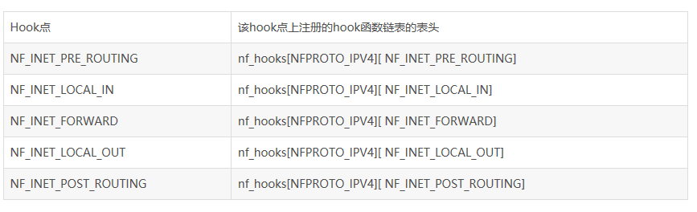

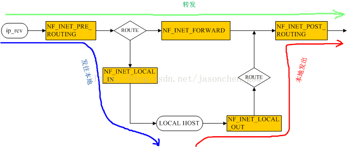

对于发往本地的数据包，会依次经过NF_INET_PRE_ROUTING和NF_INET_LOCAL_IN两个hook点的处理。

对于本地向外发出去的数据包，会依次经过NF_INET_LOCAL_OUT和NF_INET_POST_ROUTING两个hook点的处理。

对于经过本机转发的数据包，会依次经过F_INET_PRE_ROUTING、NF_INET_FORWARD和NF_INET_POST_ROUTING三个hook点的处理。


在每个关键点上，有很多已经按照优先级预先注册了的回调函数(称为“钩子函数”)埋伏在这些关键点，形成了一条链。对于每个到来的数据包会依次被那些回调函数“调戏”一番再视情况是将其放行，丢弃还是怎么滴。但是无论如何，这些回调函数最后必须向Netfilter报告一下该数据包的死活情况，因为毕竟每个数据包都是Netfilter从人家协议栈那儿借调过来给兄弟们Happy的，别个再怎么滴也总得“活要见人，死要见尸”吧。

### 常见的缓存替换算法有哪些？
1. LRU (Least recently used) 最近最少使用，如果数据最近被访问过，那么将来被访问的几率也更高。
2. LFU (Least frequently used) 最不经常使用，如果一个数据在最近一段时间内使用次数很少，那么在将来一段时间内被使用的可能性也很小。
3. FIFO (Fist in first out) 先进先出， 如果一个数据最先进入缓存中，则应该最早淘汰掉。

### 请实现LRU算法
像浏览器的缓存策略、memcached的缓存策略都是使用LRU这个算法，LRU算法会将近期最不会访问的数据淘汰掉。LRU如此流行的原因是实现比较简单，而且对于实际问题也很实用，良好的运行时性能，命中率较高。

实现：
- 新数据插入到链表头部
- 每当缓存命中（即缓存数据被访问），则将数据移到链表头部
- 当链表满的时候，将链表尾部的数据丢弃

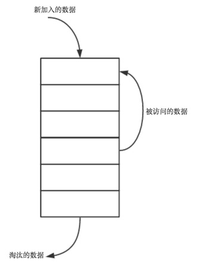

LRU Cache具备的操作：

- set(key,value)：如果key在hashmap中存在，则先重置对应的value值，然后获取对应的节点cur，将cur节点从链表删除，并移动到链表的头部；若果key在hashmap不存在，则新建一个节点，并将节点放到链表的头部。当Cache存满的时候，将链表最后一个节点删除即可。
- get(key)：如果key在hashmap中存在，则把对应的节点放到链表头部，并返回对应的value值；如果不存在，则返回-1。


### fopen文件操作，文本模式跟二进制模式有什么区别，追加模式有什么区别?
- r	以只读方式打开文件，该文件必须存在。
- r+	以读/写方式打开文件，该文件必须存在。
- rb+	以读/写方式打开一个二进制文件，只允许读/写数据。
- rt+	以读/写方式打开一个文本文件，允许读和写。
- w	打开只写文件，若文件存在则长度清为 0，即该文件内容消失，若不存在则创建该文件。
- w+	打开可读/写文件，若文件存在则文件长度清为零，即该文件内容会消失。若文件不存在则建立该文件。
- a	以附加的方式打开只写文件。若文件不存在，则会建立该文件，如果文件存在，写入的数据会被加到文件尾，即文件原先的内容会被保留（EOF 符保留）。
- a+	以附加方式打开可读/写的文件。若文件不存在，则会建立该文件，如果文件存在，则写入的数据会被加到文件尾后，即文件原先的内容会被保留（原来的 EOF 符不保留）。
- wb	以只写方式打开或新建一个二进制文件，只允许写数据。
- wb+	以读/写方式打开或建立一个二进制文件，允许读和写。
- wt+	以读/写方式打开或建立一个文本文件，允许读写。
- at+	以读/写方式打开一个文本文件，允许读或在文本末追加数据。
- ab+	以读/写方式打开一个二进制文件，允许读或在文件末追加数据。


二进制和文本模式的区别：二进制文件和文本文件的不同就是编码层面的不同，二进制文件是值编码，而 ASCII 的文本文件文件是ASCII编码。文本编码可以是定长的（如作为基础的ASCII一个字符总是7位的，Unicode16位），也可以是不定长的（如UTF-8）。而值编码是不定长的（如BMP），它通过一定的读取规则来解释这些字节甚至一个bit就能包含一个信息。

### 常见的磁盘调度算法有哪些？
1. 先来先服务算法（FCFS），
2. 最短寻道时间优先算法（SSTF），
3. 扫描算法（SCAN），
4. 循环扫描算法（CSCAN）

SSTF，最短寻道时间算法。这种算法的本质是利用贪心算法来实现，假设当前磁道在某一位置，接下来处理的是距离当前磁道最近的磁道号，处理完成之后再处理离这个磁道号最近的磁道号，直到所有的磁道号都服务完了程序结束。这样做的优点是性能会优于FIFO算法，但是会产生距离当前磁道较远的磁道号长期得不到服务，也就是“饥饿”现象.

SCAN算法，也就是很形象的电梯调度算法。先按照一个方向(比如从外向内扫描)，扫描的过程中依次访问要求服务的序列。当扫描到最里层的一个服务序列时反向扫描，这里要注意，假设最里层为0号磁道，最里面的一个要求服务的序列是5号，访问完5号之后，就反向了，不需要再往里扫。结合电梯过程更好理解，在电梯往下接人的时候，明知道最下面一层是没有人的，它是不会再往下走的。

CSCAN算法，循环扫描算法，CSCAN算法的思想是，访问完最里面一个要求服务的序列之后，立即回到最外层欲访问磁道。也就是始终保持一个方向。故也称之为单向扫描调度算法。从最里面的一个磁道立即回到最外层欲访问的磁道，这步的距离是两者磁道号差的绝对值。

### 消息队列的作用是什么？
1. 削峰填谷：如果短时间内要处理的业务量大于数据库的服务能力，则可能会卡死数据库；使用MQ可以慢慢处理。
2. 异步化：如果处理的工作非常耗时，则RPC的请求一直halt，对系统性能是个很大影响，发到MQ上，直接继续处理其他请求，则是一个更好的选择。
3. 解耦：系统直接不像是RPC那些直接依赖了，不管有多少系统，都跟MQ打交道即可。
4. 负载均衡：如果一台机器处理消息不够及时，可以多上几台机器做消息消费。

### 进程的内存布局是怎么样的？
内核、栈、动态链接库、堆、静态区、代码段、保留区

1. 内核态内存空间，其大小一般比较固定（可以编译时调整），但 32 位系统和 64 位系统的值不一样。
2. 用户态的堆栈，大小不固定，可以用 ulimit -s 进行调整，默认一般为 8M，从高地址向低地址增长。
3. mmap 区域，进程茫茫内存空间里的主要部分，既可以从高地址到低地址延伸(所谓 flexible layout)，也可以从低到高延伸(所谓 legacy layout)，看进程具体情况【2】【3】。
4. brk 区域，紧邻数据段(甚至贴着)，从低位向高位伸展，但它的大小主要取决于 mmap 如何增长，一般来说，即使是 32 位的进程以传统方式延伸，也有差不多 1 GB 的空间（准确地说是 TASK_SIZE/3 - 代码段数据段，参看 arch/x86/include/asm/processor.h 里的定义)【4】
5. 数据段，主要是进程里初始化和未初始化的全局数据总和，当然还有编译器生成一些辅助数据结构等等)，大小取决于具体进程，其位置紧贴着代码段。
6. 代码段，主要是进程的指令，包括用户代码和编译器生成的辅助代码，其大小取决于具体程序，但起始位置根据 32 位还是 64 位一般固定(-fPIC, -fPIE等除外【5】)。


### PCB的数据结构task_struct里都保存了些什么？
每个进程在内核中都有一个进程控制块(PCB)来维护进程相关的信息,Linux内核的进程控制块是task_struct结构体.

- 标示符 ： 描述本进程的唯⼀标示符，用来区别其他进程。 
- 状态 ： 任务状态，退出代码，退出信号等。 
- 优先级 ： 相对于其他进程的优先级。 
- 程序计数器： 程序中即将被执行的下⼀条指令的地址。 
- 内存指针： 包括程序代码和进程相关数据的指针，还有和其他进程共享的内存块的指针 
- 上下文数据： 进程执行时处理器的寄存器中的数据。 
- I／O状态信息：包括显示的I/O请求,分配给进程的I／O设备和被进程使用的文件列表。 
- 记账信息： 可能包括处理器时间总和，使用的时钟数总和，时间限制，记账号等。

什么是coredump?
正常情况下coredmp包含了程序运行时的内存，寄存器状态，堆栈指针，内存管理信息等。可以理解为把程序工作的当前状态存储成一个文件。许多程序和操作系统出错时会自动生成一个core文件。


### RST什么时候会出现？
什么时候发送RST包
1. 建立连接的SYN到达某端口，但是该端口上没有正在 监听的服务。
2. TCP收到了一个根本不存在的连接上的分节。
3. 请求超时。 使用setsockopt的SO_RCVTIMEO选项设置recv的超时时间。接收数据超时时，会发送RST包。

RST标示复位、用来异常的关闭连接。
1. 发送RST包关闭连接时，不必等缓冲区的包都发出去，直接就丢弃缓冲区中的包，发送RST。
2. 而接收端收到RST包后，也不必发送ACK包来确认。

### 如何做到fork 子进程不继承父进程打开的文件描述符？
使用clone().

系统调用fork()和vfork()是无参数的，而clone()则带有参数。fork()是全部复制，vfork()是共享内存，而clone()是则可以将父进程资源有选择地复制给子进程，而没有复制的数据结构则通过指针的复制让子进程共享，具体要复制哪些资源给子进程，由参数列表中的clone_flags来决定。另外，clone()返回的是子进程的pid。

### 多个进程监听同一个端口可以实现吗？
方式1：通过 fork 创建子进程的方式可以实现，其他情况下不行。

方式二：linux 3.9以上内核支持SO_REUSEPORT选项，即允许多个socket bind/listen在同一个端口上。这样，多个进程就可以各自申请socket监听同一个端口，当数据来时，内核做负载均衡，唤醒监听的其中一个进程处理，用法类似于setsockopt(listener, SOL_SOCKET, SO_REUSEPORT, &option, sizeof(option))

### fork与vfork的区别？
1. vfork保证子进程先运行，在它调用exec或exit之后父进程才可能被调度运行。如果在调用这两个函数之前子进程依赖于父进程的进一步动作，则会导致死锁。

2. fork要拷贝父进程的进程环境；而vfork则不需要完全拷贝父进程的进程环境，在子进程没有调用exec和exit之前，子进程与父进程共享进程环境，相当于线程的概念，此时父进程阻塞等待。


### 快重传机制是怎么样的？
1. 要求接收方每收到一个失序的报文段后就立即发出重复确认而不是等待自己发送数据时才捎带确认
2. 发送方只要一连收到三个重复确认就立即重传对方尚未收到的报文段，而不必等待设置的重传计时器到期
3. 有的快重传实现把开始时的拥塞窗口cwnd设置为ssthresh+3*MSS的字节数值，原因是认为收到三个重复确认后，表明网络中已经有三个分组离开了，证明现在网络中并没有堆积分组，因此适当增大拥塞窗口

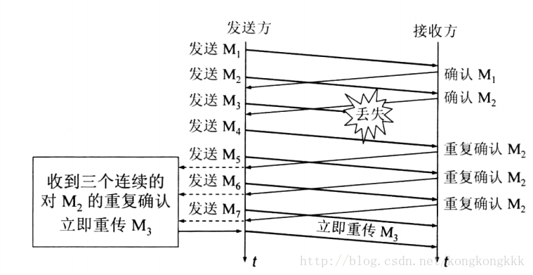
