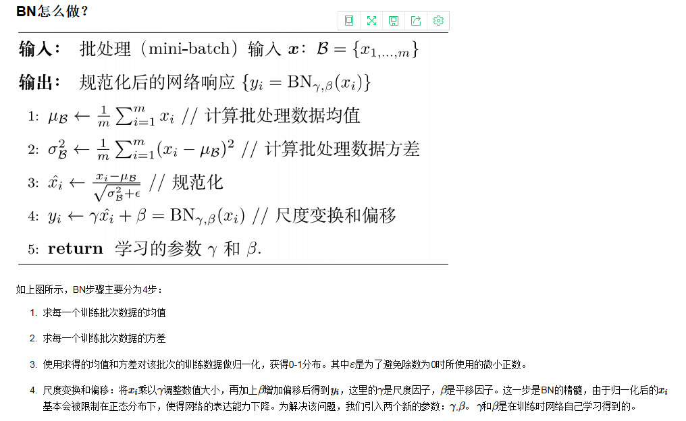

# 数学基础、机器学习、深度学习知识点汇总

## 大数定律和中心极限定理的区别是什么？

大数定律是说，n只要越来越大，我把这n个独立同分布的数加起来去除以n得到的这个样本均值（也是一个随机变量）会依概率收敛到真值u，但是样本均值的分布是怎样的我们不知道。
中心极限定理是说，n只要越来越大，这n个数的样本均值会趋近于正态分布，并且这个正态分布以u为均值，为方差。

中心极限定理指的是样本均值的抽样分布接近于期望为u的正态分布。

大数定理指的是当样本量无穷大时，样本均值接近于总体均值u。

综上所述，这两个定律都是在说样本均值性质。随着n增大，大数定律说样本均值几乎必然等于均值。中心极限定律说，他越来越趋近于正态分布。并且这个正态分布的方差越来越小。

## 线性代数中的特征值和特征向量的本质是什么？
定义里的公式：

左边是用矩阵A将向量做了一个转换，右边是将向量拉伸了倍。说明A有这样一个功能：即对向量变换后，长度拉伸倍，方向不变。需要注意的是：并不是所有的向量都可以被A通过变换拉伸而方向不变。能够被A拉伸且保持方向不变的向量就是A的特征向量，拉伸的倍数就是特征值。

矩阵乘法对应了一个变换，是把任意一个向量变成另一个方向或长度都大多不同的新向量。在这个变换的过程中，原向量主要发生旋转、伸缩的变化。如果矩阵对某一个向量或某些向量只发生伸缩变换，不对这些向量产生旋转的效果，那么这些向量就称为这个矩阵的特征向量，伸缩的比例就是特征值。

## 如何去直观地理解不相关不一定是独立，而独立必然不相关？

不相关的随机变量间不存在线性关系。

相互独立的随机变量间不存在任何关系。

没有线性关系，可以有别的关系，因而不相关不一定独立。

## SVD是怎么计算的？
公式：

1. 先求解，计算机其特征值和特征向量，得到U矩阵（特征向量组成）和特征值
2. 求解，计算机其特征值和特征向量，得到V矩阵（特征向量组成）
3. 根据，求出
4. 

对于奇异值,它跟我们特征分解中的特征值类似，在奇异值矩阵中也是按照从大到小排列，而且奇异值的减少特别的快，在很多情况下，前10%甚至1%的奇异值的和就占了全部的奇异值之和的99%以上的比例。

也就是说，我们也可以用最大的k个的奇异值和对应的左右奇异向量来近似描述矩阵。

由于这个重要的性质，SVD可以用于PCA降维，来做数据压缩和去噪。也可以用于推荐算法，将用户和喜好对应的矩阵做特征分解，进而得到隐含的用户需求来做推荐。同时也可以用于NLP中的算法，比如潜在语义索引（LSI）。

## 偏差（Bias）与方差（Variance）区别是什么？
通常情况下，我们训练出的模型误差指的是偏差和方差的总和，再加上一些不可避免的误差，比如训练数据本身噪音比较大等。

通常导致偏差的主要原因是对问题本身的假设不正确，比如本身训练数据并没有线性关系，但我们还是使用线性回归去训练模型，那么模型的偏差肯定会很大，也就是欠拟合的情况。

通常导致方差的主要原因是因为我们的模型太过复杂，学习到太多的噪音，比如多项式回归，当degree参数非常大的时候，也就是过拟合的情况。

- 左上：模型预测的值基本都在目标值上，并且每次预测的都很集中，说明偏差和方差都很小。
- 左下：模型预测的值虽然每次都很集中，但是整体和目标值差的很远，说明偏差很大，方差比较小。
- 右上：模型预测的值基本都围绕着目标值，但是每次预测的值之间差距较大，说明偏差较小，方差比较大。
- 右下：模型预测的值离目标值都很远，并且每次预测的值之间差距也比较打，说明偏差和方差都很大。

## 三种梯度下降方法（BGD,SGD,MBGD）的区别？
- 　　Batch gradient descent: Use all examples in each iteration；
- 　　Stochastic gradient descent: Use 1 example in each iteration；
- 　　Mini-batch gradient descent: Use b examples in each iteration.

1. 批梯度下降每次更新使用了所有的训练数据，最小化损失函数，如果只有一个极小值，那么批梯度下降是考虑了训练集所有数据，是朝着最小值迭代运动的，但是缺点是如果样本值很大的话，更新速度会很慢。

2. 随机梯度下降在每次更新的时候，只考虑了一个样本点，这样会大大加快训练数据，也恰好是批梯度下降的缺点，但是有可能由于训练数据的噪声点较多，那么每一次利用噪声点进行更新的过程中，就不一定是朝着极小值方向更新，但是由于更新多轮，整体方向还是大致朝着极小值方向更新，又提高了速度。

3. 小批量梯度下降法是为了解决批梯度下降法的训练速度慢，以及随机梯度下降法的准确性综合而来，但是这里注意，不同问题的batch是不一样的

## K-means++较K-means算法改进了哪些？

因为K-means算法中我们很难选对初始值，而初始值选定的好坏又非常影响聚类的最终效果。k-means++就是从初始值选择的角度优化K-means算法。

K-means++算法流程：
1. 先随机选择某个样本点作为初始群蔟中心，然后计算其他各个样本点到改中心点的距离；
2. 根据计算出的这些点到中心点的距离，我们可以根据这些距离的远近设定我们选中该点作为下一个群蔟中心的概率，距离远的点被选中的概率大，距离近的点被选中的概率小，依照这种方式选出第二个群蔟中心。
3. 重复1,2点，知道选出K个聚类中心。
4. 以该K个中心开始K-means聚类算法

## 生成模型和判别模型的区别？
判别模型：判别模型是学得一个分类面（即学得一个模型），该分类面可用来区分不同的数据分别属于哪一类；

生成模型：生成模型是学得各个类别各自的特征（即可看成学得多个模型），可用这些特征数据和要进行分类的数据进行比较，看新数据和学得的模型中哪个最相近，进而确定新数据属于哪一类。

举个例子：若分类目标是对图像中的大象和狗进行分类。判别方法学得一个模型，这个模型可能是判断图中动物鼻子的长度是否大于某一阈值，若大于则判断为大象，否则判断为狗；生成学习则分别构建一个大象的特征模型与狗的特征模型，来了一个新图像后，分别用大象模型与狗模型与其进行比较，若新图像与狗相似度更高则判断为狗，否则判断为大象。

判别模型：有限样本==》判别函数 = 预测模型==》预测

生成模型：无穷样本==》概率密度模型 = 产生模型==》预测

- 生成模型：朴素贝叶斯、隐马尔可夫（em算法）
- 判别模型：k近邻法、感知机、决策树、逻辑回归、线性回归、最大熵模型、支持向量机(SVM)、提升方法、条件随机场（CRF）

对比
1. 生成模型可以还原出联合概率分布（还原数据本身相似度），而判别方法不能；
2. 生成方法的学习收敛速度更快，当样本容量增加的时候，学到的模型可以更快的收敛于真实模型；
3. 当存在隐变量时，仍可以利用生成方法学习，此时判别方法不能用；
4. 判别学习不能反映训练数据本身的特性，但它寻找不同类别之间的最优分类面，反映的是异类数据之间的差异，直接面对预测，往往学习的准确率更高，由于直接学习P(Y|X)或Y=f（X），从而可以简化学习；
5. 简单的说，生成模型是从大量的数据中找规律，属于统计学习；而判别模型只关心不同类型的数据的差别，利用差别来分类

## Batch Normalization的步骤是？

## L1和L2正则化的区别？
L1相比于L2，有所不同：
1. L1减少的是一个常量，L2减少的是权重的固定比例
2. 孰快孰慢取决于权重本身的大小，权重刚大时可能L2快，较小时L1快
3. L1使权重稀疏，L2使权重平滑，一句话总结就是：L1会趋向于产生少量的特征，而其他的特征都是0，而L2会选择更多的特征，这些特征都会接近于0

实践中L2正则化通常优于L1正则化。

## NMS原理？
非极大值抑制顾名思义就是抑制不是极大值的元素，搜索局部的极大值。这个局部代表的是一个邻域，邻域有两个参数可变，一是邻域的维数，二是邻域的大小。这里不讨论通用的NMS算法，而是用于在目标检测中用于提取分数最高的窗口的。例如在行人检测中，滑动窗口经提取特征，经分类器分类识别后，每个窗口都会得到一个分数。但是滑动窗口会导致很多窗口与其他窗口存在包含或者大部分交叉的情况。这时就需要用到NMS来选取那些邻域里分数最高（是行人的概率最大），并且抑制那些分数低的窗口。
1. 将所有框的得分排序，选中最高分及其对应的框
2. 遍历其余的框，如果和当前最高分框的重叠面积(IOU)大于一定阈值，我们就将框删除。
3. 从未处理的框中继续选一个得分最高的，重复上述过程。

## 什么是梯度消失和梯度爆炸？怎么解决？
那么为什么会出现梯度消失的现象呢？因为通常神经网络所用的激活函数是sigmoid函数，这个函数有个特点，就是能将负无穷到正无穷的数映射到0和1之间，并且对这个函数求导的结果是f′(x)=f(x)(1−f(x))f′(x)=f(x)(1−f(x))。因此两个0到1之间的数相乘，得到的结果就会变得很小了。神经网络的反向传播是逐层对函数偏导相乘，因此当神经网络层数非常深的时候，最后一层产生的偏差就因为乘了很多的小于1的数而越来越小，最终就会变为0，从而导致层数比较浅的权重没有更新，这就是梯度消失。

那么什么是梯度爆炸呢？误差梯度是神经网络训练过程中计算的方向和数量，用于以正确的方向和合适的量更新网络权重。 在深层网络或循环神经网络中，误差梯度可在更新中累积，变成非常大的梯度，然后导致网络权重的大幅更新，并因此使网络变得不稳定。在极端情况下，权重的值变得非常大，以至于溢出，导致 NaN 值。 网络层之间的梯度（值大于 1.0）重复相乘导致的指数级增长会产生梯度爆炸。 

解决：Relu,BN,ResNet

## 如何解决过拟合问题？
过拟合（overfitting）是指在模型参数拟合过程中的问题，由于训练数据包含抽样误差，训练时，复杂的模型将抽样误差也考虑在内，将抽样误差也进行了很好的拟合。具体表现就是最终模型在训练集上效果好；在测试集上效果差。模型泛化能力弱。

1. ReLu
2. dropout
3. 数据增广
4. BN（正则化）
5. 多模型融合
6. 限制训练时间（early stopping）

## 什么是ROI Pooling?
感兴趣区域的池化事实上是作为 Fast R-CNN 改进 SPP-NET 的一种方法，在 Fast R-CNN 中，感兴趣的区域是指由 Selective Search得到的候选框在特征图上的映射。作为一个特殊的池化操作，感兴趣区域的池化特点是，输入特征图的尺寸不固定，但输出特征图尺寸固定。 一方面，感兴趣区域的池化层将图片中的 ROI 定位到深层特征图中，避免每个感兴趣区域都重复经过卷积神经网络带来的大量计算；另一方面，可以将特征图下采样为固定大小的特征在传入全连接层，避免了神经网络需要固定大小输出的麻烦。感兴趣区域的池化的具体操作如下：

1. 根据输入图片，将 ROI 映射到特征图对应的位置；
2. 将映射后的区域划分为相同大小的 sections（数量与输出维度相同）；
3. 对每个 section 做最大池化操作
