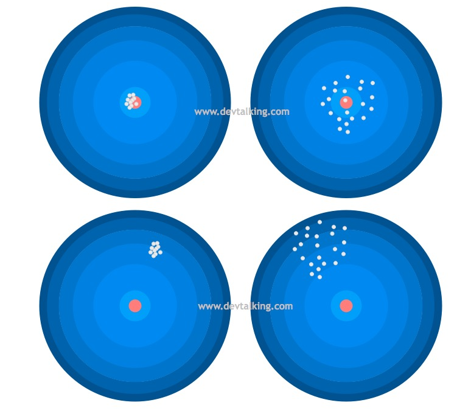

# 数学基础、机器学习、深度学习、计算机视觉知识点汇总

## 大数定律和中心极限定理的区别是什么？

大数定律是说，n只要越来越大，我把这n个独立同分布的数加起来去除以n得到的这个样本均值（也是一个随机变量）会依概率收敛到真值u，但是样本均值的分布是怎样的我们不知道。
中心极限定理是说，n只要越来越大，这n个数的样本均值会趋近于正态分布，并且这个正态分布以u为均值，为方差。

中心极限定理指的是样本均值的抽样分布接近于期望为u的正态分布。

大数定理指的是当样本量无穷大时，样本均值接近于总体均值u。

综上所述，这两个定律都是在说样本均值性质。随着n增大，大数定律说样本均值几乎必然等于均值。中心极限定律说，他越来越趋近于正态分布。并且这个正态分布的方差越来越小。

## 线性代数中的特征值和特征向量的本质是什么？
定义里的公式：

左边是用矩阵A将向量做了一个转换，右边是将向量拉伸了倍。说明A有这样一个功能：即对向量变换后，长度拉伸倍，方向不变。需要注意的是：并不是所有的向量都可以被A通过变换拉伸而方向不变。能够被A拉伸且保持方向不变的向量就是A的特征向量，拉伸的倍数就是特征值。

矩阵乘法对应了一个变换，是把任意一个向量变成另一个方向或长度都大多不同的新向量。在这个变换的过程中，原向量主要发生旋转、伸缩的变化。如果矩阵对某一个向量或某些向量只发生伸缩变换，不对这些向量产生旋转的效果，那么这些向量就称为这个矩阵的特征向量，伸缩的比例就是特征值。

## 如何去直观地理解不相关不一定是独立，而独立必然不相关？

不相关的随机变量间不存在线性关系。

相互独立的随机变量间不存在任何关系。

没有线性关系，可以有别的关系，因而不相关不一定独立。

## SVD是怎么计算的？
公式：

1. 先求解，计算机其特征值和特征向量，得到U矩阵（特征向量组成）和特征值
2. 求解，计算机其特征值和特征向量，得到V矩阵（特征向量组成）
3. 根据，求出
4. 

对于奇异值,它跟我们特征分解中的特征值类似，在奇异值矩阵中也是按照从大到小排列，而且奇异值的减少特别的快，在很多情况下，前10%甚至1%的奇异值的和就占了全部的奇异值之和的99%以上的比例。

也就是说，我们也可以用最大的k个的奇异值和对应的左右奇异向量来近似描述矩阵。

由于这个重要的性质，SVD可以用于PCA降维，来做数据压缩和去噪。也可以用于推荐算法，将用户和喜好对应的矩阵做特征分解，进而得到隐含的用户需求来做推荐。同时也可以用于NLP中的算法，比如潜在语义索引（LSI）。

## 偏差（Bias）与方差（Variance）区别是什么？
通常情况下，我们训练出的模型误差指的是偏差和方差的总和，再加上一些不可避免的误差，比如训练数据本身噪音比较大等。

通常导致偏差的主要原因是对问题本身的假设不正确，比如本身训练数据并没有线性关系，但我们还是使用线性回归去训练模型，那么模型的偏差肯定会很大，也就是欠拟合的情况。

通常导致方差的主要原因是因为我们的模型太过复杂，学习到太多的噪音，比如多项式回归，当degree参数非常大的时候，也就是过拟合的情况。

- 左上：模型预测的值基本都在目标值上，并且每次预测的都很集中，说明偏差和方差都很小。
- 左下：模型预测的值虽然每次都很集中，但是整体和目标值差的很远，说明偏差很大，方差比较小。
- 右上：模型预测的值基本都围绕着目标值，但是每次预测的值之间差距较大，说明偏差较小，方差比较大。
- 右下：模型预测的值离目标值都很远，并且每次预测的值之间差距也比较打，说明偏差和方差都很大。

